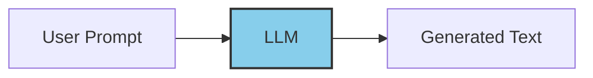

# LLMs (Language Models) - Complete Guide

> **Foundation of LangChain**: Understanding and using base language models

## 📚 Table of Contents

1. [What are LLMs?](#what-are-llms)
2. [Why Use LLMs through LangChain?](#why-use-llms-through-langchain)
3. [Folder Structure](#folder-structure)
4. [Supported Providers](#supported-providers)
5. [Core Concepts](#core-concepts)
6. [Examples](#examples)
7. [Best Practices](#best-practices)

---

## What are LLMs?

LLMs (Large Language Models) are AI models trained on vast amounts of text data. They can generate human-like text, answer questions, summarize content, and more.



### Key Characteristics:
- **Text generation**: Create human-like responses
- **Context understanding**: Comprehend complex queries
- **Knowledge**: Store information from training data
- **Versatility**: Handle multiple task types

---

## Why Use LLMs through LangChain?

| Without LangChain | With LangChain |
|-------------------|----------------|
| Different API for each provider | Unified interface |
| Manual prompt handling | Prompt templates |
| No built-in chaining | Easy composition |
| Manual error handling | Built-in retries |
| Provider lock-in | Easy provider switching |

**Example of provider-agnostic code:**
```python
# Switch providers by changing one line!
from langchain_openai import ChatOpenAI
# OR
from langchain_community.llms import Ollama

llm = ChatOpenAI(model="gpt-4")  # OpenAI
# llm = Ollama(model="mistral")  # Local alternative
```

---

## Folder Structure

```
1. LLMs/
├── llm_demo.py           # OpenAI LLM basic demo
├── ollama_llm.py         # Ollama local LLM
├── huggingface_llm.py    # HuggingFace models
├── llamacpp_llm.py       # LlamaCpp integration
└── README.md             # This file
```

---

## Supported Providers

### 1. OpenAI (`llm_demo.py`)

**Best for**: Production applications, high-quality outputs

```python
from langchain_openai import ChatOpenAI
from dotenv import load_dotenv
import os

load_dotenv()

llm = ChatOpenAI(
    model="gpt-4o-mini",
    api_key=os.getenv("OPENAI_API_KEY"),
    temperature=0.7
)

response = llm.invoke("What is LangChain?")
print(response.content)
```

**Configuration:**
| Parameter | Description | Default |
|-----------|-------------|---------|
| `model` | Model name | gpt-4o-mini |
| `temperature` | Randomness (0-2) | 1.0 |
| `max_tokens` | Max response length | None |
| `api_key` | OpenAI API key | From env |

**Popular Models:**
- `gpt-4o` - Latest multimodal model
- `gpt-4o-mini` - Fast and affordable
- `gpt-4-turbo` - High capability
- `gpt-3.5-turbo` - Fast and cost-effective

---

### 2. Ollama (`ollama_llm.py`)

**Best for**: Local development, privacy, cost savings

```python
from langchain_community.llms import Ollama

# Requires Ollama running locally
llm = Ollama(model="mistral")

response = llm.invoke("Explain machine learning")
print(response)
```

**Setup:**
```bash
# Install Ollama
curl -fsSL https://ollama.com/install.sh | sh

# Pull a model
ollama pull mistral

# Start Ollama (runs in background)
ollama serve
```

**Popular Models:**
| Model | Size | Use Case |
|-------|------|----------|
| mistral | 7B | General purpose |
| llama3 | 8B/70B | High quality |
| codellama | 7B-34B | Code generation |
| phi3 | 3.8B | Fast, compact |

---

### 3. HuggingFace (`huggingface_llm.py`)

**Best for**: Custom models, fine-tuned models, research

```python
from langchain_huggingface import HuggingFaceEndpoint

llm = HuggingFaceEndpoint(
    repo_id="mistralai/Mistral-7B-Instruct-v0.2",
    huggingfacehub_api_token=os.getenv("HUGGINGFACE_API_KEY"),
    max_new_tokens=512
)

response = llm.invoke("What is Python?")
print(response)
```

**Options:**
1. **HuggingFace Hub**: Use hosted models
2. **Local Pipeline**: Run models locally
3. **Inference Endpoints**: Dedicated inference

---

### 4. LlamaCpp (`llamacpp_llm.py`)

**Best for**: Running GGUF models locally, CPU-optimized inference

```python
from langchain_community.llms import LlamaCpp

llm = LlamaCpp(
    model_path="./models/mistral-7b-instruct.gguf",
    n_ctx=2048,
    n_threads=4
)

response = llm.invoke("Tell me a joke")
print(response)
```

**Configuration:**
| Parameter | Description |
|-----------|-------------|
| `model_path` | Path to GGUF file |
| `n_ctx` | Context window size |
| `n_threads` | CPU threads to use |
| `n_gpu_layers` | GPU acceleration layers |

---

## Core Concepts

### 1. Temperature

Controls randomness in outputs:

```python
# Low temperature - deterministic, focused
llm = ChatOpenAI(temperature=0)
# Response: "Python is a programming language."

# High temperature - creative, varied
llm = ChatOpenAI(temperature=1)
# Response: "Python is like having a friendly robot assistant!"
```

| Temperature | Use Case | Example |
|-------------|----------|---------|
| 0 | Factual, code | Math problems |
| 0.3-0.7 | Balanced | General Q&A |
| 0.8-1.0 | Creative | Story writing |

### 2. Max Tokens

Limit response length:

```python
llm = ChatOpenAI(max_tokens=100)  # Short responses
llm = ChatOpenAI(max_tokens=2000) # Longer responses
```

### 3. Streaming

Get responses in real-time:

```python
for chunk in llm.stream("Tell me a story"):
    print(chunk.content, end="", flush=True)
```

### 4. Async Support

```python
import asyncio

async def get_response():
    response = await llm.ainvoke("Hello!")
    return response

result = asyncio.run(get_response())
```

---

## Examples

### Basic Usage

```python
from langchain_openai import ChatOpenAI
from dotenv import load_dotenv

load_dotenv()

# Create LLM
llm = ChatOpenAI(model="gpt-4o-mini")

# Simple invoke
response = llm.invoke("What is Python?")
print(response.content)
```

### With Prompt Template

```python
from langchain.prompts import PromptTemplate

prompt = PromptTemplate(
    input_variables=["topic"],
    template="Explain {topic} in simple terms."
)

# Chain prompt with LLM
chain = prompt | llm
result = chain.invoke({"topic": "machine learning"})
print(result.content)
```

### Batch Processing

```python
questions = [
    "What is Python?",
    "What is JavaScript?",
    "What is Rust?"
]

responses = llm.batch(questions)
for q, r in zip(questions, responses):
    print(f"Q: {q}\nA: {r.content}\n")
```

### With Retry Logic

```python
from langchain_openai import ChatOpenAI

llm = ChatOpenAI(
    model="gpt-4o-mini",
    max_retries=3,  # Retry on failure
    timeout=30      # Timeout in seconds
)
```

---

## Best Practices

### 1. Always Use Environment Variables

```python
# ✅ Good - secure
from dotenv import load_dotenv
load_dotenv()
llm = ChatOpenAI()  # Uses OPENAI_API_KEY from env

# ❌ Bad - exposes key
llm = ChatOpenAI(api_key="sk-...")
```

### 2. Choose the Right Temperature

```python
# For code generation
llm = ChatOpenAI(temperature=0)

# For creative writing
llm = ChatOpenAI(temperature=0.8)
```

### 3. Handle Errors Gracefully

```python
try:
    response = llm.invoke(prompt)
except Exception as e:
    print(f"LLM Error: {e}")
    # Fallback logic
```

### 4. Use Streaming for Better UX

```python
# Instead of waiting for full response
for chunk in llm.stream("Tell me a long story"):
    print(chunk.content, end="")
```

### 5. Consider Costs

| Model | Cost (per 1M tokens) |
|-------|---------------------|
| gpt-4o | $5 input / $15 output |
| gpt-4o-mini | $0.15 / $0.60 |
| gpt-3.5-turbo | $0.50 / $1.50 |
| Ollama (local) | Free |

---

## LLMs vs Chat Models

| Feature | LLMs | Chat Models |
|---------|------|-------------|
| **Input** | Single text string | Message list |
| **Output** | Text completion | Message response |
| **Context** | No built-in | Conversation history |
| **Use Case** | Simple tasks | Conversations |

```python
# LLM style (completion)
response = llm.invoke("Complete this: The sky is")
# Output: "blue and beautiful"

# Chat model style (conversation)
from langchain_core.messages import HumanMessage, SystemMessage
messages = [
    SystemMessage(content="You are a helpful assistant"),
    HumanMessage(content="What color is the sky?")
]
response = chat.invoke(messages)
# Output: AIMessage(content="The sky appears blue due to...")
```

---

## Comparison Table

| Provider | Pros | Cons |
|----------|------|------|
| **OpenAI** | High quality, reliable | Paid, internet required |
| **Ollama** | Free, private, offline | Requires local resources |
| **HuggingFace** | Many models, customizable | Can be complex |
| **LlamaCpp** | CPU optimized, efficient | Setup required |

---

## Troubleshooting

### Issue: API Key not found
```python
# Solution: Check .env file exists and is loaded
from dotenv import load_dotenv
load_dotenv()  # Load before using LLM
```

### Issue: Model not found (Ollama)
```bash
# Solution: Pull the model first
ollama pull mistral
```

### Issue: Rate limiting
```python
# Solution: Add delays or use retries
import time
time.sleep(1)  # Delay between requests
```

### Issue: Response too long/short
```python
# Solution: Set max_tokens appropriately
llm = ChatOpenAI(max_tokens=500)
```

---

## Next Steps

After mastering LLMs:
1. **Chat Models** - Conversational AI (see `2.ChatModels/`)
2. **Prompts** - Template engineering (see `4.Prompts/`)
3. **Output Parsers** - Structured outputs (see `7.OutputParsers/`)
4. **Runnables** - Modern composition (see `9.Runnables/`)

---

## Quick Reference

```python
# OpenAI
from langchain_openai import ChatOpenAI
llm = ChatOpenAI(model="gpt-4o-mini")

# Ollama (local)
from langchain_community.llms import Ollama
llm = Ollama(model="mistral")

# HuggingFace
from langchain_huggingface import HuggingFaceEndpoint
llm = HuggingFaceEndpoint(repo_id="...")

# LlamaCpp (local GGUF)
from langchain_community.llms import LlamaCpp
llm = LlamaCpp(model_path="./model.gguf")

# Basic usage
response = llm.invoke("Your prompt here")
print(response.content)  # or just response for non-chat models
```

---

**Remember:** LLMs are the foundation of LangChain. Master the basics here before moving to more advanced topics!
