# Retrievers - Complete Guide

> **From Basic to Advanced**: Everything you need to know about retrieving relevant information for your LLM applications

## 📚 Table of Contents

1. [What are Retrievers?](#what-are-retrievers)
2. [Why Use Retrievers?](#why-use-retrievers)
3. [Architecture Overview](#architecture-overview)
4. [Folder Structure](#folder-structure)
5. [Basic Retrievers](#basic-retrievers)
6. [Intermediate Retrievers](#intermediate-retrievers)
7. [Advanced Retrievers](#advanced-retrievers)
8. [RAG Pipeline](#rag-pipeline)
9. [Comparison Guide](#comparison-guide)
10. [Best Practices](#best-practices)
11. [Real-World Use Cases](#real-world-use-cases)

---

## What are Retrievers?

Retrievers are components that fetch relevant documents or information from a data source based on a query. They're essential for building **RAG (Retrieval Augmented Generation)** systems that combine external knowledge with LLMs.


**Key Concept**: Instead of relying solely on the LLM's training data, retrievers fetch up-to-date, relevant information to enhance responses.

---

## Why Use Retrievers?

| Without Retrievers | With Retrievers |
|-------------------|-----------------|
| ❌ Limited to training data | ✅ Access to current information |
| ❌ May hallucinate facts | ✅ Grounded in real documents |
| ❌ No domain-specific knowledge | ✅ Custom knowledge bases |
| ❌ Static knowledge cutoff | ✅ Dynamic, updatable data |
| ❌ Generic responses | ✅ Context-aware answers |

**Example Scenario:**

```python
# Without Retriever
query = "What's our company's vacation policy?"
response = llm.invoke(query)
# Returns: Generic/guessed answer ❌

# With Retriever
docs = retriever.get_relevant_documents(query)
response = llm.invoke(f"Context: {docs}\n\nQuestion: {query}")
# Returns: Accurate answer based on actual company docs ✅
```

---

## Architecture Overview

### Complete RAG System Flow


---

## Folder Structure

```
10.Retrievers/
├── 1.Basic/
│   ├── 1_vector_store_retriever.py      # Basic vector search
│   ├── 2_keyword_retriever.py           # BM25 keyword search
│   ├── 3_simple_rag_chain.py            # Basic RAG implementation
│   └── 4_document_loading.py            # Loading various document types
│
├── 2.Intermediate/
│   ├── 1_contextual_compression.py      # Compress retrieved docs
│   ├── 2_multi_query_retriever.py       # Generate multiple queries
│   ├── 3_parent_document_retriever.py   # Retrieve parent docs
│   ├── 4_ensemble_retriever.py          # Combine multiple retrievers
│   ├── 5_time_weighted_retriever.py     # Decay old documents
│   └── 6_self_query_retriever.py        # Metadata filtering
│
├── 3.Advanced/
│   ├── 1_custom_retriever.py            # Build your own
│   ├── 2_hybrid_search.py               # Vector + Keyword combined
│   ├── 3_reranking_retriever.py         # Rerank with cross-encoder
│   ├── 4_retrieval_qa_with_sources.py   # Track document sources
│   ├── 5_conversational_retrieval.py    # Chat with memory
│   └── 6_multi_vector_retriever.py      # Multiple embeddings per doc
│
└── README.md (this file)
```

---

## Basic Retrievers

### 1. Vector Store Retriever

**The foundation of semantic search**

```mermaid
graph LR
    A[Query: "machine learning"] --> B[Embed Query]
    B --> C[Vector: 0.2, 0.8, ...]
    C --> D[Search Vector DB]
    D --> E[Similar Vectors]
    E --> F[Return Documents]
    
    style B fill:#FFE4B5
    style D fill:#87CEEB
    style F fill:#90EE90
```

**How it works:**

1. Documents are converted to embeddings (vectors)
2. Query is converted to embedding
3. Retrieve documents with similar embeddings (cosine similarity)

**Example:**

```python
from langchain_community.vectorstores import Chroma
from langchain_openai import OpenAIEmbeddings
from langchain_community.document_loaders import TextLoader

# Load documents
loader = TextLoader("docs.txt")
documents = loader.load()

# Create embeddings and vector store
embeddings = OpenAIEmbeddings()
vectorstore = Chroma.from_documents(
    documents=documents,
    embedding=embeddings
)

# Create retriever
retriever = vectorstore.as_retriever(
    search_type="similarity",
    search_kwargs={"k": 4}  # Return top 4 results
)

# Use retriever
docs = retriever.get_relevant_documents("What is machine learning?")
```

**File:** `1.Basic/1_vector_store_retriever.py`

---

### 2. Keyword Retriever (BM25)

**Traditional keyword-based search**

```mermaid
graph LR
    A[Query: "Python tutorial"] --> B[Tokenize]
    B --> C[Calculate BM25 Score]
    C --> D[Rank Documents]
    D --> E[Top Matches]
    
    style C fill:#FFE4B5
    style D fill:#87CEEB
    style E fill:#90EE90
```

**How it works:**

- Uses TF-IDF style scoring
- Good for exact keyword matches
- Doesn't understand semantic meaning

**Example:**

```python
from langchain_community.retrievers import BM25Retriever
from langchain.schema import Document

# Create documents
documents = [
    Document(page_content="Python is a programming language"),
    Document(page_content="Java is used for enterprise applications"),
    Document(page_content="Python has great libraries for data science")
]

# Create BM25 retriever
retriever = BM25Retriever.from_documents(documents)
retriever.k = 2  # Return top 2

# Search
results = retriever.get_relevant_documents("Python programming")
```

**File:** `1.Basic/2_keyword_retriever.py`

---

### 3. Simple RAG Chain

**Putting it all together**


**Example:**

```python
from langchain_openai import ChatOpenAI
from langchain.chains import RetrievalQA

llm = ChatOpenAI(model="gpt-3.5-turbo")

# Create RAG chain
qa_chain = RetrievalQA.from_chain_type(
    llm=llm,
    chain_type="stuff",  # Stuff all docs into context
    retriever=retriever
)

# Ask question
result = qa_chain.invoke({"query": "What is machine learning?"})
print(result['result'])
```

**File:** `1.Basic/3_simple_rag_chain.py`

---

## Intermediate Retrievers

### 1. Contextual Compression Retriever

**Compress retrieved documents to only relevant parts**


**Why use it?**
- Reduces token usage
- Focuses on relevant information
- Improves answer quality

**Example:**

```python
from langchain.retrievers import ContextualCompressionRetriever
from langchain.retrievers.document_compressors import LLMChainExtractor
from langchain_openai import ChatOpenAI

llm = ChatOpenAI(temperature=0)

# Create compressor
compressor = LLMChainExtractor.from_llm(llm)

# Wrap base retriever
compression_retriever = ContextualCompressionRetriever(
    base_compressor=compressor,
    base_retriever=base_retriever
)

# Get compressed docs
compressed_docs = compression_retriever.get_relevant_documents(
    "What are the benefits of exercise?"
)
```

**File:** `2.Intermediate/1_contextual_compression.py`

---

### 2. Multi-Query Retriever

**Generate multiple query variations for better retrieval**

```mermaid
graph TB
    A[Original Query:<br/>"benefits of AI"] --> B[LLM]
    B --> C["Query 1: advantages of AI"]
    B --> D["Query 2: positive impacts AI"]
    B --> E["Query 3: AI benefits society"]
    C --> F[Retriever]
    D --> F
    E --> F
    F --> G[Union of Results]
    G --> H[Deduplicated Docs]
    
    style B fill:#FFD700
    style F fill:#87CEEB
    style H fill:#90EE90
```

**Why use it?**
- Overcomes query phrasing issues
- Retrieves diverse perspectives
- Increases recall

**Example:**

```python
from langchain.retrievers import MultiQueryRetriever
from langchain_openai import ChatOpenAI

llm = ChatOpenAI(temperature=0)

# Create multi-query retriever
multi_query_retriever = MultiQueryRetriever.from_llm(
    retriever=base_retriever,
    llm=llm
)

# Automatically generates multiple queries
docs = multi_query_retriever.get_relevant_documents(
    "What are the benefits of machine learning?"
)
```

**File:** `2.Intermediate/2_multi_query_retriever.py`

---

### 3. Parent Document Retriever

**Search on small chunks, retrieve full documents**


**Why use it?**
- Better context for the LLM
- Precise search, comprehensive retrieval
- Maintains document coherence

**Example:**

```python
from langchain.retrievers import ParentDocumentRetriever
from langchain.storage import InMemoryStore
from langchain.text_splitter import RecursiveCharacterTextSplitter

# Small chunks for retrieval
child_splitter = RecursiveCharacterTextSplitter(chunk_size=400)

# Store for parent documents
store = InMemoryStore()

# Create retriever
retriever = ParentDocumentRetriever(
    vectorstore=vectorstore,
    docstore=store,
    child_splitter=child_splitter
)

# Add documents
retriever.add_documents(documents)

# Search small chunks, get full parent docs
docs = retriever.get_relevant_documents("machine learning")
```

**File:** `2.Intermediate/3_parent_document_retriever.py`

---

### 4. Ensemble Retriever

**Combine multiple retrieval methods**


**Why use it?**
- Best of both worlds (semantic + keyword)
- Robust to different query types
- Higher retrieval quality

**Example:**

```python
from langchain.retrievers import EnsembleRetriever
from langchain_community.retrievers import BM25Retriever

# Vector retriever
vector_retriever = vectorstore.as_retriever(search_kwargs={"k": 5})

# Keyword retriever
bm25_retriever = BM25Retriever.from_documents(documents)
bm25_retriever.k = 5

# Combine with weights
ensemble_retriever = EnsembleRetriever(
    retrievers=[vector_retriever, bm25_retriever],
    weights=[0.5, 0.5]  # Equal weight
)

# Get best results from both methods
docs = ensemble_retriever.get_relevant_documents("machine learning tutorial")
```

**File:** `2.Intermediate/4_ensemble_retriever.py`

---

### 5. Time-Weighted Vector Store Retriever

**Prioritize recent documents**

```mermaid
graph LR
    A[Document Score] --> B[Base Similarity]
    A --> C[Time Decay Factor]
    
    B --> D[Combined Score:<br/>similarity × decay]
    C --> D
    
    D --> E[Recent docs ranked higher]
    
    style D fill:#FFD700
    style E fill:#90EE90
```



**Why use it?**
- Favor fresh information
- Good for news/updates
- Automatic temporal relevance

**Example:**

```python
from langchain.retrievers import TimeWeightedVectorStoreRetriever
import datetime

# Create time-weighted retriever
retriever = TimeWeightedVectorStoreRetriever(
    vectorstore=vectorstore,
    decay_rate=0.01,  # How fast old docs decay
    k=4
)

# Add documents with timestamps
retriever.add_documents(
    documents,
    current_time=datetime.datetime.now()
)

# Recent docs get boost
docs = retriever.get_relevant_documents("latest AI news")
```

**File:** `2.Intermediate/5_time_weighted_retriever.py`

---

### 6. Self-Query Retriever

**Natural language metadata filtering**

```mermaid
graph TB
    A["Query: Show me<br/>Python tutorials from 2023"] --> B[LLM]
    B --> C[Semantic Part:<br/>"Python tutorials"]
    B --> D[Metadata Filter:<br/>year = 2023]
    
    C --> E[Vector Search]
    D --> E
    
    E --> F[Filtered Results]
    
    style B fill:#FFD700
    style E fill:#87CEEB
    style F fill:#90EE90
```

**Why use it?**
- Natural language filters
- No need for structured queries
- Powerful metadata handling

**Example:**

```python
from langchain.retrievers.self_query.base import SelfQueryRetriever
from langchain.chains.query_constructor.base import AttributeInfo

# Define metadata attributes
metadata_field_info = [
    AttributeInfo(
        name="category",
        description="The category of the document",
        type="string"
    ),
    AttributeInfo(
        name="year",
        description="The year the document was published",
        type="integer"
    )
]

# Create self-query retriever
retriever = SelfQueryRetriever.from_llm(
    llm=llm,
    vectorstore=vectorstore,
    document_contents="Programming tutorials",
    metadata_field_info=metadata_field_info
)

# Query with natural language filters
docs = retriever.get_relevant_documents(
    "Show me Python tutorials from 2023"
)
```

**File:** `2.Intermediate/6_self_query_retriever.py`

---

## Advanced Retrievers

### 1. Custom Retriever

**Build your own retrieval logic**


**Example:**

```python
from langchain.schema import BaseRetriever, Document
from typing import List

class DatabaseRetriever(BaseRetriever):
    """Retrieve from custom database."""
    
    database_connection: Any
    k: int = 4
    
    def _get_relevant_documents(self, query: str) -> List[Document]:
        """Custom retrieval logic."""
        # Your custom logic here
        results = self.database_connection.search(query, limit=self.k)
        
        # Convert to LangChain documents
        docs = [
            Document(
                page_content=result['content'],
                metadata=result['metadata']
            )
            for result in results
        ]
        return docs
    
    async def _aget_relevant_documents(self, query: str) -> List[Document]:
        """Async version."""
        # Async implementation
        pass

# Use custom retriever
retriever = DatabaseRetriever(
    database_connection=db,
    k=5
)

docs = retriever.get_relevant_documents("query")
```

**File:** `3.Advanced/1_custom_retriever.py`

---

### 2. Hybrid Search (Advanced)

**Optimal combination of vector + keyword search**


**Example:**

```python
from langchain.retrievers import EnsembleRetriever
from langchain_community.retrievers import BM25Retriever

def create_hybrid_retriever(documents, vectorstore):
    """Create optimized hybrid retriever."""
    
    # Vector search (semantic)
    vector_retriever = vectorstore.as_retriever(
        search_type="similarity",
        search_kwargs={"k": 10}
    )
    
    # Keyword search (lexical)
    bm25_retriever = BM25Retriever.from_documents(documents)
    bm25_retriever.k = 10
    
    # Ensemble with optimized weights
    hybrid_retriever = EnsembleRetriever(
        retrievers=[vector_retriever, bm25_retriever],
        weights=[0.6, 0.4],  # Tuned weights
        c=60  # RRF constant
    )
    
    return hybrid_retriever

# Use hybrid retriever
retriever = create_hybrid_retriever(documents, vectorstore)
docs = retriever.get_relevant_documents("complex query")
```

**File:** `3.Advanced/2_hybrid_search.py`

---

### 3. Reranking Retriever

**Rerank results with a cross-encoder for higher accuracy**


**Why use it?**
- Dramatically improves accuracy
- Two-stage retrieval (fast then precise)
- Better than single-stage retrieval

**Example:**

```python
from langchain.retrievers import ContextualCompressionRetriever
from langchain.retrievers.document_compressors import CrossEncoderReranker
from langchain_community.cross_encoders import HuggingFaceCrossEncoder

# Base retriever (gets many candidates)
base_retriever = vectorstore.as_retriever(search_kwargs={"k": 20})

# Cross-encoder reranker
model = HuggingFaceCrossEncoder(model_name="cross-encoder/ms-marco-MiniLM-L-6-v2")
compressor = CrossEncoderReranker(model=model, top_n=3)

# Reranking retriever
reranking_retriever = ContextualCompressionRetriever(
    base_compressor=compressor,
    base_retriever=base_retriever
)

# Get reranked results
docs = reranking_retriever.get_relevant_documents("machine learning")
```

**File:** `3.Advanced/3_reranking_retriever.py`

---

### 4. Retrieval QA with Sources

**Track which documents were used for the answer**


**Example:**

```python
from langchain.chains import RetrievalQAWithSourcesChain

chain = RetrievalQAWithSourcesChain.from_chain_type(
    llm=llm,
    chain_type="stuff",
    retriever=retriever,
    return_source_documents=True
)

result = chain.invoke({"question": "What is machine learning?"})

print("Answer:", result['answer'])
print("Sources:")
for doc in result['source_documents']:
    print(f"  - {doc.metadata['source']}")
```

**File:** `3.Advanced/4_retrieval_qa_with_sources.py`

---

### 5. Conversational Retrieval Chain

**RAG with conversation memory**


**Example:**

```python
from langchain.chains import ConversationalRetrievalChain
from langchain.memory import ConversationBufferMemory

# Create memory
memory = ConversationBufferMemory(
    memory_key="chat_history",
    return_messages=True
)

# Create conversational chain
qa_chain = ConversationalRetrievalChain.from_llm(
    llm=llm,
    retriever=retriever,
    memory=memory
)

# First question
response1 = qa_chain.invoke({"question": "What is machine learning?"})

# Follow-up (uses context)
response2 = qa_chain.invoke({"question": "What are its applications?"})
```

**File:** `3.Advanced/5_conversational_retrieval.py`

---

### 6. Multi-Vector Retriever

**Multiple embeddings per document for better retrieval**


**Why use it?**
- Better retrieval accuracy
- Captures multiple aspects
- Flexible matching

**Example:**

```python
from langchain.retrievers.multi_vector import MultiVectorRetriever
from langchain.storage import InMemoryStore

# Document store
docstore = InMemoryStore()

# Create multi-vector retriever
retriever = MultiVectorRetriever(
    vectorstore=vectorstore,
    docstore=docstore,
    id_key="doc_id"
)

# Add documents with multiple embeddings
import uuid
doc_ids = [str(uuid.uuid4()) for _ in documents]

# Create summaries
summaries = [llm.invoke(f"Summarize: {doc.page_content}") for doc in documents]

# Add both summaries and full docs
retriever.vectorstore.add_documents(
    [Document(page_content=s, metadata={"doc_id": doc_ids[i]}) 
     for i, s in enumerate(summaries)]
)
retriever.docstore.mset(list(zip(doc_ids, documents)))

# Search summaries, return full docs
docs = retriever.get_relevant_documents("machine learning")
```

**File:** `3.Advanced/6_multi_vector_retriever.py`

---

## RAG Pipeline

### Complete Production-Ready RAG System


### Implementation Example

```python
from langchain_openai import ChatOpenAI, OpenAIEmbeddings
from langchain_community.vectorstores import Chroma
from langchain.text_splitter import RecursiveCharacterTextSplitter
from langchain.chains import RetrievalQA
from langchain.prompts import PromptTemplate

class ProductionRAG:
    """Production-ready RAG system."""
    
    def __init__(self, documents):
        # 1. Split documents
        text_splitter = RecursiveCharacterTextSplitter(
            chunk_size=1000,
            chunk_overlap=200
        )
        self.chunks = text_splitter.split_documents(documents)
        
        # 2. Create embeddings and vector store
        embeddings = OpenAIEmbeddings()
        self.vectorstore = Chroma.from_documents(
            documents=self.chunks,
            embedding=embeddings
        )
        
        # 3. Create hybrid retriever
        self.retriever = self._create_retriever()
        
        # 4. Create LLM
        self.llm = ChatOpenAI(model="gpt-4", temperature=0)
        
        # 5. Create QA chain
        self.qa_chain = self._create_qa_chain()
    
    def _create_retriever(self):
        """Create hybrid retriever with reranking."""
        from langchain.retrievers import EnsembleRetriever
        from langchain_community.retrievers import BM25Retriever
        
        # Vector retriever
        vector_retriever = self.vectorstore.as_retriever(
            search_kwargs={"k": 10}
        )
        
        # BM25 retriever
        bm25_retriever = BM25Retriever.from_documents(self.chunks)
        bm25_retriever.k = 10
        
        # Ensemble
        ensemble = EnsembleRetriever(
            retrievers=[vector_retriever, bm25_retriever],
            weights=[0.6, 0.4]
        )
        
        return ensemble
    
    def _create_qa_chain(self):
        """Create QA chain with custom prompt."""
        template = """You are a helpful assistant. Use the following context to answer the question.
If you don't know the answer, say so - don't make it up.

Context:
{context}

Question: {question}

Answer: Let me help you with that."""

        prompt = PromptTemplate(
            template=template,
            input_variables=["context", "question"]
        )
        
        chain = RetrievalQA.from_chain_type(
            llm=self.llm,
            chain_type="stuff",
            retriever=self.retriever,
            chain_type_kwargs={"prompt": prompt},
            return_source_documents=True
        )
        
        return chain
    
    def query(self, question: str):
        """Query the RAG system."""
        result = self.qa_chain.invoke({"query": question})
        
        return {
            "answer": result['result'],
            "sources": [doc.metadata.get('source', 'Unknown') 
                       for doc in result['source_documents']]
        }

# Usage
rag = ProductionRAG(documents)
result = rag.query("What is machine learning?")
print(result['answer'])
print("Sources:", result['sources'])
```

---

## Comparison Guide

### Retriever Selection Matrix

| Use Case | Recommended Retriever | Why |
|----------|----------------------|-----|
| **Simple QA** | VectorStoreRetriever | Fast, accurate for semantic search |
| **Keyword-heavy queries** | BM25Retriever | Good for exact term matching |
| **Best accuracy** | Hybrid + Reranking | Combines semantic + lexical + reranking |
| **Long documents** | ParentDocumentRetriever | Search chunks, retrieve full context |
| **Query variations** | MultiQueryRetriever | Handles different phrasings |
| **Time-sensitive data** | TimeWeightedRetriever | Favors recent information |
| **Metadata filtering** | SelfQueryRetriever | Natural language filters |
| **Chatbots** | ConversationalRetrieval | Maintains conversation context |
| **Custom logic** | Custom Retriever | Full control over retrieval |

### Performance Comparison


| Retriever | Speed | Accuracy | Setup Complexity | Best For |
|-----------|-------|----------|------------------|----------|
| Vector Store | ⚡⚡⚡ | ⭐⭐⭐ | 🔧 | General semantic search |
| BM25 | ⚡⚡⚡ | ⭐⭐ | 🔧 | Keyword matching |
| Hybrid | ⚡⚡ | ⭐⭐⭐⭐ | 🔧🔧 | Balanced performance |
| Reranking | ⚡ | ⭐⭐⭐⭐⭐ | 🔧🔧 | Maximum accuracy |
| MultiQuery | ⚡⚡ | ⭐⭐⭐⭐ | 🔧🔧 | Robust retrieval |
| Ensemble | ⚡⚡ | ⭐⭐⭐⭐ | 🔧🔧 | Production systems |
| Contextual Compression | ⚡ | ⭐⭐⭐⭐ | 🔧🔧🔧 | Token optimization |
| MultiVector | ⚡⚡ | ⭐⭐⭐⭐⭐ | 🔧🔧🔧 | Complex documents |

---

## Best Practices

### 1. Document Chunking Strategy


**Recommendations:**

```python
# For most cases
text_splitter = RecursiveCharacterTextSplitter(
    chunk_size=1000,
    chunk_overlap=200,
    separators=["\n\n", "\n", " ", ""]
)

# For code
code_splitter = RecursiveCharacterTextSplitter.from_language(
    language=Language.PYTHON,
    chunk_size=800,
    chunk_overlap=100
)

# For markdown
markdown_splitter = MarkdownTextSplitter(
    chunk_size=1000,
    chunk_overlap=200
)
```

---

### 2. Embedding Model Selection

| Model | Dimensions | Speed | Quality | Use Case |
|-------|-----------|-------|---------|----------|
| **OpenAI text-embedding-3-small** | 1536 | ⚡⚡⚡ | ⭐⭐⭐ | Cost-effective |
| **OpenAI text-embedding-3-large** | 3072 | ⚡⚡ | ⭐⭐⭐⭐⭐ | Best quality |
| **HuggingFace all-MiniLM-L6-v2** | 384 | ⚡⚡⚡ | ⭐⭐ | Free, local |
| **Cohere embed-english-v3** | 1024 | ⚡⚡ | ⭐⭐⭐⭐ | Balanced |

---

### 3. Retrieval Parameters

```python
# Conservative (high precision)
retriever = vectorstore.as_retriever(
    search_type="similarity_score_threshold",
    search_kwargs={
        "k": 3,
        "score_threshold": 0.8
    }
)

# Balanced (recommended)
retriever = vectorstore.as_retriever(
    search_type="similarity",
    search_kwargs={"k": 5}
)

# Aggressive (high recall)
retriever = vectorstore.as_retriever(
    search_type="mmr",  # Maximum Marginal Relevance
    search_kwargs={
        "k": 10,
        "fetch_k": 20,
        "lambda_mult": 0.5
    }
)
```

---

### 4. Prompt Engineering for RAG

```python
# Good RAG prompt
rag_template = """Answer the question based on the following context. 
If the answer is not in the context, say "I don't have enough information to answer that."

Context:
{context}

Question: {question}

Instructions:
- Be specific and cite relevant information
- If uncertain, express the level of confidence
- Keep the answer concise but complete

Answer:"""

# With chain of thought
cot_template = """Use the following context to answer the question.

Context:
{context}

Question: {question}

Let's approach this step by step:
1. First, identify relevant information from the context
2. Then, reason about how it relates to the question
3. Finally, provide a clear answer

Answer:"""
```

---

### 5. Error Handling

```python
from langchain.schema import Document

class RobustRetriever:
    """Retriever with error handling."""
    
    def __init__(self, retriever, fallback_retriever=None):
        self.retriever = retriever
        self.fallback_retriever = fallback_retriever
    
    def get_relevant_documents(self, query: str) -> List[Document]:
        """Get documents with fallback."""
        try:
            docs = self.retriever.get_relevant_documents(query)
            
            # Check if results are meaningful
            if not docs or len(docs) == 0:
                print("No documents found, trying fallback...")
                if self.fallback_retriever:
                    docs = self.fallback_retriever.get_relevant_documents(query)
                else:
                    # Return a default document
                    docs = [Document(
                        page_content="I couldn't find relevant information.",
                        metadata={"source": "fallback"}
                    )]
            
            return docs
            
        except Exception as e:
            print(f"Retrieval error: {e}")
            return [Document(
                page_content="An error occurred during retrieval.",
                metadata={"error": str(e)}
            )]
```

---

## Real-World Use Cases

### 1. Customer Support Bot

```python
# Setup
documents = load_support_docs()  # FAQs, policies, etc.
retriever = create_hybrid_retriever(documents)

# Conversational chain with memory
memory = ConversationBufferMemory()
qa_chain = ConversationalRetrievalChain.from_llm(
    llm=llm,
    retriever=retriever,
    memory=memory
)

# Use
response = qa_chain.invoke({
    "question": "How do I reset my password?"
})
```

### 2. Research Assistant

```python
# Setup with reranking for accuracy
base_retriever = vectorstore.as_retriever(search_kwargs={"k": 20})
reranking_retriever = create_reranking_retriever(base_retriever)

# QA with sources
chain = RetrievalQAWithSourcesChain.from_chain_type(
    llm=llm,
    retriever=reranking_retriever,
    return_source_documents=True
)

# Query
result = chain.invoke({
    "question": "What are the latest findings on quantum computing?"
})
print(result['answer'])
print("Sources:", result['sources'])
```

### 3. Code Documentation Search

```python
# Load code with metadata
loader = DirectoryLoader(
    "codebase/",
    glob="**/*.py",
    loader_cls=PythonLoader
)
documents = loader.load()

# Self-query for metadata filtering
retriever = SelfQueryRetriever.from_llm(
    llm=llm,
    vectorstore=vectorstore,
    document_contents="Python code and documentation",
    metadata_field_info=[
        AttributeInfo(name="file_path", type="string"),
        AttributeInfo(name="class_name", type="string"),
        AttributeInfo(name="function_name", type="string")
    ]
)

# Natural language query with filters
docs = retriever.get_relevant_documents(
    "Show me authentication functions from the auth module"
)
```

### 4. Legal Document Analysis

```python
# Parent document retriever for legal docs
child_splitter = RecursiveCharacterTextSplitter(chunk_size=400)
parent_retriever = ParentDocumentRetriever(
    vectorstore=vectorstore,
    docstore=InMemoryStore(),
    child_splitter=child_splitter
)

# Add legal documents
parent_retriever.add_documents(legal_documents)

# Search specific clauses, get full context
docs = parent_retriever.get_relevant_documents(
    "liability limitations in software agreements"
)
```

---

## Integration Patterns

### RAG + Agents

```mermaid
graph TB
    A[User Query] --> B[Agent]
    B --> C{Needs<br/>Retrieval?}
    
    C -->|Yes| D[Retriever Tool]
    C -->|No| E[Direct LLM]
    
    D --> F[Relevant Docs]
    F --> G[LLM with Context]
    G --> H[Answer]
    E --> H
    
    style B fill:#FFD700
    style D fill:#87CEEB
    style H fill:#90EE90
```

```python
from langchain.agents import initialize_agent, Tool
from langchain.tools.retriever import create_retriever_tool

# Create retriever tool
retriever_tool = create_retriever_tool(
    retriever=retriever,
    name="documentation_search",
    description="Search the documentation for information"
)

# Create agent with retriever
agent = initialize_agent(
    tools=[retriever_tool, other_tools],
    llm=llm,
    agent="openai-functions"
)

# Agent decides when to retrieve
response = agent.invoke({"input": "How do I configure the API?"})
```

---

## Troubleshooting

| Issue | Cause | Solution |
|-------|-------|----------|
| **Poor retrieval quality** | Bad embeddings or chunk size | Try different embedding models, adjust chunk size |
| **Irrelevant results** | Query-document mismatch | Use MultiQueryRetriever or hybrid search |
| **Slow performance** | Too many documents | Use smaller k, add caching, optimize vector store |
| **High token usage** | Long contexts | Use ContextualCompression or reranking |
| **Outdated information** | Old documents ranked high | Use TimeWeightedRetriever |
| **Missing metadata** | Poor filtering | Add metadata during ingestion, use SelfQueryRetriever |

---

## Performance Optimization

### 1. Caching

```python
from langchain.cache import InMemoryCache
from langchain.globals import set_llm_cache

# Cache LLM responses
set_llm_cache(InMemoryCache())

# Cache embeddings
from langchain.embeddings import CacheBackedEmbeddings
from langchain.storage import LocalFileStore

store = LocalFileStore("./cache/")
cached_embeddings = CacheBackedEmbeddings.from_bytes_store(
    underlying_embeddings=OpenAIEmbeddings(),
    document_embedding_cache=store,
    namespace="openai-embeddings"
)
```

### 2. Batch Processing

```python
# Process multiple queries efficiently
queries = ["query1", "query2", "query3"]

# Batch retrieve
all_docs = retriever.batch(queries)

# Batch generate
results = llm.batch([
    f"Context: {docs}\nQuestion: {q}"
    for q, docs in zip(queries, all_docs)
])
```

---

## Next Steps

After mastering Retrievers:

1. **Combine with Agents** - Build intelligent retrieval systems
2. **Add Memory** - Create stateful RAG applications
3. **Deploy to Production** - Use vector databases like Pinecone, Weaviate
4. **Optimize Performance** - Fine-tune embeddings, implement caching
5. **Monitor & Improve** - Track retrieval quality, iterate on chunks

---

## Additional Resources

- [LangChain Retrievers Documentation](https://python.langchain.com/docs/modules/data_connection/retrievers/)
- [Vector Store Guide](https://python.langchain.com/docs/modules/data_connection/vectorstores/)
- [RAG Best Practices](https://www.anthropic.com/index/building-effective-agents)
- [Embedding Models Comparison](https://huggingface.co/spaces/mteb/leaderboard)

---

## 🎯 Summary

**Key Takeaways:**

1. **Retrievers bridge LLMs and external knowledge**
2. **Choose the right retriever for your use case**
3. **Hybrid search (vector + keyword) often works best**
4. **Reranking significantly improves accuracy**
5. **Proper chunking and embeddings are crucial**
6. **Always handle errors and edge cases**
7. **Monitor and iterate on retrieval quality**

**Retrieval Pipeline:**
```
Documents → Chunking → Embedding → Vector Store → Query → Retrieval → Reranking → LLM → Answer
```

**Golden Rule:** Start simple with VectorStoreRetriever, then optimize based on your specific needs!

---

**Happy Building! 🚀**

Remember: Effective retrieval is the foundation of great RAG systems. Master the basics before moving to advanced patterns.

