# Text Splitters - Complete Guide

> From Basic to Advanced: Everything you need to know about splitting text for LLM applications

## 📚 Table of Contents

1. [What are Text Splitters?](#what-are-text-splitters)
2. [Why Use Text Splitters?](#why-use-text-splitters)
3. [Folder Structure](#folder-structure)
4. [Basic Splitters](#basic-splitters)
5. [Intermediate Splitters](#intermediate-splitters)
6. [Advanced Splitters](#advanced-splitters)
7. [How They Work](#how-they-work)
8. [Comparison Guide](#comparison-guide)

---

## What are Text Splitters?

Text splitters break down large documents into smaller chunks that fit within LLM context windows and maintain semantic coherence.

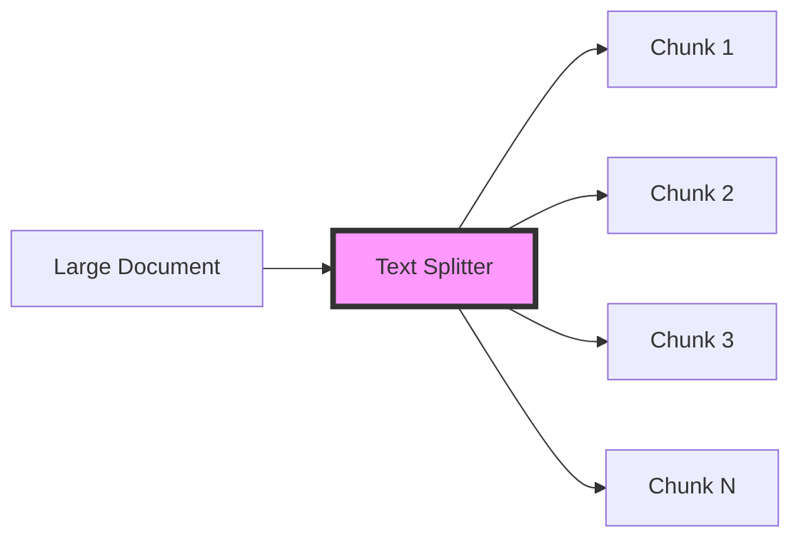

---

## Why Use Text Splitters?

| Problem | Solution with Text Splitters |
|---------|------------------------------|
| Document too large for LLM | Split into manageable chunks |
| Loss of context | Overlap chunks to maintain continuity |
| Semantic fragmentation | Split by meaningful boundaries |
| Token limits exceeded | Calculate and respect token limits |

**Example Use Cases:**
- 📄 **RAG Systems**: Split documents for vector storage
- 🔍 **Semantic Search**: Create searchable chunks
- 📊 **Summarization**: Process long documents in parts
- 💬 **Question Answering**: Find relevant context chunks

---

## Folder Structure

```
10.TextSplitters/
├── 1.Basic/
│   ├── 1_character_splitter.py       # CharacterTextSplitter
│   ├── 2_recursive_splitter.py       # RecursiveCharacterTextSplitter
│   └── 3_token_splitter.py           # TokenTextSplitter
├── 2.Intermediate/
│   ├── 1_language_splitter.py        # Language-specific splitting
│   ├── 2_markdown_splitter.py        # MarkdownTextSplitter
│   └── 3_html_splitter.py            # HTMLHeaderTextSplitter
├── 3.Advanced/
│   ├── 1_semantic_splitter.py        # Semantic chunking
│   └── 2_custom_splitter.py          # Custom implementation
└── README.md (this file)
```

---

## Basic Splitters

### 1. Character Text Splitter

**Use:** Simple splitting by character count

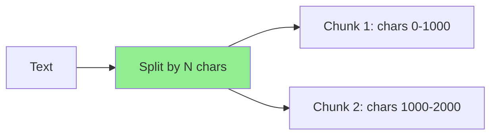

**File:** `1.Basic/1_character_splitter.py`

**Example:**
```python
from langchain_text_splitters import CharacterTextSplitter

splitter = CharacterTextSplitter(
    chunk_size=1000,
    chunk_overlap=200,
    separator="\n"
)
chunks = splitter.split_text(long_text)
```

**Key Parameters:**
- `chunk_size`: Maximum characters per chunk
- `chunk_overlap`: Characters to overlap between chunks
- `separator`: Character to split on (e.g., "\n", " ", ".")

---

### 2. Recursive Character Text Splitter

**Use:** Smart splitting with fallback separators (Recommended for most cases)

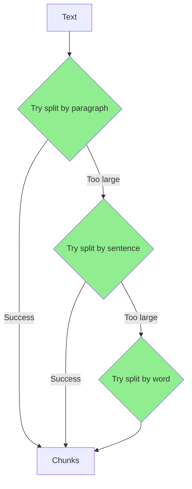

**File:** `1.Basic/2_recursive_splitter.py`

**Example:**
```python
from langchain_text_splitters import RecursiveCharacterTextSplitter

splitter = RecursiveCharacterTextSplitter(
    chunk_size=1000,
    chunk_overlap=200,
    separators=["\n\n", "\n", ".", " ", ""]
)
chunks = splitter.split_text(text)
```

**Why Recursive is Better:**
- ✅ Tries to keep paragraphs together
- ✅ Falls back gracefully to smaller units
- ✅ Maintains semantic coherence
- ✅ Most versatile option

---

### 3. Token Text Splitter

**Use:** Split by token count (important for LLM limits)

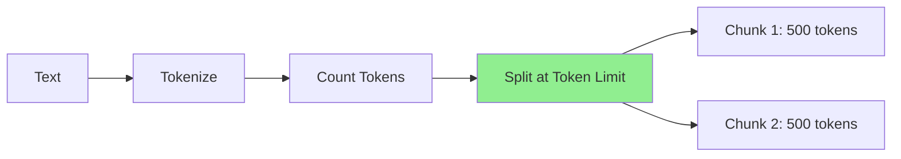

**File:** `1.Basic/3_token_splitter.py`

**Example:**
```python
from langchain_text_splitters import TokenTextSplitter

splitter = TokenTextSplitter(
    chunk_size=500,
    chunk_overlap=50
)
chunks = splitter.split_text(text)
```

**When to use:**
- ✅ Strict token limits (API constraints)
- ✅ Cost optimization (pay per token)
- ✅ Precise context window management

---

## Intermediate Splitters

### 1. Language-Specific Splitters

**Use:** Respect code syntax when splitting

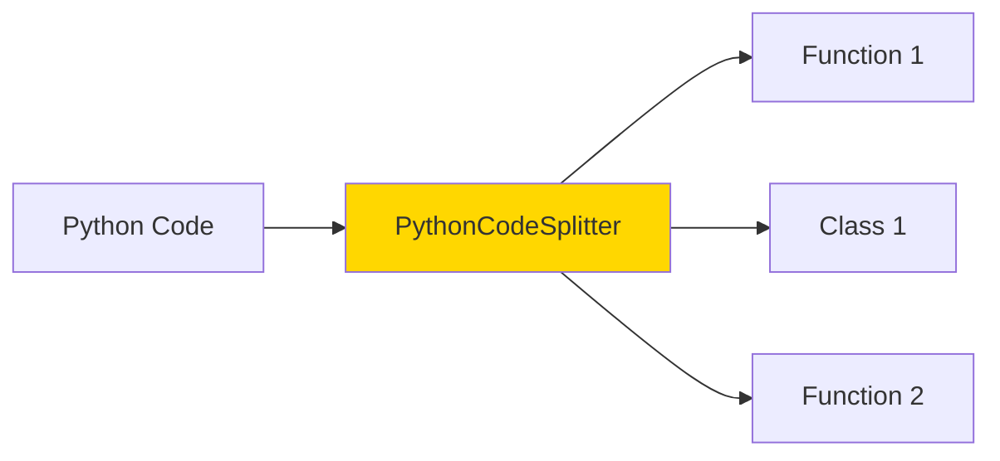

**File:** `2.Intermediate/1_language_splitter.py`

**Example:**
```python
from langchain_text_splitters import PythonCodeTextSplitter

splitter = PythonCodeTextSplitter(
    chunk_size=1000,
    chunk_overlap=200
)
chunks = splitter.split_text(python_code)
```

**Supported Languages:**
- Python
- JavaScript/TypeScript
- Java
- C/C++
- Go
- Rust
- And more...

---

### 2. Markdown Text Splitter

**Use:** Respect Markdown structure (headers, lists)

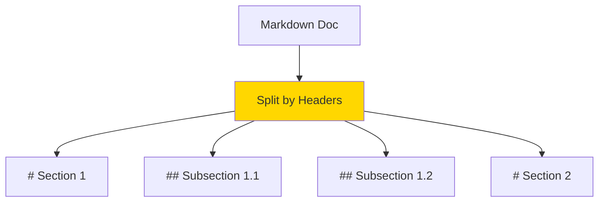

**File:** `2.Intermediate/2_markdown_splitter.py`

**Example:**
```python
from langchain_text_splitters import MarkdownTextSplitter

splitter = MarkdownTextSplitter(
    chunk_size=1000,
    chunk_overlap=200
)
chunks = splitter.split_text(markdown_text)
```

**Benefits:**
- ✅ Preserves document structure
- ✅ Keeps sections together
- ✅ Maintains header context

---

### 3. HTML Text Splitter

**Use:** Parse and split HTML documents

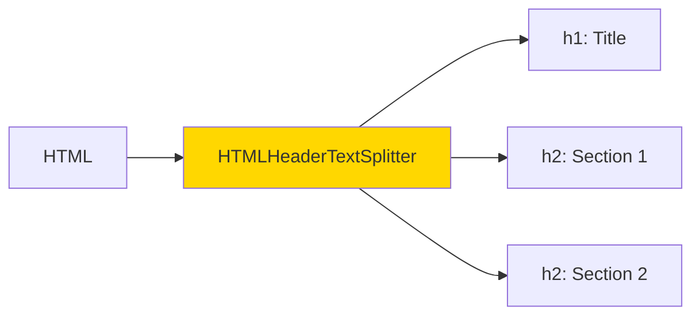

**File:** `2.Intermediate/3_html_splitter.py`

**Example:**
```python
from langchain_text_splitters import HTMLHeaderTextSplitter

headers_to_split_on = [
    ("h1", "Header 1"),
    ("h2", "Header 2"),
    ("h3", "Header 3"),
]

splitter = HTMLHeaderTextSplitter(headers_to_split_on=headers_to_split_on)
chunks = splitter.split_text(html_string)
```

**Use Cases:**
- Web scraping
- Documentation processing
- Knowledge base extraction

---

## Advanced Splitters

### 1. Semantic Chunker

**Use:** Split by semantic similarity (AI-powered)

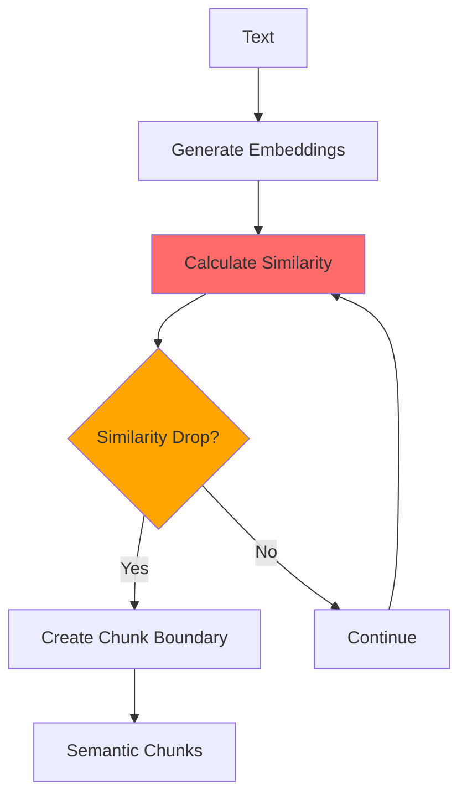

**File:** `3.Advanced/1_semantic_splitter.py`

**How it works:**

1. Generate embeddings for sentences
2. Calculate similarity between adjacent sentences
3. Split when similarity drops below threshold
4. Creates semantically coherent chunks

**Example:**
```python
from langchain_experimental.text_splitter import SemanticChunker
from langchain_openai import OpenAIEmbeddings

splitter = SemanticChunker(
    embeddings=OpenAIEmbeddings(),
    breakpoint_threshold_type="percentile"
)
chunks = splitter.split_text(text)
```

**Benefits:**
- ✅ Most intelligent splitting
- ✅ Preserves semantic meaning
- ✅ Better for RAG systems
- ❌ Slower (requires embeddings)
- ❌ Costs (API calls)

---

### 2. Custom Text Splitter

**Use:** Create splitters for unique requirements

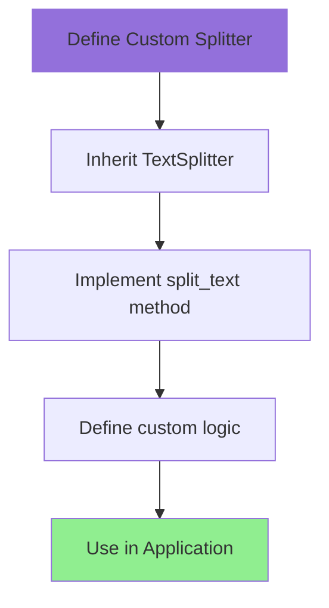

**File:** `3.Advanced/2_custom_splitter.py`

**Example:**
```python
from langchain_text_splitters import TextSplitter
from typing import List

class CustomSplitter(TextSplitter):
    def split_text(self, text: str) -> List[str]:
        # Your custom splitting logic
        chunks = []
        # ... custom implementation ...
        return chunks

splitter = CustomSplitter(chunk_size=1000)
chunks = splitter.split_text(text)
```

**When to create custom splitters:**
- ✅ Domain-specific formats
- ✅ Special parsing requirements
- ✅ Proprietary document structures
- ✅ Performance optimization

---

## How They Work

### Core Concepts

#### 1. Chunk Size
The maximum length of each text chunk.

```python
chunk_size=1000  # Maximum 1000 characters per chunk
```

#### 2. Chunk Overlap
Characters shared between consecutive chunks to maintain context.

```python
chunk_overlap=200  # Last 200 chars of chunk N = first 200 chars of chunk N+1
```

```
Chunk 1: [                    XXXXXXXXXXXXXXXXXX]
Chunk 2:                  [XXXXXXXXXXXXXXXXXX                    ]
                           ^^^^^ Overlap ^^^^^
```

#### 3. Separators
Characters/strings used as split points.

```python
separators=["\n\n", "\n", ".", " ", ""]  # Try in order
```

### Complete Flow Diagram

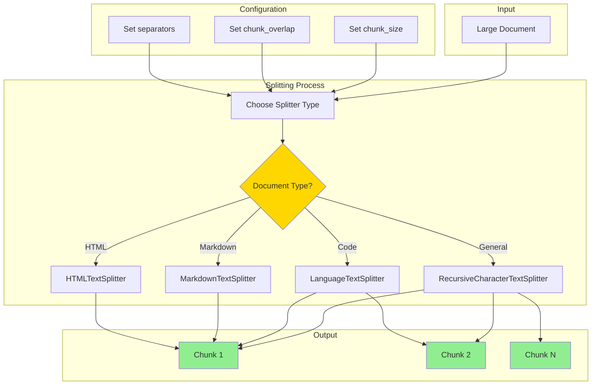

---

## Comparison Guide

### Splitter Selection Matrix

| Document Type | Recommended Splitter | Why? |
|---------------|---------------------|------|
| General text | RecursiveCharacterTextSplitter | Best balance |
| Code files | LanguageTextSplitter | Respects syntax |
| Markdown docs | MarkdownTextSplitter | Preserves structure |
| HTML pages | HTMLHeaderTextSplitter | Extracts headers |
| Precise tokens | TokenTextSplitter | API limits |
| RAG systems | SemanticChunker | Semantic coherence |

### Feature Comparison

| Splitter | Speed | Precision | Cost | Complexity |
|----------|-------|-----------|------|------------|
| Character | ⚡⚡⚡ | ⭐⭐ | Free | 🔧 |
| Recursive | ⚡⚡⚡ | ⭐⭐⭐⭐ | Free | 🔧 |
| Token | ⚡⚡ | ⭐⭐⭐⭐⭐ | Free | 🔧🔧 |
| Language | ⚡⚡ | ⭐⭐⭐⭐ | Free | 🔧🔧 |
| Markdown | ⚡⚡⚡ | ⭐⭐⭐⭐ | Free | 🔧 |
| HTML | ⚡⚡ | ⭐⭐⭐⭐ | Free | 🔧🔧 |
| Semantic | ⚡ | ⭐⭐⭐⭐⭐ | $$$ | 🔧🔧🔧 |

**Note:** "Precision" refers to Token for exact token counting, and Semantic for semantic coherence.

### Decision Tree

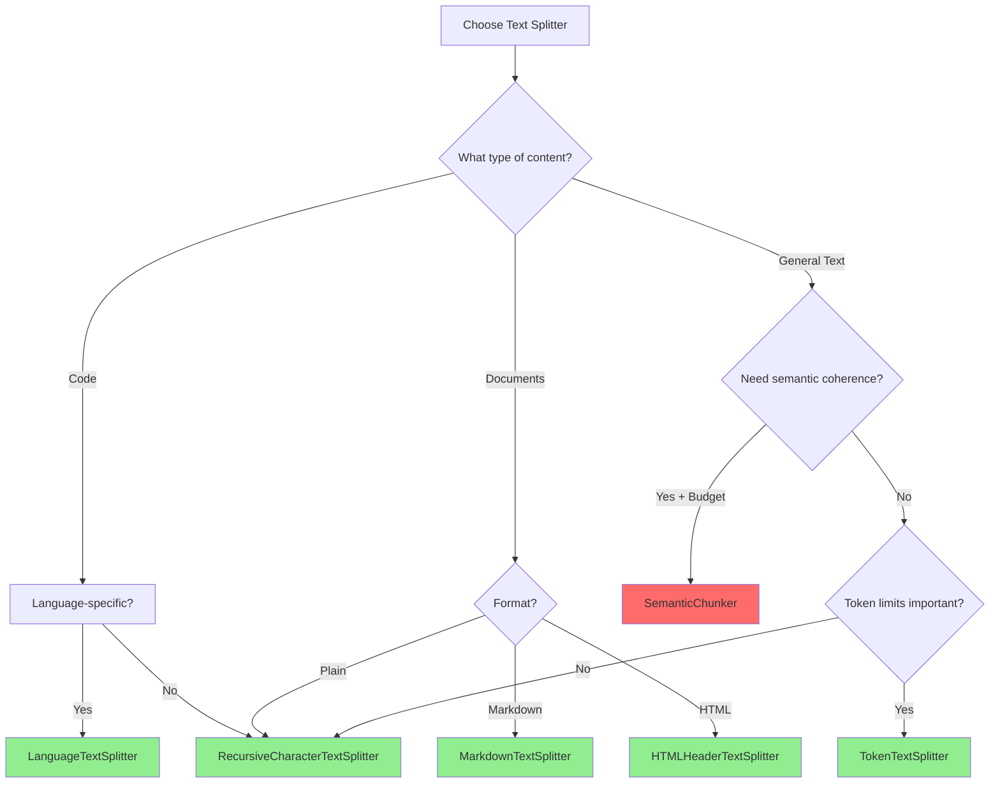

---

## Best Practices

### 1. Choose Appropriate Chunk Size

```python
# ✅ Good - Based on use case
chunk_size = 1000  # For GPT-3.5 context
chunk_size = 500   # For embedding models
chunk_size = 2000  # For GPT-4 context

# ❌ Too small - loses context
chunk_size = 100

# ❌ Too large - exceeds limits
chunk_size = 10000
```

### 2. Always Use Overlap

```python
# ✅ Good - maintains context
RecursiveCharacterTextSplitter(
    chunk_size=1000,
    chunk_overlap=200  # 20% overlap
)

# ❌ Bad - loses context between chunks
RecursiveCharacterTextSplitter(
    chunk_size=1000,
    chunk_overlap=0
)
```

### 3. Test with Real Data

```python
# Test splitter with sample data
splitter = RecursiveCharacterTextSplitter(chunk_size=1000, chunk_overlap=200)
chunks = splitter.split_text(sample_text)

print(f"Number of chunks: {len(chunks)}")
print(f"First chunk length: {len(chunks[0])}")
print(f"Last chunk length: {len(chunks[-1])}")
```

### 4. Monitor Chunk Quality

```python
# Check for orphaned sentences or incomplete thoughts
for i, chunk in enumerate(chunks):
    print(f"Chunk {i}: {chunk[:100]}...")
    # Verify chunk makes sense independently
```

### 5. Use RecursiveCharacterTextSplitter as Default

```python
# ✅ Start here for most use cases
from langchain_text_splitters import RecursiveCharacterTextSplitter

splitter = RecursiveCharacterTextSplitter(
    chunk_size=1000,
    chunk_overlap=200,
    separators=["\n\n", "\n", ".", " ", ""]
)
```

---

## Real-World Examples

### RAG System Document Processing

```python
from langchain_text_splitters import RecursiveCharacterTextSplitter
from langchain_openai import OpenAIEmbeddings
from langchain_community.vectorstores import FAISS

# 1. Load document
with open("document.txt") as f:
    text = f.read()

# 2. Split into chunks
splitter = RecursiveCharacterTextSplitter(
    chunk_size=1000,
    chunk_overlap=200
)
chunks = splitter.split_text(text)

# 3. Create embeddings and store
embeddings = OpenAIEmbeddings()
vectorstore = FAISS.from_texts(chunks, embeddings)

# 4. Query
query = "What is the main topic?"
relevant_chunks = vectorstore.similarity_search(query, k=3)
```

### Code Documentation Generation

```python
from langchain_text_splitters import PythonCodeTextSplitter

# Split Python code into functions/classes
splitter = PythonCodeTextSplitter(chunk_size=1000)
code_chunks = splitter.split_text(python_file_content)

# Generate documentation for each chunk
for chunk in code_chunks:
    doc = llm.invoke(f"Document this code:\n{chunk}")
    print(doc)
```

### Markdown Documentation Processing

```python
from langchain_text_splitters import MarkdownTextSplitter

# Process README files
splitter = MarkdownTextSplitter(chunk_size=1000, chunk_overlap=100)
sections = splitter.split_text(readme_content)

# Each section maintains header context
for section in sections:
    print(f"Section: {section[:50]}...")
```

---

## Troubleshooting

### Common Issues

**Issue:** Chunks are too small or too large

**Solutions:**
1. Adjust `chunk_size` parameter
2. Check document structure
3. Use RecursiveCharacterTextSplitter for better adaptation
4. Test with different separator configurations

**Issue:** Context is lost between chunks

**Solutions:**
1. Increase `chunk_overlap` (try 10-20% of chunk_size)
2. Use larger chunks if model allows
3. Consider SemanticChunker for coherent splits

**Issue:** Token limit exceeded

**Solutions:**
1. Use TokenTextSplitter instead of CharacterTextSplitter
2. Reduce chunk_size
3. Account for prompt tokens in calculation

**Issue:** Code syntax broken across chunks

**Solutions:**
1. Use language-specific splitters
2. Increase chunk_size to fit complete functions
3. Split by function/class boundaries

---

## Integration with RAG

Text splitters are essential for Retrieval-Augmented Generation (RAG):

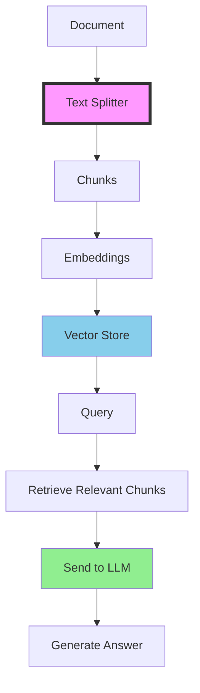

**Complete RAG Pipeline:**
```python
# 1. Split
splitter = RecursiveCharacterTextSplitter(chunk_size=1000, chunk_overlap=200)
chunks = splitter.split_text(document)

# 2. Embed
embeddings = OpenAIEmbeddings()
vectorstore = FAISS.from_texts(chunks, embeddings)

# 3. Retrieve
retriever = vectorstore.as_retriever()

# 4. Generate
from langchain.chains import RetrievalQA
qa_chain = RetrievalQA.from_chain_type(llm=llm, retriever=retriever)
answer = qa_chain.invoke({"query": question})
```

---

## Quick Reference

```python
# Basic - Character splitting
from langchain_text_splitters import CharacterTextSplitter
splitter = CharacterTextSplitter(chunk_size=1000, chunk_overlap=200)

# Basic - Recursive (Recommended)
from langchain_text_splitters import RecursiveCharacterTextSplitter
splitter = RecursiveCharacterTextSplitter(
    chunk_size=1000,
    chunk_overlap=200,
    separators=["\n\n", "\n", ".", " ", ""]
)

# Basic - Token counting
from langchain_text_splitters import TokenTextSplitter
splitter = TokenTextSplitter(chunk_size=500, chunk_overlap=50)

# Intermediate - Python code
from langchain_text_splitters import PythonCodeTextSplitter
splitter = PythonCodeTextSplitter(chunk_size=1000)

# Intermediate - Markdown
from langchain_text_splitters import MarkdownTextSplitter
splitter = MarkdownTextSplitter(chunk_size=1000)

# Intermediate - HTML
from langchain_text_splitters import HTMLHeaderTextSplitter
splitter = HTMLHeaderTextSplitter(headers_to_split_on=[("h1", "Header 1")])

# Advanced - Semantic
from langchain_experimental.text_splitter import SemanticChunker
from langchain_openai import OpenAIEmbeddings
splitter = SemanticChunker(embeddings=OpenAIEmbeddings())

# Usage
chunks = splitter.split_text(text)
```

---

## Performance Tips

### 1. Batch Processing

```python
# Process multiple documents efficiently
documents = [doc1, doc2, doc3, ...]
splitter = RecursiveCharacterTextSplitter(chunk_size=1000)

all_chunks = []
for doc in documents:
    chunks = splitter.split_text(doc)
    all_chunks.extend(chunks)
```

### 2. Caching

```python
# Cache split results for repeated use
from functools import lru_cache

@lru_cache(maxsize=100)
def get_chunks(text: str, chunk_size: int):
    splitter = RecursiveCharacterTextSplitter(chunk_size=chunk_size)
    return splitter.split_text(text)
```

### 3. Async Processing

```python
import asyncio

async def split_document(doc):
    splitter = RecursiveCharacterTextSplitter(chunk_size=1000)
    return splitter.split_text(doc)

# Process multiple documents concurrently
documents = [doc1, doc2, doc3]
chunks = await asyncio.gather(*[split_document(doc) for doc in documents])
```

---

## Next Steps

After mastering Text Splitters, explore:

1. **Embeddings** - Convert chunks to vectors
2. **Vector Stores** - Store and retrieve chunks
3. **Retrievers** - Query relevant chunks
4. **RAG Chains** - Build complete QA systems

---

## Additional Resources

### Official Documentation
- [LangChain Text Splitters](https://python.langchain.com/docs/modules/data_connection/document_transformers/)
- [Text Splitter API Reference](https://api.python.langchain.com/en/latest/text_splitters.html)

### Related Topics
- Document Loaders
- Vector Stores
- RAG Systems
- Embeddings

---

**Remember:** For most use cases, `RecursiveCharacterTextSplitter` with `chunk_size=1000` and `chunk_overlap=200` is an excellent starting point!
