# Text Splitters - Complete Guide

> **Split documents intelligently** - Character, Recursive, Semantic, and Language-Specific splitting strategies

## 📚 Table of Contents

1. [What are Text Splitters?](#what-are-text-splitters)
2. [Why Split Text?](#why-split-text)
3. [Architecture Overview](#architecture-overview)
4. [Splitter Types](#splitter-types)
5. [Basic Splitters](#basic-splitters)
6. [Intermediate Splitters](#intermediate-splitters)
7. [Advanced Splitters](#advanced-splitters)
8. [Best Practices](#best-practices)
9. [Comparison Guide](#comparison-guide)

---

## What are Text Splitters?

Text Splitters break down large documents into smaller chunks that fit within LLM context windows while preserving semantic meaning.

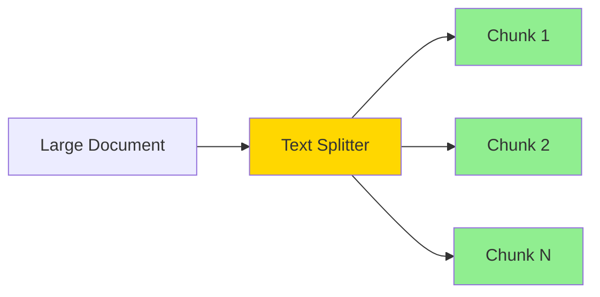

---

## Why Split Text?

### The Problem

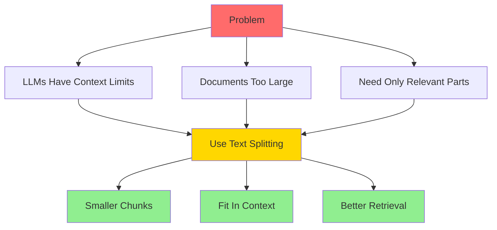

### Benefits

| Without Splitting | With Splitting |
|-------------------|----------------|
| ❌ Exceeds context window | ✅ Fits in context |
| ❌ Can't process large docs | ✅ Process any size |
| ❌ Poor retrieval precision | ✅ Precise retrieval |
| ❌ Lost in middle problem | ✅ Focused content |
| ❌ High token costs | ✅ Only relevant chunks |

---

## Architecture Overview

### Text Splitting Pipeline

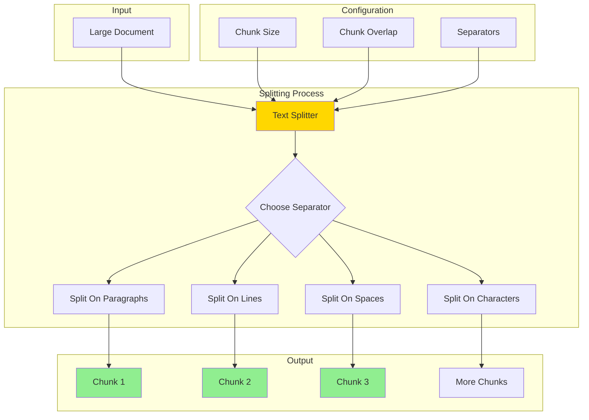

### Chunk Overlap Visualization

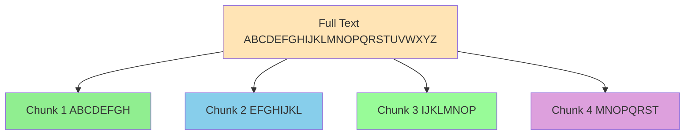

**Overlap ensures continuity between chunks!**

---

## Splitter Types

### By Strategy

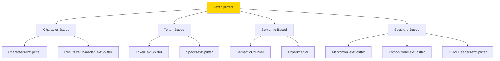

---

## Basic Splitters

### 1. Character Text Splitter

**Split by character count with simple separator**

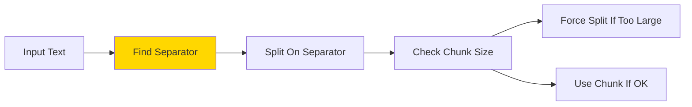

**Example:**
```python
from langchain.text_splitter import CharacterTextSplitter

text = """
This is a long document.
It has multiple paragraphs.

This is the second paragraph.
With more information.

And a third paragraph.
"""

splitter = CharacterTextSplitter(
    separator="\n\n",      # Split on double newline
    chunk_size=100,        # Max characters per chunk
    chunk_overlap=20,      # Overlap between chunks
    length_function=len,   # How to measure length
)

chunks = splitter.split_text(text)

for i, chunk in enumerate(chunks):
    print(f"Chunk {i}: {chunk}")
```

**File:** `1.Basic/1_character_splitter.py`

---

### 2. Recursive Character Text Splitter ⭐ RECOMMENDED

**Tries multiple separators hierarchically**

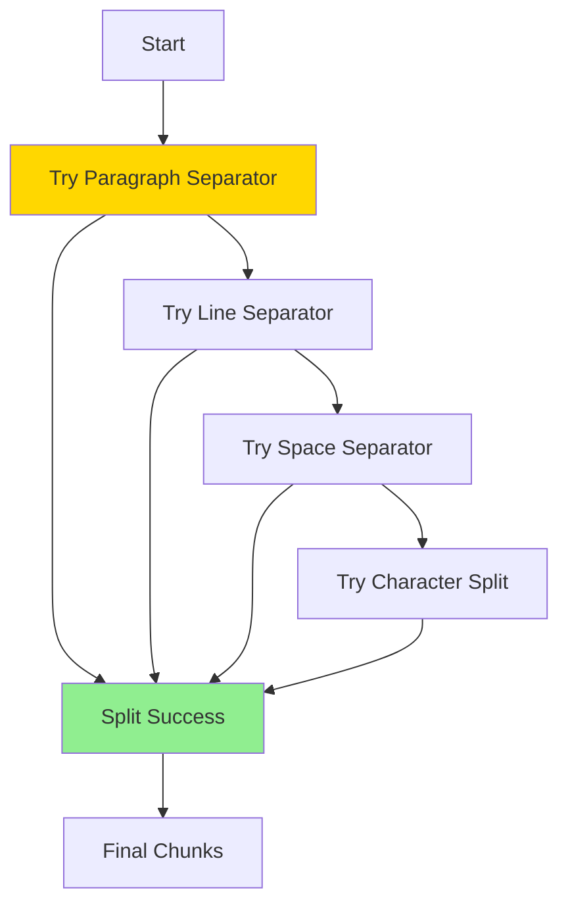

**Example:**
```python
from langchain.text_splitter import RecursiveCharacterTextSplitter

text = "Your long document here..."

splitter = RecursiveCharacterTextSplitter(
    chunk_size=1000,
    chunk_overlap=200,
    length_function=len,
    separators=[
        "\n\n",  # Try paragraphs first
        "\n",    # Then lines
        " ",     # Then words
        ""       # Finally characters
    ]
)

chunks = splitter.split_text(text)
```

**Why Recursive is Better:**
```
CharacterTextSplitter:
- Uses ONE separator only
- May break in middle of sentence

RecursiveCharacterTextSplitter:
- Tries MULTIPLE separators
- Preserves natural boundaries
- More intelligent splitting
```

**File:** `1.Basic/2_recursive_splitter.py`

---

### 3. Token Text Splitter

**Split by token count (important for LLMs)**

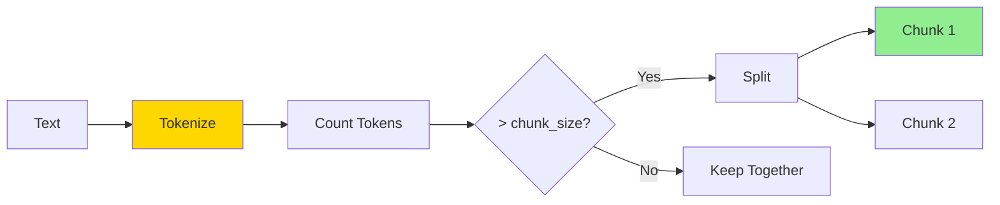

**Example:**
```python
from langchain.text_splitter import TokenTextSplitter

# Using tiktoken (OpenAI tokenizer)
splitter = TokenTextSplitter(
    chunk_size=100,      # 100 tokens per chunk
    chunk_overlap=20     # 20 token overlap
)

text = "Your document here..."
chunks = splitter.split_text(text)

# Each chunk is ~100 tokens
for chunk in chunks:
    print(f"Chunk length: {len(chunk.split())} words")
```

**Token vs Character:**
```
"Hello world!" 
Characters: 12
Tokens: 2-3 (depending on tokenizer)

Important: LLMs count tokens, not characters!
```

**File:** `1.Basic/3_token_splitter.py`

---

## Intermediate Splitters

### 1. Language-Specific Splitters

**Split code by language syntax**

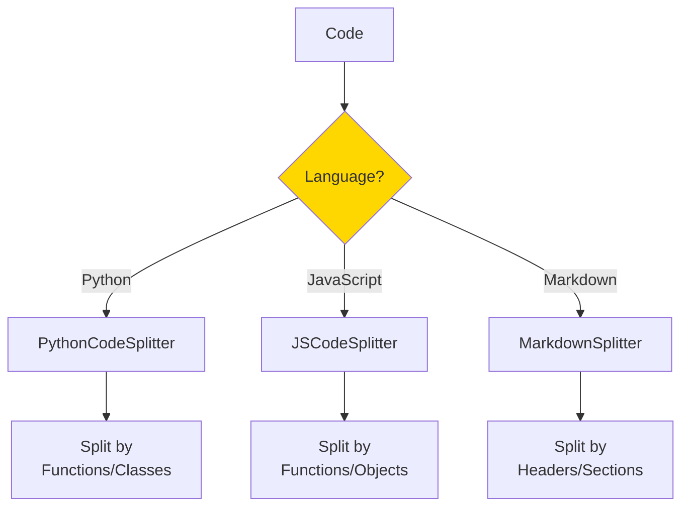

**Python Example:**
```python
from langchain.text_splitter import PythonCodeTextSplitter

python_code = """
def function1():
    print("Hello")
    return True

class MyClass:
    def method1(self):
        pass
    
    def method2(self):
        pass

def function2():
    return "World"
"""

splitter = PythonCodeTextSplitter(
    chunk_size=200,
    chunk_overlap=0
)

chunks = splitter.split_text(python_code)

# Output preserves function/class boundaries
for i, chunk in enumerate(chunks):
    print(f"\n--- Chunk {i} ---")
    print(chunk)
```

**Supported Languages:**
- Python
- JavaScript/TypeScript
- Java
- C/C++
- Go
- Ruby
- Rust
- And more!

**File:** `2.Intermediate/1_code_splitter.py`

---

### 2. Markdown Text Splitter

**Split by markdown structure**

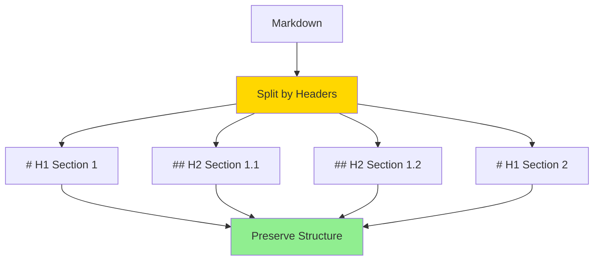

**Example:**
```python
from langchain.text_splitter import MarkdownTextSplitter

markdown_text = """
# Introduction

This is the introduction section.

## Background

Some background information here.

## Motivation

Why this project exists.

# Methods

## Approach 1

Details about approach 1.

## Approach 2

Details about approach 2.
"""

splitter = MarkdownTextSplitter(
    chunk_size=500,
    chunk_overlap=0
)

chunks = splitter.split_text(markdown_text)

# Splits at header boundaries
for chunk in chunks:
    print(chunk)
    print("---")
```

**File:** `2.Intermediate/2_markdown_splitter.py`

---

### 3. HTML Header Text Splitter

**Split HTML by header tags**

```python
from langchain.text_splitter import HTMLHeaderTextSplitter

html_string = """
<!DOCTYPE html>
<html>
<body>
    <h1>Main Title</h1>
    <p>Introduction paragraph</p>
    
    <h2>Section 1</h2>
    <p>Section 1 content</p>
    
    <h2>Section 2</h2>
    <p>Section 2 content</p>
</body>
</html>
"""

headers_to_split_on = [
    ("h1", "Header 1"),
    ("h2", "Header 2"),
    ("h3", "Header 3"),
]

splitter = HTMLHeaderTextSplitter(
    headers_to_split_on=headers_to_split_on
)

splits = splitter.split_text(html_string)
```

**File:** `2.Intermediate/3_html_splitter.py`

---

### 4. Semantic Chunker (Experimental)

**Split by semantic similarity**

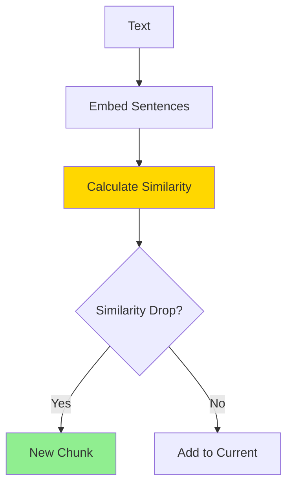

**Example:**
```python
from langchain_experimental.text_splitter import SemanticChunker
from langchain_openai import OpenAIEmbeddings

text = """
Machine learning is a subset of AI. It focuses on data and algorithms.

The weather today is sunny. Temperature is around 75 degrees.

Neural networks have multiple layers. Each layer transforms the input.
"""

splitter = SemanticChunker(
    embeddings=OpenAIEmbeddings(),
    breakpoint_threshold_type="percentile"
)

chunks = splitter.split_text(text)

# Groups semantically similar sentences
# Chunk 1: ML sentences
# Chunk 2: Weather sentences  
# Chunk 3: Neural network sentences
```

**File:** `2.Intermediate/4_semantic_splitter.py`

---

## Advanced Splitters

### 1. Custom Splitter

**Build your own splitting logic**

```python
from langchain.text_splitter import TextSplitter
from typing import List

class CustomSplitter(TextSplitter):
    """Custom text splitter with your own logic."""
    
    def __init__(
        self,
        chunk_size: int = 1000,
        chunk_overlap: int = 200,
        **kwargs
    ):
        super().__init__(**kwargs)
        self._chunk_size = chunk_size
        self._chunk_overlap = chunk_overlap
    
    def split_text(self, text: str) -> List[str]:
        """Split text using custom logic."""
        chunks = []
        
        # Your custom splitting logic here
        # Example: Split by custom delimiter
        sections = text.split("---SECTION---")
        
        for section in sections:
            if len(section) > self._chunk_size:
                # Further split large sections
                sub_chunks = self._split_large_section(section)
                chunks.extend(sub_chunks)
            else:
                chunks.append(section)
        
        return chunks
    
    def _split_large_section(self, text: str) -> List[str]:
        """Split large sections."""
        # Implement your logic
        pass

# Usage
splitter = CustomSplitter(chunk_size=500)
chunks = splitter.split_text(text)
```

**File:** `3.Advanced/1_custom_splitter.py`

---

### 2. Context-Aware Splitting

**Add context to each chunk**

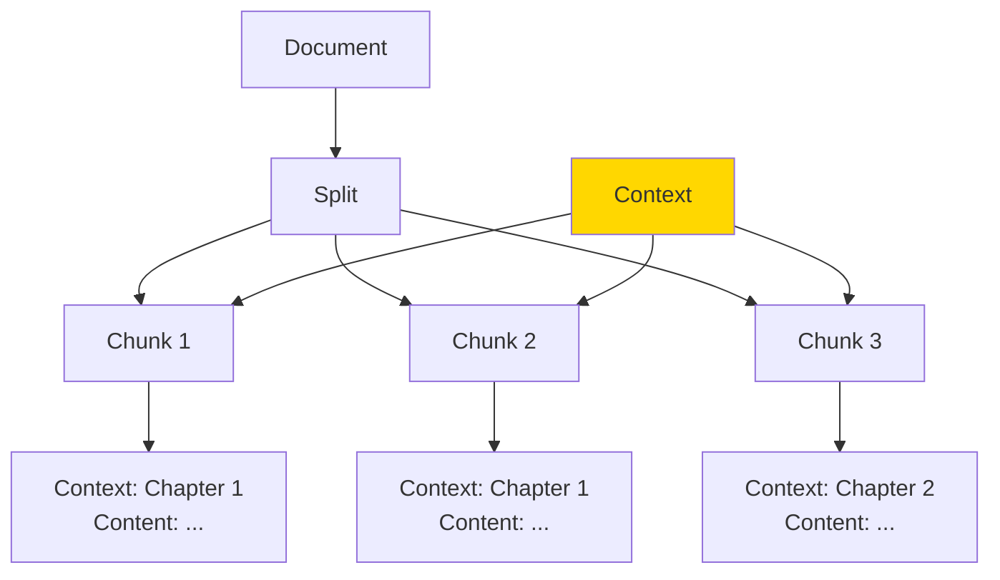

**Example:**
```python
from langchain.text_splitter import RecursiveCharacterTextSplitter

def split_with_context(document, context_info):
    """Split document and add context to each chunk."""
    
    splitter = RecursiveCharacterTextSplitter(
        chunk_size=1000,
        chunk_overlap=200
    )
    
    chunks = splitter.split_text(document)
    
    # Add context to each chunk
    chunks_with_context = [
        f"Context: {context_info}\n\n{chunk}"
        for chunk in chunks
    ]
    
    return chunks_with_context

# Usage
document = "Your long document..."
context = "Chapter 3: Machine Learning Basics"

chunks = split_with_context(document, context)
```

**File:** `3.Advanced/2_context_aware_splitting.py`

---

### 3. Multi-Level Splitting

**Split at multiple granularities**

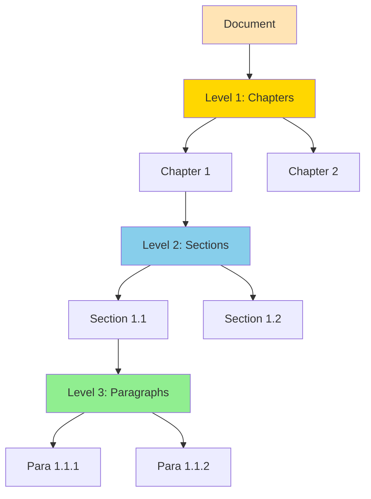

**File:** `3.Advanced/3_multi_level_splitting.py`

---

## Best Practices

### 1. Choosing Chunk Size

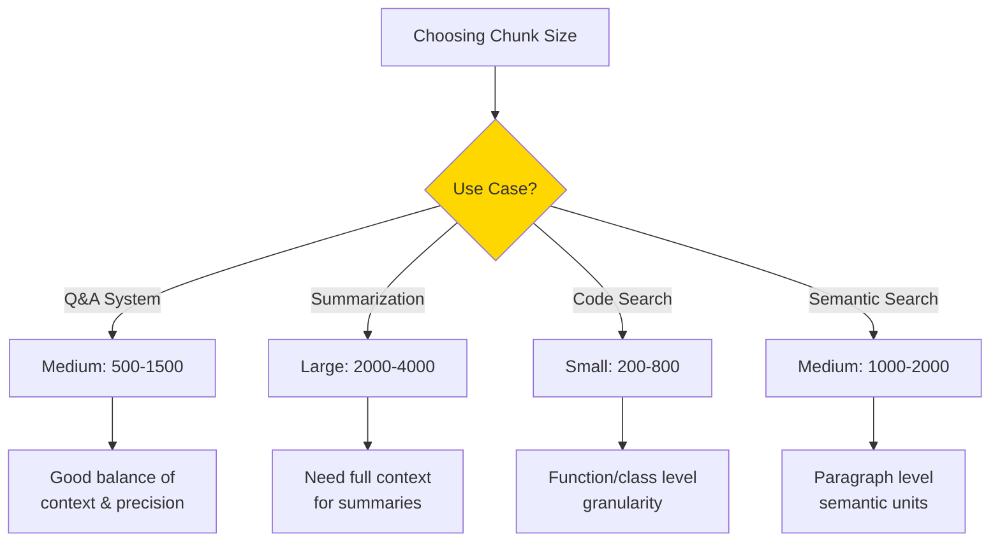

**Guidelines:**

| Use Case | Chunk Size | Overlap | Rationale |
|----------|------------|---------|-----------|
| **General Q&A** | 1000-1500 | 200 | Balanced context |
| **Code Documentation** | 500-1000 | 100 | Function-level |
| **Long-form Content** | 1500-2000 | 300 | Preserve narrative |
| **Product Descriptions** | 300-500 | 50 | Self-contained |
| **Academic Papers** | 1000-1500 | 200 | Paragraph-level |
| **Legal Documents** | 1200-1800 | 250 | Clause context |

---

### 2. Overlap Strategy

```python
# Too Little Overlap (< 5%)
chunk_size = 1000
chunk_overlap = 50
# Risk: Lost context at boundaries

# Good Overlap (10-20%)
chunk_size = 1000
chunk_overlap = 150
# ✅ Ensures continuity

# Too Much Overlap (> 30%)
chunk_size = 1000
chunk_overlap = 400
# Wasteful: Redundant content
```

**Visualization:**
```
No Overlap:
[Chunk 1: ABCDEF] [Chunk 2: GHIJKL]
❌ Breaks mid-thought

Good Overlap:
[Chunk 1: ABCDEF] [Chunk 2: DEFGHI]
✅ Smooth transition

Too Much Overlap:
[Chunk 1: ABCDEF] [Chunk 2: CDEFGH]
❌ Too redundant
```

---

### 3. Document-Specific Strategies

```python
from langchain.text_splitter import (
    RecursiveCharacterTextSplitter,
    PythonCodeTextSplitter,
    MarkdownTextSplitter
)

def get_splitter_for_doc(file_path):
    """Choose splitter based on file type."""
    
    if file_path.endswith('.py'):
        return PythonCodeTextSplitter(
            chunk_size=800,
            chunk_overlap=100
        )
    
    elif file_path.endswith('.md'):
        return MarkdownTextSplitter(
            chunk_size=1000,
            chunk_overlap=0  # Markdown has natural boundaries
        )
    
    else:
        return RecursiveCharacterTextSplitter(
            chunk_size=1000,
            chunk_overlap=200
        )

# Usage
splitter = get_splitter_for_doc("document.py")
chunks = splitter.split_text(text)
```

---

### 4. Testing Your Splits

```python
def analyze_chunks(chunks):
    """Analyze chunk quality."""
    
    print(f"Total chunks: {len(chunks)}")
    print(f"Average size: {sum(len(c) for c in chunks) / len(chunks):.0f} chars")
    print(f"Min size: {min(len(c) for c in chunks)}")
    print(f"Max size: {max(len(c) for c in chunks)}")
    
    # Check for very small chunks (may indicate issues)
    small_chunks = [c for c in chunks if len(c) < 100]
    if small_chunks:
        print(f"\n⚠️  Warning: {len(small_chunks)} chunks are < 100 chars")
    
    # Sample a chunk
    print(f"\nSample chunk:\n{chunks[0][:200]}...")

# Usage
analyze_chunks(chunks)
```

---

## Comparison Guide

### Splitter Comparison

| Splitter | Best For | Speed | Quality | Complexity |
|----------|----------|-------|---------|------------|
| **Character** | Simple text | ⚡⚡⚡ | ⭐⭐ | 🔧 |
| **Recursive** | General purpose | ⚡⚡⚡ | ⭐⭐⭐⭐ | 🔧 |
| **Token** | LLM compatibility | ⚡⚡ | ⭐⭐⭐⭐ | 🔧 |
| **Code** | Programming code | ⚡⚡ | ⭐⭐⭐⭐⭐ | 🔧🔧 |
| **Markdown** | Documentation | ⚡⚡⚡ | ⭐⭐⭐⭐ | 🔧 |
| **Semantic** | Meaning-based | ⚡ | ⭐⭐⭐⭐⭐ | 🔧🔧🔧 |
| **Custom** | Special needs | Varies | Varies | 🔧🔧🔧 |

---

## Common Patterns

### Pattern 1: Standard Pipeline

```python
from langchain.text_splitter import RecursiveCharacterTextSplitter
from langchain_community.document_loaders import TextLoader

# Load
loader = TextLoader("document.txt")
documents = loader.load()

# Split
splitter = RecursiveCharacterTextSplitter(
    chunk_size=1000,
    chunk_overlap=200
)

chunks = splitter.split_documents(documents)
```

---

### Pattern 2: Multi-Format Handling

```python
def smart_split(file_path, content):
    """Intelligently split based on content type."""
    
    if file_path.endswith('.py'):
        splitter = PythonCodeTextSplitter(chunk_size=800)
    elif file_path.endswith('.md'):
        splitter = MarkdownTextSplitter(chunk_size=1000)
    else:
        splitter = RecursiveCharacterTextSplitter(chunk_size=1000)
    
    return splitter.split_text(content)
```

---

### Pattern 3: Preserve Metadata

```python
from langchain.text_splitter import RecursiveCharacterTextSplitter

splitter = RecursiveCharacterTextSplitter(chunk_size=1000)

# split_documents preserves metadata from original docs
chunks = splitter.split_documents(documents)

# Each chunk has original metadata + chunk info
for chunk in chunks:
    print(chunk.metadata)
    # Output: {
    #     "source": "document.pdf",
    #     "page": 1,
    #     "chunk": 0  # Added by splitter
    # }
```

---

## Troubleshooting

| Issue | Cause | Solution |
|-------|-------|----------|
| **Chunks too large** | chunk_size too high | Reduce chunk_size |
| **Context loss** | No overlap | Add 10-20% overlap |
| **Broken sentences** | Wrong separator | Use RecursiveCharacterTextSplitter |
| **Too many chunks** | chunk_size too small | Increase chunk_size |
| **Poor retrieval** | Bad boundaries | Use semantic or structure-aware splitter |

---

## Next Steps

After mastering Text Splitters:

1. **Embeddings** - Convert chunks to vectors
2. **Vector Stores** - Store embeddings
3. **Retrievers** - Query chunks
4. **RAG Systems** - Complete pipeline

---

## 🎯 Summary

**Key Takeaways:**

1. **Text splitting is essential for RAG systems**
2. **RecursiveCharacterTextSplitter is the best general-purpose splitter**
3. **Chunk size depends on use case (typically 1000-1500 chars)**
4. **Always use 10-20% overlap**
5. **Use language-specific splitters for code**
6. **Test your splits before production**

**Common Pipeline:**
```
Load → Split → Embed → Store → Retrieve
```

---

**Happy Splitting! 🚀**

Remember: Good chunking is critical for retrieval quality!

