# Vector Stores - Complete Guide

> **Store and search embeddings** - Chroma, Pinecone, FAISS, Weaviate, and more

## 📚 Table of Contents

1. [What are Vector Stores?](#what-are-vector-stores)
2. [How Vector Stores Work](#how-vector-stores-work)
3. [Architecture Overview](#architecture-overview)
4. [Vector Store Types](#vector-store-types)
5. [Basic Vector Stores](#basic-vector-stores)
6. [Intermediate Vector Stores](#intermediate-vector-stores)
7. [Advanced Vector Stores](#advanced-vector-stores)
8. [Best Practices](#best-practices)
9. [Comparison Guide](#comparison-guide)

---

## What are Vector Stores?

Vector Stores (Vector Databases) store high-dimensional vectors (embeddings) and enable fast similarity search.

```mermaid
graph LR
    A[Text:<br/>"machine learning"] --> B[Embedding Model]
    B --> C[Vector:<br/>[0.2, 0.8, ...]]
    C --> D[Vector Store]
    D --> E[Similarity Search]
    
    style D fill:#FFD700
    style E fill:#90EE90
```

**Key Concept:**
- Traditional DB: Searches exact keywords
- Vector DB: Searches by meaning/similarity

---

## How Vector Stores Work

### Traditional vs Vector Search

```mermaid
graph TB
    subgraph "Traditional Database"
        A1[Query: "ML"] --> B1[Exact Match]
        B1 --> C1["Find 'ML'"]
        C1 --> D1[Limited Results]
    end
    
    subgraph "Vector Database"
        A2[Query: "ML"] --> B2[Convert to Vector]
        B2 --> C2[Similarity Search]
        C2 --> D2["Finds: ML, Machine Learning,<br/>AI, Deep Learning, etc."]
    end
    
    style C2 fill:#FFD700
    style D2 fill:#90EE90
```

### Similarity Search Process

```mermaid
graph TB
    A[Query Text] --> B[Embed Query]
    B --> C[Query Vector:<br/>[0.1, 0.9, 0.3, ...]]
    
    D[Vector Store] --> E[Stored Vectors:<br/>Doc1: [0.2, 0.8, 0.4, ...]<br/>Doc2: [0.7, 0.3, 0.1, ...]<br/>Doc3: [0.1, 0.9, 0.3, ...]]
    
    C --> F[Calculate Similarity]
    E --> F
    
    F --> G[Cosine Similarity]
    G --> H[Doc3: 0.99 ✅<br/>Doc1: 0.85<br/>Doc2: 0.34]
    
    H --> I[Return Top K<br/>Most Similar]
    
    style F fill:#FFD700
    style I fill:#90EE90
```

### Cosine Similarity Explained


**Formula:**
```
similarity = (A · B) / (||A|| × ||B||)

Where:
- A · B = dot product
- ||A|| = magnitude of A
- Result: -1 to 1 (usually 0 to 1 for embeddings)
```

---

## Architecture Overview

### Complete Vector Store Pipeline


---

## Vector Store Types

### By Deployment


### Comparison Matrix

| Vector Store | Type | Cost | Speed | Scale | Features |
|--------------|------|------|-------|-------|----------|
| **Chroma** | Local | Free | ⚡⚡⚡ | Small-Medium | Easy, good for dev |
| **FAISS** | Local | Free | ⚡⚡⚡ | Medium-Large | Fast, Facebook |
| **Pinecone** | Cloud | 💰💰 | ⚡⚡⚡ | Large | Managed, scalable |
| **Weaviate** | Both | Free/💰 | ⚡⚡ | Large | GraphQL, flexible |
| **Qdrant** | Both | Free/💰 | ⚡⚡⚡ | Large | Fast, Rust-based |
| **Milvus** | Self-hosted | Free | ⚡⚡ | Very Large | Enterprise scale |

---

## Basic Vector Stores

### 1. Chroma (Recommended for Beginners)

**Local, easy to use, perfect for development**


**Example:**
```python
from langchain_community.vectorstores import Chroma
from langchain_openai import OpenAIEmbeddings
from langchain.schema import Document

# Create documents
documents = [
    Document(page_content="Python is a programming language"),
    Document(page_content="Machine learning uses data"),
    Document(page_content="Neural networks have layers")
]

# Create embeddings
embeddings = OpenAIEmbeddings()

# Create vector store
vectorstore = Chroma.from_documents(
    documents=documents,
    embedding=embeddings,
    collection_name="my_collection",
    persist_directory="./chroma_db"  # Save to disk
)

# Similarity search
query = "What is Python?"
results = vectorstore.similarity_search(query, k=2)

for doc in results:
    print(doc.page_content)

# Persist
vectorstore.persist()
```

**Features:**
- ✅ Free and open-source
- ✅ Runs locally
- ✅ Easy setup
- ✅ Good for development
- ✅ Persistent storage

**File:** `1.Basic/1_chroma.py`

---

### 2. FAISS (Facebook AI Similarity Search)

**Fast, efficient, great for production**


**Example:**
```python
from langchain_community.vectorstores import FAISS
from langchain_openai import OpenAIEmbeddings

# Create vector store
embeddings = OpenAIEmbeddings()
vectorstore = FAISS.from_documents(documents, embeddings)

# Search
results = vectorstore.similarity_search("machine learning", k=3)

# Save to disk
vectorstore.save_local("faiss_index")

# Load from disk
new_vectorstore = FAISS.load_local(
    "faiss_index",
    embeddings,
    allow_dangerous_deserialization=True
)
```

**Features:**
- ✅ Extremely fast
- ✅ Memory efficient
- ✅ Multiple index types
- ✅ Good for large datasets
- ✅ No external dependencies

**File:** `1.Basic/2_faiss.py`

---

### 3. In-Memory Vector Store

**Simple, for testing/prototyping**

```python
from langchain_community.vectorstores import InMemoryVectorStore
from langchain_openai import OpenAIEmbeddings

embeddings = OpenAIEmbeddings()

# Create in-memory store
vectorstore = InMemoryVectorStore(embeddings)

# Add documents
vectorstore.add_documents(documents)

# Search
results = vectorstore.similarity_search("query")
```

**Use Case:** Testing, prototypes, small datasets

**File:** `1.Basic/3_inmemory.py`

---

## Intermediate Vector Stores

### 1. Pinecone (Cloud Vector Database)

**Managed, scalable, production-ready**


**Example:**
```python
from langchain_community.vectorstores import Pinecone as LangChainPinecone
from langchain_openai import OpenAIEmbeddings
import pinecone

# Initialize Pinecone
pinecone.init(
    api_key="your-api-key",
    environment="us-west1-gcp"
)

# Create or connect to index
index_name = "my-index"
if index_name not in pinecone.list_indexes():
    pinecone.create_index(
        name=index_name,
        dimension=1536,  # OpenAI embedding dimension
        metric="cosine"
    )

# Create vector store
embeddings = OpenAIEmbeddings()
vectorstore = LangChainPinecone.from_documents(
    documents,
    embeddings,
    index_name=index_name
)

# Search
results = vectorstore.similarity_search("machine learning", k=5)
```

**Features:**
- ✅ Fully managed
- ✅ Auto-scaling
- ✅ High availability
- ✅ Real-time updates
- ✅ Production-ready

**Pricing:** Free tier available, then paid

**File:** `2.Intermediate/1_pinecone.py`

---

### 2. Weaviate

**Open-source, GraphQL API, flexible**


**Example:**
```python
from langchain_community.vectorstores import Weaviate
from langchain_openai import OpenAIEmbeddings
import weaviate

# Connect to Weaviate
client = weaviate.Client(
    url="http://localhost:8080",
    auth_client_secret=weaviate.AuthApiKey("your-api-key")
)

# Create vector store
embeddings = OpenAIEmbeddings()
vectorstore = Weaviate.from_documents(
    documents,
    embeddings,
    client=client,
    index_name="MyIndex",
    text_key="text"
)

# Search with metadata filtering
results = vectorstore.similarity_search(
    "machine learning",
    k=3,
    where_filter={
        "path": ["category"],
        "operator": "Equal",
        "valueString": "AI"
    }
)
```

**Features:**
- ✅ GraphQL API
- ✅ Metadata filtering
- ✅ Cloud or self-hosted
- ✅ Vector + graph database
- ✅ Modular architecture

**File:** `2.Intermediate/2_weaviate.py`

---

### 3. Qdrant

**Fast, Rust-based, modern**

```python
from langchain_community.vectorstores import Qdrant
from langchain_openai import OpenAIEmbeddings

# In-memory mode
vectorstore = Qdrant.from_documents(
    documents,
    OpenAIEmbeddings(),
    location=":memory:",
    collection_name="my_documents"
)

# Or connect to Qdrant server
vectorstore = Qdrant.from_documents(
    documents,
    OpenAIEmbeddings(),
    url="http://localhost:6333",
    collection_name="my_documents"
)

# Search
results = vectorstore.similarity_search("query", k=5)
```

**Features:**
- ✅ Very fast (Rust)
- ✅ Rich filtering
- ✅ Multiple distance metrics
- ✅ Cloud or self-hosted
- ✅ Great documentation

**File:** `2.Intermediate/3_qdrant.py`

---

## Advanced Vector Stores

### 1. Hybrid Search (Vector + Keyword)

**Combine vector similarity with keyword matching**


**Example:**
```python
# Weaviate supports hybrid search
results = vectorstore.similarity_search(
    "machine learning",
    search_type="hybrid",  # Vector + keyword
    k=5,
    alpha=0.5  # 0.5 = balanced, 0 = pure keyword, 1 = pure vector
)
```

**File:** `3.Advanced/1_hybrid_search.py`

---

### 2. Metadata Filtering

**Filter by metadata before/during search**


**Example:**
```python
# Add documents with metadata
documents = [
    Document(
        page_content="Python tutorial",
        metadata={"category": "programming", "level": "beginner", "year": 2024}
    ),
    Document(
        page_content="Advanced Python",
        metadata={"category": "programming", "level": "advanced", "year": 2024}
    ),
    Document(
        page_content="ML basics",
        metadata={"category": "AI", "level": "beginner", "year": 2023}
    )
]

vectorstore = Chroma.from_documents(documents, embeddings)

# Search with metadata filter
results = vectorstore.similarity_search(
    "Python",
    k=5,
    filter={"category": "programming", "level": "beginner"}
)

# Only returns beginner programming documents
```

**File:** `3.Advanced/2_metadata_filtering.py`

---

### 3. Maximum Marginal Relevance (MMR)

**Balance relevance with diversity**


**Example:**
```python
# Regular similarity search (may return similar results)
results = vectorstore.similarity_search("machine learning", k=5)
# Might return 5 very similar ML docs

# MMR search (diverse results)
results = vectorstore.max_marginal_relevance_search(
    "machine learning",
    k=5,                    # Number of results
    fetch_k=20,            # Initial candidates
    lambda_mult=0.5        # 0 = max diversity, 1 = max relevance
)
# Returns diverse ML-related docs
```

**Use Case:** When you want variety in results

**File:** `3.Advanced/3_mmr_search.py`

---

### 4. Similarity Score Threshold

**Only return results above confidence threshold**

```python
# Return only high-confidence matches
results = vectorstore.similarity_search_with_score(
    "machine learning",
    k=10,
    score_threshold=0.8  # Only results with score > 0.8
)

for doc, score in results:
    print(f"Score: {score:.2f} - {doc.page_content}")
```

**File:** `3.Advanced/4_score_threshold.py`

---

### 5. Multi-Vector Store

**Search across multiple vector stores**


**File:** `3.Advanced/5_multi_store.py`

---

## Best Practices

### 1. Choosing a Vector Store


**Decision Matrix:**

| Requirement | Recommended | Why |
|-------------|-------------|-----|
| **Just learning** | Chroma | Easy setup, free |
| **Local development** | FAISS or Chroma | No API keys needed |
| **Small production** | FAISS | Fast, reliable |
| **Growing production** | Qdrant or Pinecone | Scalable |
| **Enterprise** | Weaviate or Milvus | Full features |
| **Budget conscious** | Chroma or FAISS | Free |
| **Need managed service** | Pinecone | Fully managed |

---

### 2. Embedding Model Selection

**Vector store performance depends heavily on embeddings!**


| Model | Dimensions | Quality | Speed | Cost |
|-------|------------|---------|-------|------|
| **OpenAI text-embedding-3-large** | 3072 | ⭐⭐⭐⭐⭐ | ⚡⚡ | 💰💰 |
| **OpenAI text-embedding-3-small** | 1536 | ⭐⭐⭐⭐ | ⚡⚡⚡ | 💰 |
| **HuggingFace all-MiniLM-L6-v2** | 384 | ⭐⭐⭐ | ⚡⚡⚡ | Free |
| **Cohere embed-english-v3** | 1024 | ⭐⭐⭐⭐ | ⚡⚡ | 💰 |

---

### 3. Index Configuration

```python
# Optimize for different use cases

# Small dataset (< 10K docs)
vectorstore = FAISS.from_documents(
    documents,
    embeddings,
    distance_strategy="COSINE"
)

# Large dataset (> 100K docs)
import faiss

# Use IVF (Inverted File Index) for speed
index = faiss.IndexIVFFlat(
    embeddings_dimension,
    nlist=100  # Number of clusters
)

# Medium dataset with accuracy priority
index = faiss.IndexHNSWFlat(
    embeddings_dimension,
    M=32  # Connections per element
)
```

---

### 4. Batch Operations

```python
# ❌ Slow: One at a time
for doc in documents:
    vectorstore.add_documents([doc])

# ✅ Fast: Batch insert
vectorstore.add_documents(documents, batch_size=100)
```

---

### 5. Memory Management

```python
from langchain_community.vectorstores import Chroma

# For large datasets, use persistent storage
vectorstore = Chroma(
    persist_directory="./chroma_db",
    embedding_function=embeddings,
    collection_metadata={"hnsw:space": "cosine"}
)

# Add in batches to avoid memory issues
batch_size = 1000
for i in range(0, len(documents), batch_size):
    batch = documents[i:i+batch_size]
    vectorstore.add_documents(batch)
    vectorstore.persist()  # Save after each batch
```

---

### 6. Monitoring & Debugging

```python
def analyze_vectorstore(vectorstore, query):
    """Analyze vector store search results."""
    
    # Get results with scores
    results = vectorstore.similarity_search_with_score(query, k=10)
    
    print(f"Query: {query}\n")
    print(f"Total results: {len(results)}\n")
    
    for i, (doc, score) in enumerate(results, 1):
        print(f"{i}. Score: {score:.4f}")
        print(f"   Content: {doc.page_content[:100]}...")
        print(f"   Metadata: {doc.metadata}\n")
    
    # Score distribution
    scores = [score for _, score in results]
    print(f"Score range: {min(scores):.4f} to {max(scores):.4f}")
    print(f"Average score: {sum(scores)/len(scores):.4f}")

# Usage
analyze_vectorstore(vectorstore, "machine learning")
```

---

## Comparison Guide

### Performance Benchmarks

```mermaid
graph TB
    A[Performance Metrics] --> B[Speed]
    A --> C[Accuracy]
    A --> D[Scalability]
    
    B --> B1[FAISS: ⚡⚡⚡⚡⚡]
    B --> B2[Chroma: ⚡⚡⚡⚡]
    B --> B3[Pinecone: ⚡⚡⚡⚡]
    
    C --> C1[All: ⭐⭐⭐⭐<br/>depends on embeddings]
    
    D --> D1[Pinecone: Best]
    D --> D2[Milvus: Excellent]
    D --> D3[FAISS: Limited]
    
    style A fill:#FFD700
```



### Feature Comparison

| Feature | Chroma | FAISS | Pinecone | Weaviate | Qdrant |
|---------|--------|-------|----------|----------|---------|
| **Local** | ✅ | ✅ | ❌ | ✅ | ✅ |
| **Cloud** | ❌ | ❌ | ✅ | ✅ | ✅ |
| **Free** | ✅ | ✅ | Limited | ✅ | ✅ |
| **Metadata Filter** | ✅ | ❌ | ✅ | ✅ | ✅ |
| **Hybrid Search** | ❌ | ❌ | ❌ | ✅ | ✅ |
| **Real-time Updates** | ✅ | ✅ | ✅ | ✅ | ✅ |
| **Persistence** | ✅ | ✅ | ✅ | ✅ | ✅ |
| **Scalability** | Medium | High | Very High | Very High | Very High |

---

## Common Patterns

### Pattern 1: Development to Production

```python
# Development (Chroma)
from langchain_community.vectorstores import Chroma

dev_vectorstore = Chroma.from_documents(
    documents,
    embeddings,
    persist_directory="./dev_db"
)

# Production (Pinecone)
from langchain_community.vectorstores import Pinecone

prod_vectorstore = Pinecone.from_documents(
    documents,
    embeddings,
    index_name="production-index"
)
```

---

### Pattern 2: Multi-Tenant

```python
# Separate collection per tenant
def get_tenant_vectorstore(tenant_id):
    """Get vector store for specific tenant."""
    return Chroma(
        collection_name=f"tenant_{tenant_id}",
        embedding_function=embeddings,
        persist_directory=f"./db/tenant_{tenant_id}"
    )

# Usage
tenant1_store = get_tenant_vectorstore("company_a")
tenant2_store = get_tenant_vectorstore("company_b")
```

---

### Pattern 3: Version Control

```python
# Keep different versions of your knowledge base
vectorstore_v1 = Chroma(
    collection_name="knowledge_base_v1",
    persist_directory="./db"
)

vectorstore_v2 = Chroma(
    collection_name="knowledge_base_v2",
    persist_directory="./db"
)

# A/B test different versions
```

---

## Troubleshooting

| Issue | Cause | Solution |
|-------|-------|----------|
| **Slow search** | Too many vectors | Use better indexing (IVF, HNSW) |
| **Poor results** | Bad embeddings | Try different embedding model |
| **Out of memory** | Large dataset | Use persistent storage, batch operations |
| **Low similarity scores** | Mismatched embeddings | Ensure query uses same embedding model |
| **Duplicate results** | Same doc added multiple times | Deduplicate before adding |
| **Connection errors** | Wrong URL/credentials | Check configuration |

---

## Next Steps

After mastering Vector Stores:

1. **Retrievers** - Query your vector store
2. **RAG Chains** - Build Q&A systems
3. **Agents** - Add decision-making
4. **Production Deployment** - Scale your app

---

## 🎯 Summary

**Key Takeaways:**

1. **Vector stores enable semantic search**
2. **Choose based on your scale and budget**
3. **Chroma/FAISS for development**
4. **Pinecone/Weaviate/Qdrant for production**
5. **Embedding quality = Search quality**
6. **Use metadata filtering for precision**
7. **Batch operations for efficiency**

**Common Pipeline:**
```
Documents → Split → Embed → Vector Store → Search → Results
```

**Popular Choices:**
- **Learning:** Chroma
- **Local Production:** FAISS
- **Cloud Production:** Pinecone
- **Enterprise:** Weaviate or Milvus

---

**Happy Storing! 🚀**

Remember: The right vector store + good embeddings = excellent search results!

