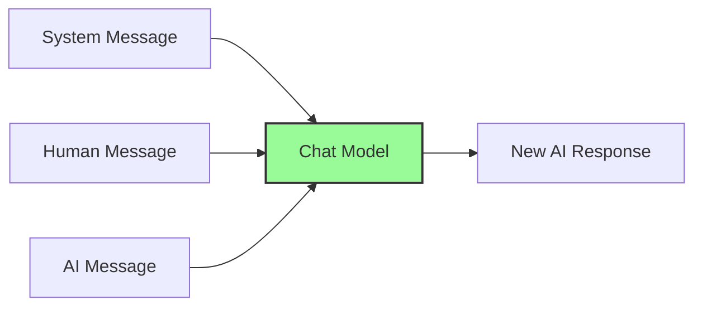
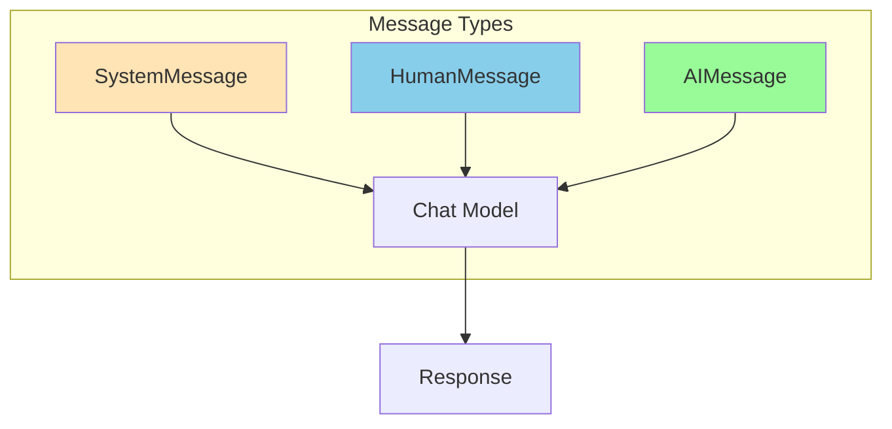

# Chat Models - Complete Guide

> **Conversational AI**: Build interactive chat applications with LangChain

## 📚 Table of Contents

1. [What are Chat Models?](#what-are-chat-models)
2. [Chat Models vs LLMs](#chat-models-vs-llms)
3. [Folder Structure](#folder-structure)
4. [Message Types](#message-types)
5. [Supported Providers](#supported-providers)
6. [Examples](#examples)
7. [Best Practices](#best-practices)

---

## What are Chat Models?

Chat Models are AI models optimized for conversational interactions. They understand context, maintain conversation history, and generate contextual responses.



### Key Features:
- **Message-based**: Work with structured message objects
- **Context-aware**: Understand conversation history
- **Role-based**: System, user, and assistant roles
- **Streaming**: Real-time response generation

---

## Chat Models vs LLMs

| Feature | LLMs | Chat Models |
|---------|------|-------------|
| **Input** | Plain text string | List of messages |
| **Output** | Text completion | Message object |
| **Context** | Manual handling | Built-in |
| **Roles** | None | System, Human, AI |
| **Use Case** | Text completion | Conversations |

```python
# LLM approach
response = llm.invoke("What is Python?")
# Just text completion

# Chat Model approach
from langchain_core.messages import HumanMessage, SystemMessage

messages = [
    SystemMessage(content="You are a Python expert."),
    HumanMessage(content="What is Python?")
]
response = chat.invoke(messages)
# Context-aware response
```

---

## Folder Structure

```
2.ChatModels/
├── openai_chatModel.py       # OpenAI ChatGPT
├── chatmodel_ollama.py       # Ollama local models
├── chatmodel_gemini.py       # Google Gemini
├── chatmodel_claude.py       # Anthropic Claude
├── chatmodel_huggingface.py  # HuggingFace models
├── chatmodel_llamacpp.py     # LlamaCpp local models
└── README.md                 # This file
```

---

## Message Types

LangChain uses different message types to structure conversations:



### 1. SystemMessage

Sets the AI's behavior and context:

```python
from langchain_core.messages import SystemMessage

system = SystemMessage(content="""
You are a helpful Python tutor.
- Explain concepts clearly
- Use simple examples
- Be encouraging
""")
```

### 2. HumanMessage

User's input/questions:

```python
from langchain_core.messages import HumanMessage

human = HumanMessage(content="How do I create a list in Python?")
```

### 3. AIMessage

Previous AI responses (for context):

```python
from langchain_core.messages import AIMessage

ai = AIMessage(content="To create a list, use square brackets: my_list = [1, 2, 3]")
```

### Complete Conversation Example

```python
from langchain_openai import ChatOpenAI
from langchain_core.messages import SystemMessage, HumanMessage, AIMessage

chat = ChatOpenAI(model="gpt-4o-mini")

messages = [
    SystemMessage(content="You are a helpful coding assistant."),
    HumanMessage(content="What is a function?"),
    AIMessage(content="A function is a reusable block of code..."),
    HumanMessage(content="Can you give me an example?")
]

response = chat.invoke(messages)
print(response.content)
```

---

## Supported Providers

### 1. OpenAI (`openai_chatModel.py`)

**Best for**: Production, high-quality responses

```python
from langchain_openai import ChatOpenAI
from langchain_core.messages import HumanMessage, SystemMessage
from dotenv import load_dotenv

load_dotenv()

chat = ChatOpenAI(
    model="gpt-4o-mini",
    temperature=0.7,
    max_tokens=500
)

messages = [
    SystemMessage(content="You are a helpful assistant."),
    HumanMessage(content="Hello! How are you?")
]

response = chat.invoke(messages)
print(response.content)
```

**Models:**
| Model | Context | Best For |
|-------|---------|----------|
| gpt-4o | 128K | Multimodal, complex tasks |
| gpt-4o-mini | 128K | Fast, affordable |
| gpt-4-turbo | 128K | High capability |
| gpt-3.5-turbo | 16K | Cost-effective |

---

### 2. Anthropic Claude (`chatmodel_claude.py`)

**Best for**: Long context, safety, reasoning

```python
from langchain_anthropic import ChatAnthropic
from langchain_core.messages import HumanMessage, SystemMessage

chat = ChatAnthropic(
    model="claude-3-sonnet-20240229",
    temperature=0.7
)

messages = [
    SystemMessage(content="You are a research assistant."),
    HumanMessage(content="Explain quantum computing.")
]

response = chat.invoke(messages)
print(response.content)
```

**Models:**
| Model | Context | Capability |
|-------|---------|------------|
| claude-3-opus | 200K | Highest quality |
| claude-3-sonnet | 200K | Balanced |
| claude-3-haiku | 200K | Fast, efficient |

---

### 3. Google Gemini (`chatmodel_gemini.py`)

**Best for**: Multimodal, Google integration

```python
from langchain_google_genai import ChatGoogleGenerativeAI
from langchain_core.messages import HumanMessage

chat = ChatGoogleGenerativeAI(
    model="gemini-pro",
    temperature=0.7
)

messages = [
    HumanMessage(content="What is machine learning?")
]

response = chat.invoke(messages)
print(response.content)
```

**Models:**
| Model | Features |
|-------|----------|
| gemini-pro | Text-based tasks |
| gemini-pro-vision | Text + images |

---

### 4. Ollama (`chatmodel_ollama.py`)

**Best for**: Local development, privacy, offline

```python
from langchain_community.chat_models import ChatOllama
from langchain_core.messages import HumanMessage, SystemMessage

# Requires Ollama running locally
chat = ChatOllama(
    model="mistral",
    temperature=0.7
)

messages = [
    SystemMessage(content="You are a coding assistant."),
    HumanMessage(content="Write a Python hello world.")
]

response = chat.invoke(messages)
print(response.content)
```

**Setup:**
```bash
# Install and run Ollama
curl -fsSL https://ollama.com/install.sh | sh
ollama pull mistral
ollama serve
```

**Popular Models:**
- `mistral` - Fast, general purpose
- `llama3` - Meta's latest
- `codellama` - Code-focused
- `phi3` - Compact, efficient

---

### 5. HuggingFace (`chatmodel_huggingface.py`)

**Best for**: Custom models, open-source

```python
from langchain_huggingface import ChatHuggingFace, HuggingFaceEndpoint

llm = HuggingFaceEndpoint(
    repo_id="HuggingFaceH4/zephyr-7b-beta",
    task="text-generation",
    max_new_tokens=512
)

chat = ChatHuggingFace(llm=llm)

messages = [
    HumanMessage(content="What is deep learning?")
]

response = chat.invoke(messages)
print(response.content)
```

---

## Examples

### Basic Conversation

```python
from langchain_openai import ChatOpenAI
from langchain_core.messages import HumanMessage, SystemMessage

chat = ChatOpenAI(model="gpt-4o-mini")

# Simple question
response = chat.invoke([
    HumanMessage(content="What is Python?")
])
print(response.content)
```

### Multi-turn Conversation

```python
from langchain_openai import ChatOpenAI
from langchain_core.messages import HumanMessage, SystemMessage, AIMessage

chat = ChatOpenAI(model="gpt-4o-mini")

# Build conversation history
history = [
    SystemMessage(content="You are a helpful tutor."),
    HumanMessage(content="What is a variable?"),
    AIMessage(content="A variable is a named container for storing data."),
    HumanMessage(content="Give me an example in Python.")
]

response = chat.invoke(history)
print(response.content)
```

### Streaming Responses

```python
from langchain_openai import ChatOpenAI
from langchain_core.messages import HumanMessage

chat = ChatOpenAI(model="gpt-4o-mini", streaming=True)

for chunk in chat.stream([HumanMessage(content="Tell me a story")]):
    print(chunk.content, end="", flush=True)
```

### With ChatPromptTemplate

```python
from langchain_openai import ChatOpenAI
from langchain_core.prompts import ChatPromptTemplate

chat = ChatOpenAI(model="gpt-4o-mini")

prompt = ChatPromptTemplate.from_messages([
    ("system", "You are a {role} who speaks {language}."),
    ("human", "{question}")
])

chain = prompt | chat

response = chain.invoke({
    "role": "teacher",
    "language": "simple English",
    "question": "What is gravity?"
})
print(response.content)
```

### Async Support

```python
import asyncio
from langchain_openai import ChatOpenAI
from langchain_core.messages import HumanMessage

async def chat_async():
    chat = ChatOpenAI(model="gpt-4o-mini")
    response = await chat.ainvoke([
        HumanMessage(content="Hello!")
    ])
    return response.content

result = asyncio.run(chat_async())
print(result)
```

---

## Best Practices

### 1. Use System Messages Effectively

```python
# ✅ Good - clear instructions
SystemMessage(content="""You are a Python expert.
Rules:
1. Explain simply
2. Include code examples
3. Highlight best practices
""")

# ❌ Bad - vague instructions
SystemMessage(content="Be helpful")
```

### 2. Manage Conversation History

```python
# Limit history to avoid token limits
MAX_HISTORY = 10

if len(messages) > MAX_HISTORY:
    # Keep system message + last N messages
    messages = [messages[0]] + messages[-MAX_HISTORY:]
```

### 3. Handle Errors

```python
try:
    response = chat.invoke(messages)
except Exception as e:
    print(f"Error: {e}")
    # Fallback logic
```

### 4. Use Streaming for Better UX

```python
# Instead of waiting for full response
for chunk in chat.stream(messages):
    print(chunk.content, end="")
```

### 5. Choose the Right Model

| Use Case | Recommended Model |
|----------|-------------------|
| General chat | gpt-4o-mini, mistral |
| Complex reasoning | gpt-4o, claude-3-opus |
| Code generation | gpt-4o, codellama |
| Long documents | claude-3, gpt-4-turbo |
| Local/private | ollama (mistral, llama3) |

---

## Comparison Table

| Provider | Pros | Cons | Cost |
|----------|------|------|------|
| **OpenAI** | High quality, reliable | Internet required | Paid |
| **Claude** | Long context, safety | Internet required | Paid |
| **Gemini** | Multimodal, Google | Beta features | Paid/Free tier |
| **Ollama** | Free, private, offline | Local resources | Free |
| **HuggingFace** | Open-source, customizable | Setup complexity | Varies |

---

## Troubleshooting

### Issue: No response content
```python
# Solution: Access content correctly
response = chat.invoke(messages)
print(response.content)  # Not response directly!
```

### Issue: Token limit exceeded
```python
# Solution: Limit history or use larger context model
# Or summarize old messages
```

### Issue: Slow responses
```python
# Solution: Use streaming
for chunk in chat.stream(messages):
    print(chunk.content, end="")
```

### Issue: Model not found (Ollama)
```bash
# Solution: Pull model first
ollama pull mistral
```

---

## ChatPromptTemplate Patterns

### Basic Pattern

```python
from langchain_core.prompts import ChatPromptTemplate

prompt = ChatPromptTemplate.from_messages([
    ("system", "You are a helpful assistant."),
    ("human", "{input}")
])
```

### With Placeholders

```python
prompt = ChatPromptTemplate.from_messages([
    ("system", "You are a {role}."),
    ("human", "Help me with {task}.")
])

chain = prompt | chat
response = chain.invoke({
    "role": "Python tutor",
    "task": "writing a function"
})
```

### Few-shot Pattern

```python
prompt = ChatPromptTemplate.from_messages([
    ("system", "Translate to French."),
    ("human", "Hello"),
    ("ai", "Bonjour"),
    ("human", "Goodbye"),
    ("ai", "Au revoir"),
    ("human", "{input}")
])
```

---

## Next Steps

After mastering Chat Models:
1. **Prompts** - Template engineering (see `4.Prompts/`)
2. **Output Parsers** - Structured outputs (see `7.OutputParsers/`)
3. **Runnables** - Modern composition (see `9.Runnables/`)
4. **Build a Chatbot** - Complete app (see `5.Chatbot/`)

---

## Quick Reference

```python
# OpenAI
from langchain_openai import ChatOpenAI
chat = ChatOpenAI(model="gpt-4o-mini")

# Anthropic
from langchain_anthropic import ChatAnthropic
chat = ChatAnthropic(model="claude-3-sonnet-20240229")

# Google
from langchain_google_genai import ChatGoogleGenerativeAI
chat = ChatGoogleGenerativeAI(model="gemini-pro")

# Ollama (local)
from langchain_community.chat_models import ChatOllama
chat = ChatOllama(model="mistral")

# Message types
from langchain_core.messages import SystemMessage, HumanMessage, AIMessage

# Basic usage
messages = [
    SystemMessage(content="You are helpful."),
    HumanMessage(content="Hello!")
]
response = chat.invoke(messages)
print(response.content)
```

---

**Remember:** Chat Models are essential for building conversational AI. Master message types and conversation management before building complex applications!
