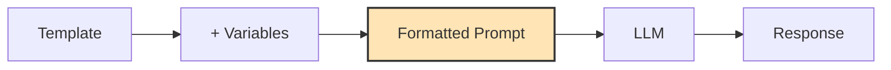

# Prompts - Complete Guide

> **Prompt Engineering**: Master the art of crafting effective prompts with LangChain

## 📚 Table of Contents

1. [What are Prompts?](#what-are-prompts)
2. [Why Use Prompt Templates?](#why-use-prompt-templates)
3. [Folder Structure](#folder-structure)
4. [Prompt Types](#prompt-types)
5. [Examples](#examples)
6. [Advanced Techniques](#advanced-techniques)
7. [Best Practices](#best-practices)

---

## What are Prompts?

Prompts are the instructions you give to an LLM. Prompt templates allow you to create reusable prompts with dynamic variables.



### Example:
```python
# Template
template = "Explain {topic} to a {audience}."

# Variables
topic = "machine learning"
audience = "5-year-old"

# Result
prompt = "Explain machine learning to a 5-year-old."
```

---

## Why Use Prompt Templates?

| Without Templates | With Templates |
|-------------------|----------------|
| String concatenation | Clean, readable code |
| Hard to maintain | Easy to modify |
| No validation | Built-in validation |
| Repetitive code | Reusable templates |
| Error-prone | Type-safe |

### Benefits:
- **Reusability**: Write once, use many times
- **Maintainability**: Change prompts in one place
- **Validation**: Ensure all variables are provided
- **Composition**: Combine templates easily
- **Format Instructions**: Include parsing guidance

---

## Folder Structure

```
4.Prompts/
├── basic_prompt_template.py       # Basic templates
├── few_shot_prompts.py            # Few-shot learning
├── chain_of_thought_prompts.py    # CoT prompting
├── conversational_prompts.py      # Chat templates
├── output_parsing_prompts.py      # Structured output
├── structured_output_prompts.py   # Pydantic integration
├── rag_prompts.py                 # RAG templates
├── advanced_use_cases.py          # Complex patterns
└── README.md                      # This file
```

---

## Prompt Types

### 1. PromptTemplate

**Basic template with variables:**

```python
from langchain.prompts import PromptTemplate

template = PromptTemplate(
    input_variables=["topic"],
    template="Explain {topic} in simple terms."
)

prompt = template.format(topic="quantum computing")
# Result: "Explain quantum computing in simple terms."
```

**With multiple variables:**

```python
template = PromptTemplate(
    input_variables=["language", "topic", "level"],
    template="""You are a {language} tutor for {level} learners.
Explain the concept of {topic} with examples.
"""
)

prompt = template.format(
    language="Python",
    topic="decorators",
    level="intermediate"
)
```

---

### 2. ChatPromptTemplate

**For chat models with message roles:**

```python
from langchain_core.prompts import ChatPromptTemplate

template = ChatPromptTemplate.from_messages([
    ("system", "You are a helpful {role}."),
    ("human", "{question}")
])

messages = template.format_messages(
    role="Python tutor",
    question="What are list comprehensions?"
)
```

**With placeholders:**

```python
from langchain_core.prompts import ChatPromptTemplate, MessagesPlaceholder

template = ChatPromptTemplate.from_messages([
    ("system", "You are a helpful assistant."),
    MessagesPlaceholder(variable_name="history"),
    ("human", "{input}")
])
```

---

### 3. FewShotPromptTemplate

**Include examples for better outputs:**

```python
from langchain.prompts import FewShotPromptTemplate, PromptTemplate

# Define examples
examples = [
    {"word": "happy", "antonym": "sad"},
    {"word": "tall", "antonym": "short"},
    {"word": "fast", "antonym": "slow"}
]

# Example format
example_template = PromptTemplate(
    input_variables=["word", "antonym"],
    template="Word: {word}\nAntonym: {antonym}"
)

# Few-shot template
few_shot_prompt = FewShotPromptTemplate(
    examples=examples,
    example_prompt=example_template,
    prefix="Give the antonym of every input word.",
    suffix="Word: {input}\nAntonym:",
    input_variables=["input"]
)

prompt = few_shot_prompt.format(input="hot")
```

**Output:**
```
Give the antonym of every input word.

Word: happy
Antonym: sad

Word: tall
Antonym: short

Word: fast
Antonym: slow

Word: hot
Antonym:
```

---

### 4. Pipeline Prompts

**Compose multiple templates:**

```python
from langchain.prompts import PromptTemplate
from langchain.prompts.pipeline import PipelinePromptTemplate

# Final template
final_template = PromptTemplate(
    input_variables=["intro", "example", "task"],
    template="{intro}\n\n{example}\n\nNow, {task}"
)

# Component templates
intro_template = PromptTemplate(
    input_variables=["topic"],
    template="You are an expert in {topic}."
)

example_template = PromptTemplate(
    input_variables=["example_input", "example_output"],
    template="Example:\nInput: {example_input}\nOutput: {example_output}"
)

# Compose
pipeline_prompt = PipelinePromptTemplate(
    final_prompt=final_template,
    pipeline_prompts=[
        ("intro", intro_template),
        ("example", example_template)
    ]
)
```

---

## Examples

### Basic Prompt Template

```python
from langchain_openai import ChatOpenAI
from langchain.prompts import PromptTemplate
from dotenv import load_dotenv

load_dotenv()

# Create template
template = PromptTemplate(
    input_variables=["topic"],
    template="Write a short paragraph about {topic}."
)

# Create chain
llm = ChatOpenAI(model="gpt-4o-mini")
chain = template | llm

# Run
result = chain.invoke({"topic": "Python programming"})
print(result.content)
```

### Chat Prompt Template

```python
from langchain_openai import ChatOpenAI
from langchain_core.prompts import ChatPromptTemplate

llm = ChatOpenAI(model="gpt-4o-mini")

# Create template
prompt = ChatPromptTemplate.from_messages([
    ("system", "You are a {language} expert."),
    ("human", "Explain {concept} with an example.")
])

# Create chain
chain = prompt | llm

# Run
result = chain.invoke({
    "language": "Python",
    "concept": "decorators"
})
print(result.content)
```

### Few-Shot Prompting

```python
from langchain.prompts import FewShotPromptTemplate, PromptTemplate

# Examples
examples = [
    {"input": "The movie was amazing!", "output": "positive"},
    {"input": "I hate this product.", "output": "negative"},
    {"input": "It's okay, nothing special.", "output": "neutral"}
]

# Example format
example_template = PromptTemplate(
    input_variables=["input", "output"],
    template="Text: {input}\nSentiment: {output}"
)

# Few-shot template
prompt = FewShotPromptTemplate(
    examples=examples,
    example_prompt=example_template,
    prefix="Classify the sentiment of the text.",
    suffix="Text: {text}\nSentiment:",
    input_variables=["text"]
)

# Use with LLM
chain = prompt | llm
result = chain.invoke({"text": "This is the best day ever!"})
```

### Chain of Thought (CoT)

```python
from langchain.prompts import PromptTemplate

# CoT template
cot_template = PromptTemplate(
    input_variables=["problem"],
    template="""Solve this step by step:

Problem: {problem}

Let's think through this carefully:
Step 1:"""
)

chain = cot_template | llm
result = chain.invoke({
    "problem": "If a train travels 60 miles in 1 hour, how far does it travel in 2.5 hours?"
})
```

### With Output Parsing

```python
from langchain.prompts import PromptTemplate
from langchain_core.output_parsers import PydanticOutputParser
from pydantic import BaseModel

class Movie(BaseModel):
    title: str
    director: str
    year: int
    genre: str

parser = PydanticOutputParser(pydantic_object=Movie)

template = PromptTemplate(
    input_variables=["movie_description"],
    partial_variables={"format_instructions": parser.get_format_instructions()},
    template="""Extract movie information from: {movie_description}

{format_instructions}
"""
)

chain = template | llm | parser
result = chain.invoke({
    "movie_description": "The Matrix is a 1999 sci-fi film directed by the Wachowskis."
})
print(result.title)  # The Matrix
```

### RAG Prompt

```python
from langchain.prompts import PromptTemplate

rag_template = PromptTemplate(
    input_variables=["context", "question"],
    template="""Use the following context to answer the question.

Context:
{context}

Question: {question}

Answer based only on the context provided. If the answer is not in the context, say "I don't have enough information to answer this question."

Answer:"""
)
```

---

## Advanced Techniques

### 1. Dynamic Few-Shot Selection

Select examples dynamically based on the input:

```python
from langchain.prompts import FewShotPromptTemplate
from langchain.prompts.example_selector import SemanticSimilarityExampleSelector
from langchain_openai import OpenAIEmbeddings
from langchain_community.vectorstores import FAISS

# Create example selector
example_selector = SemanticSimilarityExampleSelector.from_examples(
    examples,
    OpenAIEmbeddings(),
    FAISS,
    k=3  # Select 3 most similar examples
)

# Use with few-shot template
dynamic_prompt = FewShotPromptTemplate(
    example_selector=example_selector,
    example_prompt=example_template,
    prefix="...",
    suffix="...",
    input_variables=["input"]
)
```

### 2. Partial Variables

Pre-fill some variables:

```python
from langchain.prompts import PromptTemplate

template = PromptTemplate(
    input_variables=["topic", "format"],
    template="Explain {topic} in {format} format."
)

# Pre-fill format
partial_template = template.partial(format="bullet points")

# Now only topic is needed
prompt = partial_template.format(topic="machine learning")
```

### 3. Template Composition

Combine templates:

```python
from langchain.prompts import PromptTemplate

# Base templates
intro = PromptTemplate.from_template("You are an expert in {topic}.")
task = PromptTemplate.from_template("Explain {concept} in detail.")

# Combine
combined = intro + "\n\n" + task
prompt = combined.format(topic="Python", concept="decorators")
```

### 4. Message Placeholders

For chat history:

```python
from langchain_core.prompts import ChatPromptTemplate, MessagesPlaceholder
from langchain_core.messages import HumanMessage, AIMessage

template = ChatPromptTemplate.from_messages([
    ("system", "You are a helpful assistant."),
    MessagesPlaceholder(variable_name="chat_history"),
    ("human", "{input}")
])

# With history
messages = template.format_messages(
    chat_history=[
        HumanMessage(content="Hi!"),
        AIMessage(content="Hello! How can I help?")
    ],
    input="What can you do?"
)
```

---

## Best Practices

### 1. Be Specific and Clear

```python
# ✅ Good - specific instructions
template = """You are a Python programming tutor.
Explain the concept of {concept} to a beginner.
Include:
- A simple definition
- A practical example
- Common mistakes to avoid"""

# ❌ Bad - vague instructions
template = "Tell me about {concept}"
```

### 2. Include Examples (Few-Shot)

```python
# ✅ Good - with examples
template = """Convert to past tense:

Example 1:
Present: I walk
Past: I walked

Example 2:
Present: She runs
Past: She ran

Now convert:
Present: {verb}
Past:"""
```

### 3. Use Role-Based Prompts

```python
# ✅ Good - clear role
ChatPromptTemplate.from_messages([
    ("system", "You are a senior Python developer with 10 years of experience."),
    ("human", "{question}")
])
```

### 4. Structure Output Format

```python
# ✅ Good - explicit format
template = """Analyze the text and respond in JSON format:
{{
    "sentiment": "positive/negative/neutral",
    "confidence": 0.0-1.0,
    "key_phrases": ["phrase1", "phrase2"]
}}

Text: {text}

JSON:"""
```

### 5. Handle Edge Cases

```python
template = """Answer the question based on the context.

Context: {context}

Question: {question}

Rules:
- If the answer is not in the context, say "Information not available."
- If the question is unclear, ask for clarification.
- Cite relevant parts of the context.

Answer:"""
```

### 6. Use Validation

```python
from langchain.prompts import PromptTemplate

template = PromptTemplate(
    input_variables=["name", "age"],
    template="Hello {name}, you are {age} years old.",
    validate_template=True  # Validates variables match
)
```

---

## Prompt Patterns

### 1. Zero-Shot

```python
template = "What is {topic}?"
```

### 2. One-Shot

```python
template = """Example:
Q: What is Python?
A: Python is a programming language.

Q: What is {topic}?
A:"""
```

### 3. Few-Shot

```python
template = """Examples:
Q: What is Python? A: A programming language.
Q: What is JavaScript? A: A scripting language.
Q: What is HTML? A: A markup language.

Q: What is {topic}?
A:"""
```

### 4. Chain of Thought

```python
template = """Let's solve this step by step:

Problem: {problem}

Step 1: Understand the problem
Step 2: Identify key information
Step 3: Apply the solution method
Step 4: Calculate the answer
Step 5: Verify the result

Solution:"""
```

### 5. Role-Playing

```python
template = """You are {role} speaking to {audience}.
Explain {topic} in a way that {audience} can understand.
Use language appropriate for your role."""
```

---

## Comparison: Template Types

| Type | Use Case | Best For |
|------|----------|----------|
| PromptTemplate | Simple text | Basic queries |
| ChatPromptTemplate | Chat models | Conversations |
| FewShotPromptTemplate | Examples needed | Classification, formatting |
| PipelinePromptTemplate | Complex prompts | Multi-part prompts |

---

## Troubleshooting

### Issue: Missing variables
```python
# Solution: Check input_variables matches placeholders
template = PromptTemplate(
    input_variables=["topic"],  # Must match {topic}
    template="Explain {topic}."
)
```

### Issue: Template not formatting
```python
# Solution: Use double braces for literal braces
template = "Return JSON: {{\"key\": \"value\"}}"
```

### Issue: Long prompts hitting token limits
```python
# Solution: Use summarization or chunking
# Or select fewer few-shot examples
```

---

## Quick Reference

```python
# Basic template
from langchain.prompts import PromptTemplate
template = PromptTemplate.from_template("Explain {topic}")

# Chat template
from langchain_core.prompts import ChatPromptTemplate
template = ChatPromptTemplate.from_messages([
    ("system", "You are helpful."),
    ("human", "{input}")
])

# Few-shot template
from langchain.prompts import FewShotPromptTemplate
# (see examples above)

# Format prompt
prompt = template.format(topic="AI")
# Or with invoke
chain = template | llm
result = chain.invoke({"topic": "AI"})
```

---

## Next Steps

After mastering Prompts:
1. **Output Parsers** - Structure LLM outputs (see `7.OutputParsers/`)
2. **Chains** - Connect components (see `8.Chains/`)
3. **Runnables** - Modern composition (see `9.Runnables/`)
4. **RAG** - Retrieval-augmented generation

---

**Remember:** Good prompts = Good outputs. Invest time in prompt engineering for better results!
