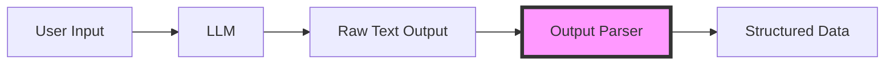

# Output Parsers - Complete Guide

> From Basic to Advanced: Everything you need to know about parsing LLM outputs

## 📚 Table of Contents

1. [What are Output Parsers?](#what-are-output-parsers)
2. [Why Use Output Parsers?](#why-use-output-parsers)
3. [Folder Structure](#folder-structure)
4. [Basic Parsers](#basic-parsers)
5. [Intermediate Parsers](#intermediate-parsers)
6. [Advanced Parsers](#advanced-parsers)
7. [How They Work](#how-they-work)
8. [Comparison Guide](#comparison-guide)

---

## What are Output Parsers?

Output parsers transform raw LLM text output into structured, usable data formats like lists, dictionaries, or custom objects.



---

## Why Use Output Parsers?

| Without Parser | With Parser |
|----------------|-------------|
| Raw text string | Structured data (dict, list, object) |
| Manual parsing needed | Automatic parsing |
| Error-prone | Built-in validation |
| Hard to work with | Easy programmatic access |

**Example:**

```python
# Without parser
response = "Python, Java, JavaScript, C++"
languages = response.split(", ")  # Manual parsing

# With parser
chain = llm | CommaSeparatedListOutputParser()
languages = chain.invoke("List 4 languages")  # Automatic!
```

---

## Folder Structure

```
7.OutputParsers/
├── 1.Basic/
│   ├── 1_string_parser.py           # StrOutputParser
│   ├── 2_list_parser.py             # CommaSeparatedListOutputParser
│   └── 3_json_parser.py             # JsonOutputParser
├── 2.Intermediate/
│   ├── 1_pydantic_parser.py         # PydanticOutputParser
│   ├── 2_structured_parser.py       # StructuredOutputParser
│   └── 3_xml_parser.py              # XMLOutputParser
├── 3.Advanced/
│   ├── 1_retry_parser.py            # RetryWithErrorOutputParser
│   └── 2_custom_parser.py           # Custom parsers
└── README.md (this file)
```

---

## Basic Parsers

### 1. String Output Parser

**Use:** When you just need clean text


**File:** `1.Basic/1_string_parser.py`

**Example:**
```python
from langchain_core.output_parsers import StrOutputParser

chain = llm | StrOutputParser()
result = chain.invoke("What is 2+2?")
# Returns: "2+2 equals 4" (string)
```

---

### 2. Comma Separated List Parser

**Use:** Parse comma-separated values into lists


**File:** `1.Basic/2_list_parser.py`

**Example:**
```python
from langchain_core.output_parsers import CommaSeparatedListOutputParser

parser = CommaSeparatedListOutputParser()
chain = llm | parser
result = chain.invoke("List 3 colors")
# Returns: ["red", "green", "blue"]
```

---

### 3. JSON Output Parser

**Use:** Parse JSON responses into dictionaries


**File:** `1.Basic/3_json_parser.py`

**Example:**
```python
from langchain_core.output_parsers import JsonOutputParser

chain = llm | JsonOutputParser()
result = chain.invoke('{"name": "Alice", "age": 30}')
# Returns: {"name": "Alice", "age": 30}
```

---

## Intermediate Parsers

### 1. Pydantic Output Parser

**Use:** Type-safe, validated data models


**File:** `2.Intermediate/1_pydantic_parser.py`

**Example:**
```python
from langchain_core.output_parsers import PydanticOutputParser
from pydantic import BaseModel

class Person(BaseModel):
    name: str
    age: int

parser = PydanticOutputParser(pydantic_object=Person)
chain = llm | parser
result = chain.invoke(prompt)
# Returns: Person(name="John", age=30)
```

**Benefits:**
- ✅ Type validation
- ✅ Field validation
- ✅ IDE autocomplete
- ✅ Clear structure

---

### 2. Structured Output Parser

**Use:** Define schema without Pydantic


**File:** `2.Intermediate/2_structured_parser.py`

**Example:**
```python
from langchain_core.output_parsers import StructuredOutputParser, ResponseSchema

schemas = [
    ResponseSchema(name="product", description="Product name"),
    ResponseSchema(name="price", description="Price in USD")
]

parser = StructuredOutputParser.from_response_schemas(schemas)
chain = llm | parser
result = chain.invoke(prompt)
# Returns: {"product": "Laptop", "price": "999"}
```

---

### 3. XML Output Parser

**Use:** Parse XML-formatted responses


**File:** `2.Intermediate/3_xml_parser.py`

**Example:**
```python
from langchain_core.output_parsers import XMLOutputParser

parser = XMLOutputParser()
chain = llm | parser
# Parses <book><title>...</title></book> → {"book": {"title": "..."}}
```

---

## Advanced Parsers

### 1. Retry With Error Parser

**Use:** Automatically retry with error feedback


**File:** `3.Advanced/1_retry_parser.py`

**How it works:**

1. LLM generates output
2. Parser tries to parse → **Fails**
3. Error message generated
4. Error sent back to LLM: *"Fix this error: ..."*
5. LLM generates corrected output
6. Parser tries again → **Success!** ✅

**Example:**
```python
from langchain.output_parsers import RetryWithErrorOutputParser

retry_parser = RetryWithErrorOutputParser.from_llm(
    parser=base_parser,
    llm=llm
)

result = retry_parser.parse_with_prompt(completion, prompt)
# Automatically retries if parsing fails
```

**Trade-offs:**
- ✅ Higher success rate
- ✅ Handles edge cases
- ❌ More LLM calls (cost)
- ❌ Slower

---

### 2. Custom Output Parser

**Use:** Create parsers for unique formats


**File:** `3.Advanced/2_custom_parser.py`

**Example:**
```python
from langchain_core.output_parsers import BaseOutputParser

class BulletPointParser(BaseOutputParser[List[str]]):
    def parse(self, text: str) -> List[str]:
        # Your custom parsing logic
        return parsed_bullets
    
    def get_format_instructions(self) -> str:
        return "Format as bullet points: • Item 1\n• Item 2"

parser = BulletPointParser()
chain = llm | parser
```

**When to create custom parsers:**
- ✅ Unique format requirements
- ✅ Domain-specific parsing
- ✅ Legacy format support
- ✅ Performance optimization

---

## How They Work

### Complete Flow Diagram


### Chain Syntax

```python
# Method 1: Pipe operator (Recommended)
chain = llm | parser
result = chain.invoke(input)

# Method 2: Manual
response = llm.invoke(input)
result = parser.parse(response)
```

---

## Comparison Guide

### Parser Selection Matrix

| Need | Use This Parser | Level |
|------|----------------|-------|
| Just text | StrOutputParser | Basic |
| Simple list | CommaSeparatedListOutputParser | Basic |
| Dictionary | JsonOutputParser | Basic |
| Type validation | PydanticOutputParser | Intermediate |
| Quick schema | StructuredOutputParser | Intermediate |
| XML format | XMLOutputParser | Intermediate |
| Error handling | RetryWithErrorOutputParser | Advanced |
| Unique format | Custom Parser | Advanced |

### Feature Comparison


---

## Performance Considerations

| Parser | Speed | Reliability | Cost | Complexity |
|--------|-------|-------------|------|------------|
| String | ⚡⚡⚡ | ⭐⭐ | 💰 | 🔧 |
| List | ⚡⚡⚡ | ⭐⭐⭐ | 💰 | 🔧 |
| JSON | ⚡⚡ | ⭐⭐⭐ | 💰 | 🔧🔧 |
| Pydantic | ⚡⚡ | ⭐⭐⭐⭐⭐ | 💰 | 🔧🔧 |
| Structured | ⚡⚡ | ⭐⭐⭐⭐ | 💰 | 🔧 |
| Retry | ⚡ | ⭐⭐⭐⭐⭐ | 💰💰 | 🔧🔧🔧 |

---

## Best Practices

### 1. Always Use Format Instructions

```python
# ✅ Good
format_instructions = parser.get_format_instructions()
prompt = f"Question\n\n{format_instructions}"

# ❌ Bad
prompt = "Question"  # LLM doesn't know format!
```

### 2. Handle Errors

```python
try:
    result = chain.invoke(input)
except Exception as e:
    print(f"Parsing failed: {e}")
    # Fallback logic
```

### 3. Use Retry for Critical Data

```python
# For production/important data
retry_parser = RetryWithErrorOutputParser.from_llm(
    parser=pydantic_parser,
    llm=llm
)
```

### 4. Start Simple, Then Optimize

```
1. Start with StrOutputParser
2. Move to JsonOutputParser if needed
3. Add PydanticOutputParser for validation
4. Add RetryParser for reliability
```

---

## Real-World Examples

### E-commerce Product Extraction

```python
from pydantic import BaseModel
from langchain_core.output_parsers import PydanticOutputParser

class Product(BaseModel):
    name: str
    price: float
    category: str
    in_stock: bool

parser = PydanticOutputParser(pydantic_object=Product)
chain = llm | parser

result = chain.invoke("Extract product: iPhone 15, $999, Electronics, Available")
# Product(name="iPhone 15", price=999.0, category="Electronics", in_stock=True)
```

### Customer Feedback Analysis

```python
schemas = [
    ResponseSchema(name="sentiment", description="positive, negative, or neutral"),
    ResponseSchema(name="category", description="product, service, or support"),
    ResponseSchema(name="priority", description="high, medium, or low")
]

parser = StructuredOutputParser.from_response_schemas(schemas)
```

---

## Troubleshooting

### Common Issues

**Issue:** Parser fails to parse LLM output

**Solutions:**
1. Check format instructions are included in prompt
2. Verify LLM output format
3. Use RetryParser for automatic fixing
4. Add examples in prompt

**Issue:** Validation errors with PydanticOutputParser

**Solutions:**
1. Make fields optional with `Optional[type]`
2. Add custom validators
3. Use less strict types (e.g., `str` instead of specific types)

**Issue:** Inconsistent results

**Solutions:**
1. Add more specific format instructions
2. Provide examples in prompt
3. Lower temperature for more consistent output
4. Use Pydantic with strict validation

---

## Quick Reference

```python
# String - simplest
from langchain_core.output_parsers import StrOutputParser
parser = StrOutputParser()

# List - comma separated
from langchain_core.output_parsers import CommaSeparatedListOutputParser
parser = CommaSeparatedListOutputParser()

# JSON - dictionary
from langchain_core.output_parsers import JsonOutputParser
parser = JsonOutputParser()

# Pydantic - type safe
from langchain_core.output_parsers import PydanticOutputParser
parser = PydanticOutputParser(pydantic_object=MyModel)

# Structured - simple schema
from langchain_core.output_parsers import StructuredOutputParser
parser = StructuredOutputParser.from_response_schemas(schemas)

# Retry - error handling
from langchain.output_parsers import RetryWithErrorOutputParser
parser = RetryWithErrorOutputParser.from_llm(parser=base_parser, llm=llm)
```

---

## Next Steps

After mastering Output Parsers, explore:

1. **Prompt Templates** - Combine parsers with templates
2. **Chains** - Build complex workflows
3. **Agents** - Decision-making systems
4. **Memory** - Stateful conversations

---

**Remember:** Start with basic parsers and add complexity only when needed. Most use cases work perfectly with `PydanticOutputParser`!
