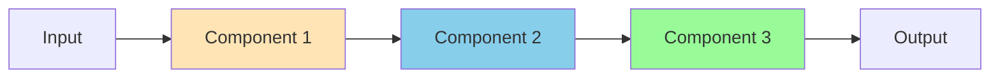
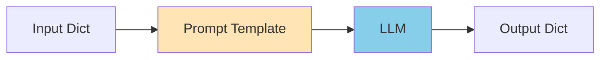
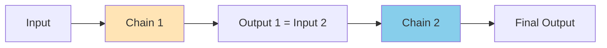
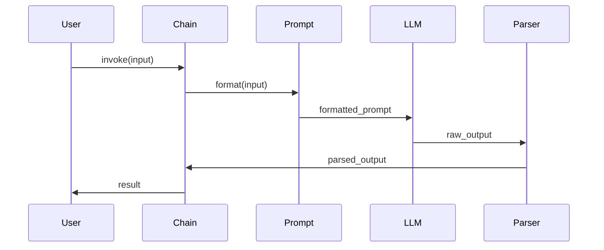
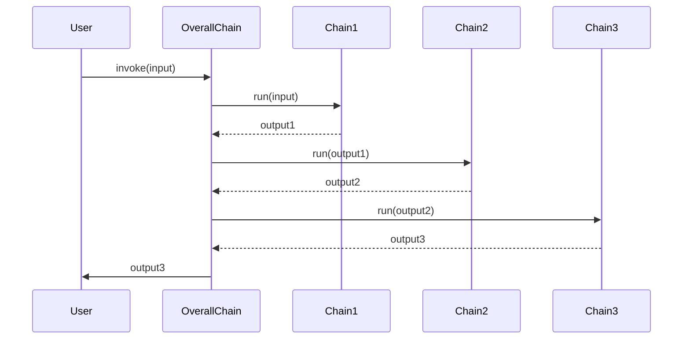
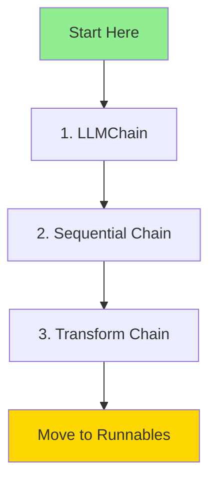

# Chains - Complete Guide

> Build multi-step workflows by connecting LangChain components

## 📚 What are Chains?

Chains connect multiple components (LLMs, prompts, parsers, tools) into workflows. Think of them as recipes that define how data flows through your application.



---

## 🗂️ Folder Structure

```
8.Chains/
├── 1.Basic/
│   ├── 1_simple_llm_chain.py      # LLMChain basics
│   ├── 2_sequential_chain.py      # Chain steps in sequence
│   └── 3_transform_chain.py       # Custom transformations
├── 2.Intermediate/
│   ├── (Coming soon - Router chains)
│   ├── (Coming soon - Map-Reduce)
│   └── (Coming soon - Multi-input)
├── 3.Advanced/
│   └── (Coming soon - Custom chains)
└── README.md (this file)
```

---

## 🎯 Basic Chains

### 1. LLMChain

**The fundamental building block**

```python
from langchain.chains import LLMChain
from langchain.prompts import PromptTemplate

template = "Question: {question}\nAnswer:"
prompt = PromptTemplate(template=template, input_variables=["question"])

chain = LLMChain(llm=llm, prompt=prompt)
result = chain.invoke({"question": "What is AI?"})
```

**Flow:**


---

### 2. Sequential Chain

**Connect multiple chains in sequence**

```python
from langchain.chains import SimpleSequentialChain

# Chain 1: Generate topic
chain1 = LLMChain(llm=llm, prompt=topic_prompt)

# Chain 2: Write about topic  
chain2 = LLMChain(llm=llm, prompt=writing_prompt)

# Connect them
overall = SimpleSequentialChain(chains=[chain1, chain2])
result = overall.invoke("Machine Learning")
```

**Flow:**


---

### 3. Transform Chain

**Apply custom logic between steps**

```python
from langchain.chains import TransformChain

def transform_func(inputs: dict) -> dict:
    text = inputs["text"]
    return {
        "uppercase": text.upper(),
        "word_count": len(text.split())
    }

transform_chain = TransformChain(
    input_variables=["text"],
    output_variables=["uppercase", "word_count"],
    transform=transform_func
)
```

**Use Cases:**
- Data preprocessing
- Format conversion
- Metric calculation
- Validation

---

## 🔄 How Chains Work

### Basic Chain Execution



### Sequential Chain Execution



---

## 🆚 Chains vs Runnables

| Feature | Chains (Legacy) | Runnables (Modern) |
|---------|----------------|-------------------|
| **Syntax** | `Chain(...)` | `a \| b \| c` |
| **Readability** | Verbose | Clean |
| **Streaming** | Limited | Full support |
| **Flexibility** | Medium | High |
| **Status** | ⚠️ Legacy | ✅ Recommended |

**Example Comparison:**

```python
# Chains (Old way)
from langchain.chains import LLMChain

chain = LLMChain(llm=llm, prompt=prompt, output_parser=parser)
result = chain.invoke({"input": "test"})

# Runnables (New way)
chain = prompt | llm | parser
result = chain.invoke({"input": "test"})
```

---

## 💡 When to Use Chains

### Use Chains When:
- ✅ Working with legacy code
- ✅ Learning LangChain basics
- ✅ Need specific chain types (RouterChain, etc.)

### Use Runnables When:
- ✅ Starting new project
- ✅ Need streaming
- ✅ Want cleaner code
- ✅ Building production apps

---

## 🚀 Common Patterns

### Pattern 1: Generate → Refine → Validate

```python
# Step 1: Generate
generate_chain = LLMChain(llm=llm, prompt=generate_prompt)

# Step 2: Refine
refine_chain = LLMChain(llm=llm, prompt=refine_prompt)

# Step 3: Validate
validate_chain = LLMChain(llm=llm, prompt=validate_prompt)

# Combine
overall = SequentialChain(
    chains=[generate_chain, refine_chain, validate_chain]
)
```

### Pattern 2: Preprocess → Process → Postprocess

```python
# Preprocess
preprocess_chain = TransformChain(...)

# Process
process_chain = LLMChain(...)

# Postprocess  
postprocess_chain = TransformChain(...)

# Combine
overall = SequentialChain(
    chains=[preprocess_chain, process_chain, postprocess_chain]
)
```

---

## 📊 Best Practices

### 1. Keep Chains Simple

```python
# ❌ Too complex
mega_chain = SequentialChain(
    chains=[chain1, chain2, chain3, chain4, chain5]
)

# ✅ Break into smaller chains
part1 = SequentialChain(chains=[chain1, chain2])
part2 = SequentialChain(chains=[chain3, chain4])
```

### 2. Use Verbose Mode for Debugging

```python
chain = SimpleSequentialChain(
    chains=[chain1, chain2],
    verbose=True  # Shows intermediate steps
)
```

### 3. Handle Errors

```python
try:
    result = chain.invoke(input)
except Exception as e:
    print(f"Chain failed: {e}")
    # Fallback logic
```

### 4. Consider Migration to Runnables

For new projects, consider using LCEL (Runnables) instead:

```python
# Instead of
chain = LLMChain(llm=llm, prompt=prompt)

# Use
chain = prompt | llm
```

---

## 🔍 Chain Types Reference

| Chain Type | Purpose | Status |
|------------|---------|--------|
| LLMChain | Basic LLM + Prompt | ✅ Stable |
| SimpleSequentialChain | Linear workflow | ✅ Stable |
| SequentialChain | Multi-input workflow | ✅ Stable |
| TransformChain | Custom transforms | ✅ Stable |
| RouterChain | Conditional routing | ⚠️ Consider RunnableBranch |
| MapReduceChain | Parallel processing | ⚠️ Consider RunnableParallel |

---

## 🎓 Learning Path



1. **Week 1**: Master LLMChain
2. **Week 2**: Build Sequential workflows
3. **Week 3**: Add custom transforms
4. **Week 4**: Migrate to Runnables

---

## 🐛 Troubleshooting

### Issue: Chain output doesn't match expected format

**Solution:** Check intermediate outputs with `verbose=True`

```python
chain = SimpleSequentialChain(chains=[...], verbose=True)
```

### Issue: Chain too slow

**Solution:** Consider parallel execution or switch to Runnables

---

## 🔗 Next Steps

After mastering Chains:

1. **Learn Runnables/LCEL** - Modern syntax (Recommended)
2. **Add Memory** - Stateful conversations
3. **Build Agents** - Decision-making systems

---

**Note:** While Chains are still supported, LangChain recommends using **Runnables/LCEL** for new projects. Check out the [Runnables guide](../9.Runnables/README.md) for modern patterns!
