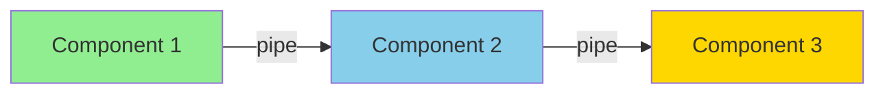
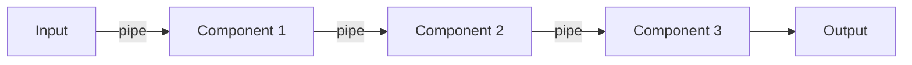
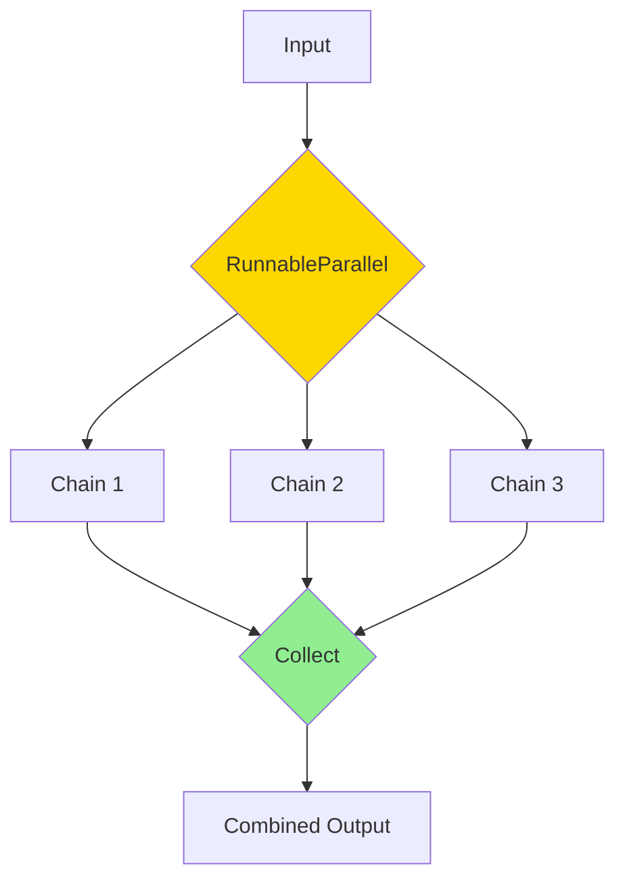
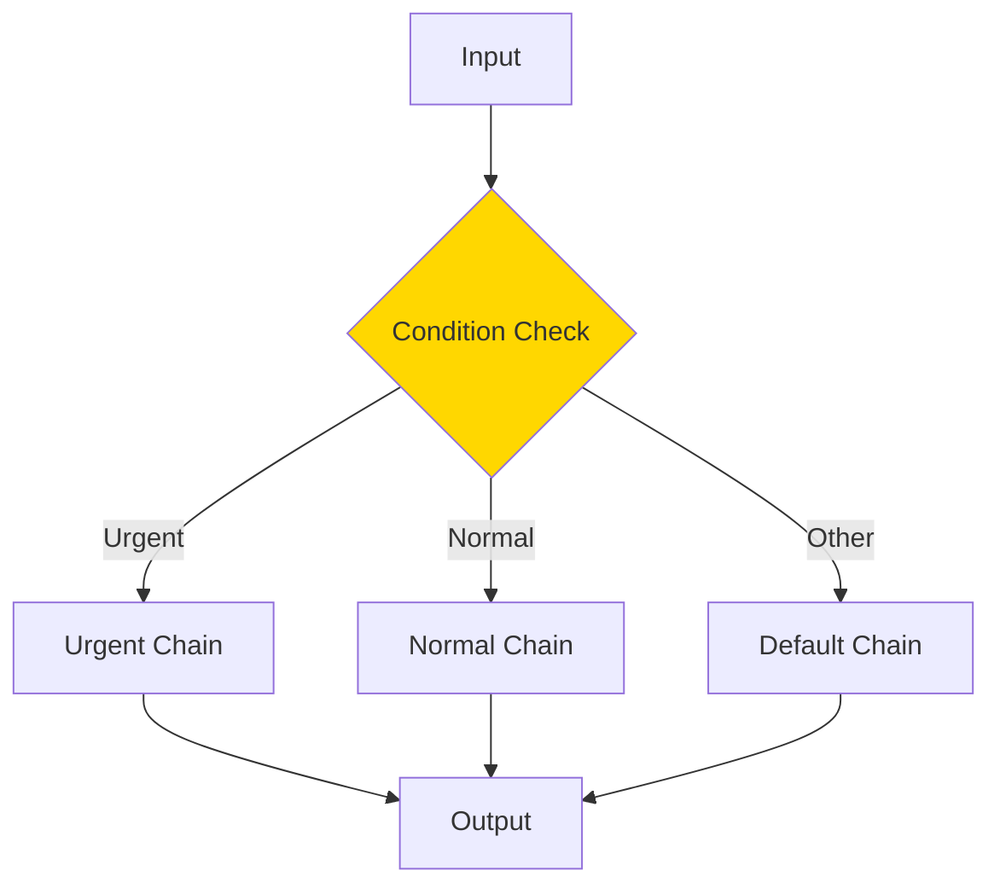
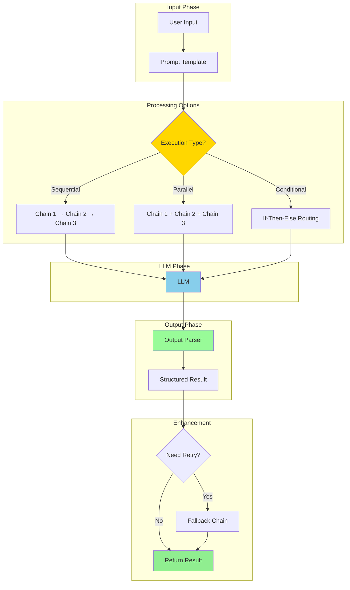
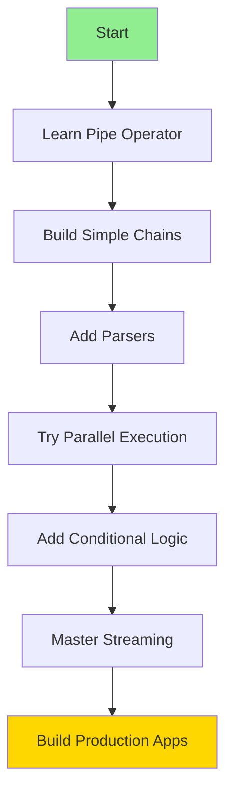

# Runnables (LCEL) - Complete Guide

> **LangChain Expression Language**: The modern way to build with LangChain

## 🚀 What is LCEL?

LCEL (LangChain Expression Language) is the modern syntax for composing LangChain components using the pipe operator `|`. It's cleaner, more flexible, and supports advanced features like streaming.



---

## 🆚 Old vs New

### Before (Chains)
```python
from langchain.chains import LLMChain

chain = LLMChain(
    llm=llm,
    prompt=prompt,
    output_parser=parser
)
result = chain.invoke({"input": "hello"})
```

### After (Runnables)
```python
chain = prompt | llm | parser
result = chain.invoke({"input": "hello"})
```

**90% less code, same functionality!** ✨

---

## 📂 Folder Structure

```
9.Runnables/
├── 1.Basic/
│   ├── (Coming soon - Pipe basics)
│   ├── (Coming soon - RunnableSequence)
│   └── (Coming soon - Simple composition)
├── 2.Intermediate/
│   ├── (Coming soon - RunnableParallel)
│   ├── (Coming soon - RunnableBranch)
│   └── (Coming soon - Fallbacks)
├── 3.Advanced/
│   ├── (Coming soon - Dynamic routing)
│   ├── (Coming soon - Streaming)
│   └── (Coming soon - Custom runnables)
└── README.md (this file)
```

---

## 🎯 Core Concepts

### 1. The Pipe Operator `|`

Connects components left-to-right:

```python
result = component1 | component2 | component3
```

**Flow:**


---

### 2. RunnableSequence

Automatically created when you use `|`:

```python
# These are equivalent
chain = prompt | llm | parser

# Behind the scenes
from langchain_core.runnables import RunnableSequence
chain = RunnableSequence(steps=[prompt, llm, parser])
```

---

### 3. RunnableParallel

Run multiple components in parallel:

```python
from langchain_core.runnables import RunnableParallel

parallel = RunnableParallel(
    sentiment=sentiment_chain,
    summary=summary_chain,
    keywords=keywords_chain
)

result = parallel.invoke({"text": "..."})
# {
#   "sentiment": "positive",
#   "summary": "...",
#   "keywords": [...]
# }
```

**Flow:**


---

### 4. RunnableBranch

Conditional routing:

```python
from langchain_core.runnables import RunnableBranch

branch = RunnableBranch(
    (lambda x: x["type"] == "urgent", urgent_chain),
    (lambda x: x["type"] == "normal", normal_chain),
    default_chain  # Fallback
)
```

**Flow:**


---

## 💡 Key Advantages

### 1. Cleaner Syntax

```python
# Old
chain = LLMChain(llm=llm, prompt=prompt)
chain = chain | output_parser

# New
chain = prompt | llm | output_parser
```

### 2. Streaming Support

```python
chain = prompt | llm | parser

# Stream tokens as they arrive
for chunk in chain.stream({"input": "hello"}):
    print(chunk, end="", flush=True)
```

### 3. Flexible Composition

```python
# Easy to modify
basic_chain = prompt | llm
with_parser = basic_chain | parser
with_fallback = with_parser.with_fallbacks([fallback_chain])
```

### 4. Parallel Execution

```python
# Run multiple chains at once
parallel = RunnableParallel(
    task1=chain1,
    task2=chain2,
    task3=chain3
)
```

---

## 🔧 Common Patterns

### Pattern 1: Basic Pipeline

```python
from langchain_ollama import OllamaLLM
from langchain.prompts import PromptTemplate
from langchain_core.output_parsers import StrOutputParser

llm = OllamaLLM(model="mistral")
prompt = PromptTemplate.from_template("Tell me about {topic}")
parser = StrOutputParser()

chain = prompt | llm | parser
result = chain.invoke({"topic": "AI"})
```

### Pattern 2: Parallel Tasks

```python
from langchain_core.runnables import RunnableParallel

# Analyze text in multiple ways simultaneously
analysis = RunnableParallel(
    sentiment=prompt_sentiment | llm | sentiment_parser,
    entities=prompt_entities | llm | entity_parser,
    summary=prompt_summary | llm | summary_parser
)

result = analysis.invoke({"text": "..."})
```

### Pattern 3: Conditional Routing

```python
from langchain_core.runnables import RunnableBranch

router = RunnableBranch(
    (lambda x: "code" in x["query"], code_chain),
    (lambda x: "math" in x["query"], math_chain),
    general_chain
)

result = router.invoke({"query": "write code"})
```

### Pattern 4: Fallback Chain

```python
# Try primary, fallback if fails
chain = primary_chain.with_fallbacks([
    fallback_chain_1,
    fallback_chain_2
])

result = chain.invoke(input)
```

---

## 📊 Complete Flow Diagram



---

## 🎯 Use Cases

### 1. Customer Support

```python
# Route based on urgency
support_chain = RunnableBranch(
    (is_urgent, escalate_chain),
    (is_technical, technical_chain),
    general_support_chain
)
```

### 2. Content Generation

```python
# Generate multiple versions in parallel
content_gen = RunnableParallel(
    short=short_prompt | llm,
    medium=medium_prompt | llm,
    long=long_prompt | llm
)
```

### 3. Data Pipeline

```python
# Extract → Transform → Load
pipeline = (
    extract_chain
    | transform_chain
    | validate_chain
    | load_chain
)
```

---

## 🚀 Advanced Features

### 1. Streaming

```python
# Stream intermediate results
for chunk in chain.stream(input):
    print(chunk)
```

### 2. Batch Processing

```python
# Process multiple inputs
results = chain.batch([
    {"input": "query1"},
    {"input": "query2"},
    {"input": "query3"}
])
```

### 3. Async Support

```python
# Async execution
result = await chain.ainvoke(input)

# Async streaming
async for chunk in chain.astream(input):
    print(chunk)
```

### 4. Retry Logic

```python
# Automatically retry on failure
chain = (
    prompt 
    | llm.with_retry(stop_after_attempt=3)
    | parser
)
```

---

## 📈 Performance Benefits

| Feature | Chains | Runnables | Improvement |
|---------|--------|-----------|-------------|
| **Syntax** | Verbose | Concise | 90% less code |
| **Streaming** | Limited | Full | Real-time output |
| **Parallel** | Manual | Built-in | Faster execution |
| **Composition** | Rigid | Flexible | Easy to modify |
| **Debugging** | Hard | Easy | Better visibility |

---

## 🔍 Debugging

### Use `.invoke()` for step-by-step

```python
chain = prompt | llm | parser

# Debug each step
step1 = prompt.invoke(input)
print("After prompt:", step1)

step2 = llm.invoke(step1)
print("After LLM:", step2)

step3 = parser.invoke(step2)
print("Final:", step3)
```

### Enable verbose mode

```python
chain = prompt | llm | parser
result = chain.invoke(input, config={"verbose": True})
```

---

## 💡 Best Practices

### 1. Start Simple

```python
# ✅ Start here
chain = prompt | llm

# Then add complexity
chain = prompt | llm | parser
chain = chain.with_fallbacks([backup])
```

### 2. Use Type Hints

```python
from typing import Dict, Any

def process_data(input: Dict[str, Any]) -> str:
    return input["text"].upper()

chain = RunnableLambda(process_data) | llm
```

### 3. Handle Errors

```python
try:
    result = chain.invoke(input)
except Exception as e:
    print(f"Error: {e}")
    # Use fallback
```

### 4. Test Components Individually

```python
# Test each component
assert prompt.invoke(test_input) == expected
assert llm.invoke(test_prompt) is not None
```

---

## 🎓 Learning Path



1. **Day 1-2**: Pipe operator basics
2. **Day 3-4**: Sequential chains
3. **Day 5-6**: Parallel execution
4. **Week 2**: Conditional routing
5. **Week 3**: Streaming & async
6. **Week 4**: Production patterns

---

## 🔗 Integration with Other Modules

### With Output Parsers

```python
from langchain_core.output_parsers import PydanticOutputParser

parser = PydanticOutputParser(pydantic_object=MyModel)
chain = prompt | llm | parser
```

### With Chains (Migration)

```python
# Old LLMChain
old_chain = LLMChain(llm=llm, prompt=prompt)

# Convert to Runnable
new_chain = prompt | llm
```

---

## 📚 Additional Resources

- [Official LCEL Docs](https://python.langchain.com/docs/expression_language/)
- [Runnable Interface](https://api.python.langchain.com/en/latest/runnables/langchain_core.runnables.base.Runnable.html)
- [Streaming Guide](https://python.langchain.com/docs/expression_language/streaming)

---

## 🎯 Summary

**Runnables/LCEL is the modern, recommended way to build with LangChain.**

**Key Points:**
- ✅ Use `|` to chain components
- ✅ RunnableParallel for concurrent execution
- ✅ RunnableBranch for conditional logic
- ✅ Full streaming support
- ✅ Cleaner, more maintainable code

**Migration Tip:** New projects should start with Runnables. Existing projects can gradually migrate from Chains.

---

**Next Step:** Start building! Check out the examples in `1.Basic/` to get started.
