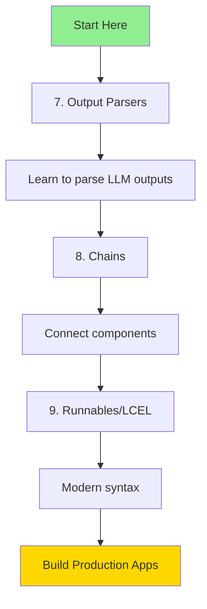
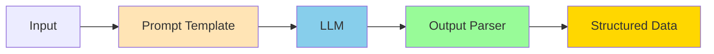
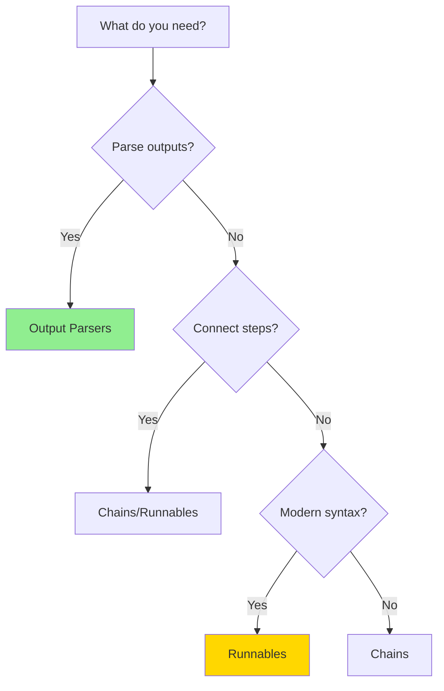
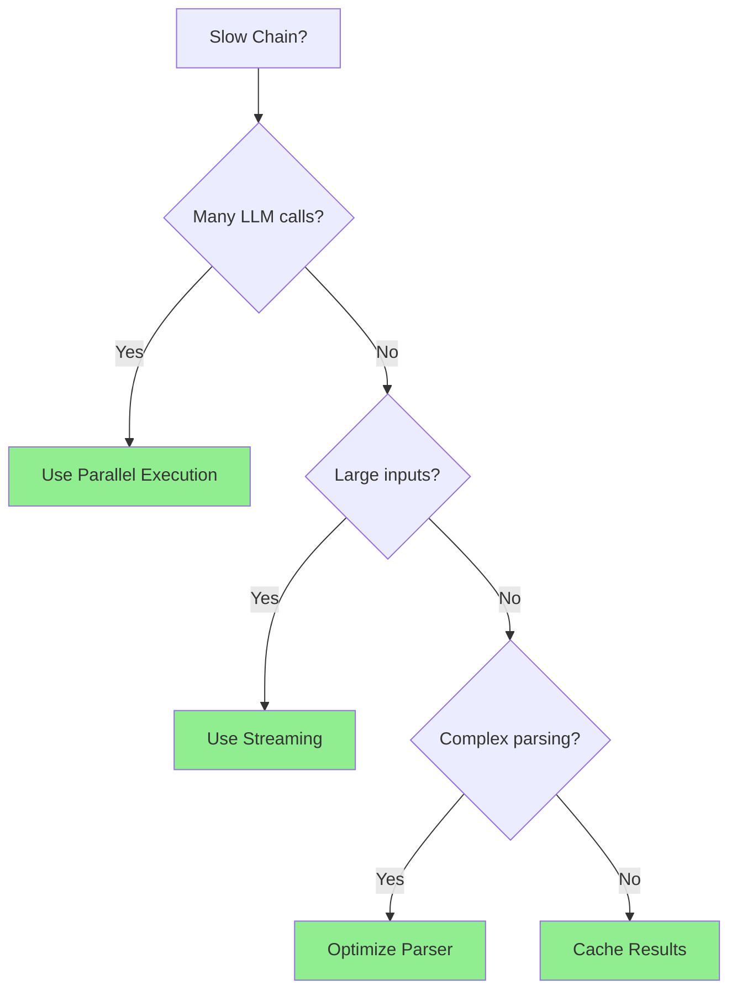

# 🔗 LangChain Complete Guide

> **Output Parsers + Chains + Runnables** - From Basics to Advanced

This comprehensive guide covers three essential LangChain concepts with examples, diagrams, and best practices.

## 📂 Repository Structure

```
├── 7.OutputParsers/          # Parse LLM outputs into structured data
│   ├── 1.Basic/              # String, List, JSON parsers
│   ├── 2.Intermediate/       # Pydantic, Structured, XML parsers
│   ├── 3.Advanced/           # Retry, Custom parsers
│   └── README.md
│
├── 8.Chains/                 # Connect components in workflows
│   ├── 1.Basic/              # Simple, Sequential, Transform chains
│   ├── 2.Intermediate/       # Router, Map-Reduce chains
│   ├── 3.Advanced/           # Custom, Conditional chains
│   └── README.md
│
└── 9.Runnables/              # Modern LCEL (LangChain Expression Language)
    ├── 1.Basic/              # Basic runnables, pipe operator
    ├── 2.Intermediate/       # Parallel, branching, fallbacks
    ├── 3.Advanced/           # Dynamic routing, streaming
    └── README.md
```

## 🎯 Learning Path



### Recommended Order:

1. **Start with Output Parsers** (Week 1)
   - Understand how to structure LLM outputs
   - Master basic → intermediate → advanced parsers

2. **Move to Chains** (Week 2)
   - Learn to connect components
   - Build multi-step workflows

3. **Learn Runnables/LCEL** (Week 3)
   - Modern, cleaner syntax
   - Production-ready patterns

## 🔍 Quick Comparison

### Output Parsers vs Chains vs Runnables

```mermaid
graph LR
    subgraph "Output Parsers"
        A1[LLM Output] --> A2[Parser]
        A2 --> A3[Structured Data]
    end
    
    subgraph "Chains"
        B1[Input] --> B2[Chain Step 1]
        B2 --> B3[Chain Step 2]
        B3 --> B4[Output]
    end
    
    subgraph "Runnables LCEL"
        C1[Input] --> C2[Component1 | Component2 | Component3]
        C2 --> C3[Output]
    end
```

| Feature | Output Parsers | Chains | Runnables |
|---------|---------------|--------|-----------|
| **Purpose** | Parse outputs | Connect steps | Modern composition |
| **Syntax** | `parser.parse()` | `Chain(...)` | `a \| b \| c` |
| **Complexity** | Simple | Medium | Simple |
| **Modern** | ✅ | ⚠️ Legacy | ✅ Recommended |
| **Flexibility** | Low | Medium | High |

## 📚 Module Deep Dive

### 7. Output Parsers

**What:** Transform raw LLM text into structured data

**Why:** Easier to work with parsed data programmatically

**Example:**
```python
# Without parser
output = "red, blue, green"
colors = output.split(", ")  # Manual

# With parser
parser = CommaSeparatedListOutputParser()
chain = llm | parser
colors = chain.invoke("List 3 colors")  # Automatic
```

**Key Concepts:**
- String Parser - Basic text
- List Parser - Arrays
- JSON Parser - Objects
- Pydantic Parser - Validated models
- Custom Parser - Your own logic

[→ Full Output Parsers Guide](./7.OutputParsers/README.md)

---

### 8. Chains

**What:** Connect multiple components in a workflow

**Why:** Build complex multi-step processes

**Example:**
```python
# Sequential chain
chain1 = LLMChain(llm, prompt1)  # Generate idea
chain2 = LLMChain(llm, prompt2)  # Expand idea
chain3 = LLMChain(llm, prompt3)  # Summarize

overall = SequentialChain(chains=[chain1, chain2, chain3])
result = overall.invoke("AI")
```

**Key Concepts:**
- LLMChain - Basic LLM + Prompt
- Sequential - Chain steps
- Router - Conditional routing
- Map-Reduce - Parallel processing
- Custom - Your own chains

[→ Full Chains Guide](./8.Chains/README.md)

---

### 9. Runnables (LCEL)

**What:** Modern LangChain syntax using pipes and composition

**Why:** Cleaner code, better streaming, more flexible

**Example:**
```python
# Old way (Chains)
chain = LLMChain(llm=llm, prompt=prompt)
result = chain.invoke({"input": "test"})

# New way (Runnables)
chain = prompt | llm | parser
result = chain.invoke({"input": "test"})
```

**Key Concepts:**
- Pipe operator `|`
- RunnableSequence
- RunnableParallel
- RunnableBranch
- Streaming support

[→ Full Runnables Guide](./9.Runnables/README.md)

---

## 🚀 Complete Example

Here's how all three work together:

```python
from langchain_ollama import OllamaLLM
from langchain.prompts import PromptTemplate
from langchain_core.output_parsers import PydanticOutputParser
from pydantic import BaseModel

# 1. Define structure (Output Parser)
class Analysis(BaseModel):
    sentiment: str
    confidence: float
    summary: str

# 2. Create parser
parser = PydanticOutputParser(pydantic_object=Analysis)

# 3. Create prompt
template = """Analyze this text: {text}

{format_instructions}"""

prompt = PromptTemplate(
    template=template,
    input_variables=["text"],
    partial_variables={"format_instructions": parser.get_format_instructions()}
)

# 4. Create runnable chain (modern syntax)
llm = OllamaLLM(model="mistral")
chain = prompt | llm | parser

# 5. Run
result = chain.invoke({"text": "I love this product!"})
print(result.sentiment)  # positive
print(result.confidence)  # 0.95
print(result.summary)  # Customer expressed satisfaction
```

### Flow Diagram



---

## 🎓 Learning Resources

### By Skill Level

**Beginner (Start Here):**
1. `7.OutputParsers/1.Basic/` - Learn parsing
2. `8.Chains/1.Basic/` - Simple chains
3. `9.Runnables/1.Basic/` - Pipe syntax

**Intermediate:**
1. `7.OutputParsers/2.Intermediate/` - Pydantic validation
2. `8.Chains/2.Intermediate/` - Sequential workflows
3. `9.Runnables/2.Intermediate/` - Parallel execution

**Advanced:**
1. `7.OutputParsers/3.Advanced/` - Custom parsers
2. `8.Chains/3.Advanced/` - Complex routing
3. `9.Runnables/3.Advanced/` - Dynamic patterns

### By Use Case

**Building a Chatbot:**
- Output Parsers: Pydantic for structured responses
- Chains: Sequential for conversation flow
- Runnables: Streaming for real-time responses

**Data Extraction:**
- Output Parsers: JSON or Pydantic
- Chains: Map-Reduce for batch processing
- Runnables: Parallel for speed

**Content Generation:**
- Output Parsers: String or structured
- Chains: Sequential for multi-step
- Runnables: Branching for variations

---

## 💡 Best Practices

### 1. Choose the Right Tool



### 2. Start Simple

```python
# ❌ Don't start with this
chain = (
    RunnableParallel({
        "a": prompt1 | llm1 | parser1,
        "b": prompt2 | llm2 | parser2
    })
    | RunnableLambda(lambda x: combine(x))
    | final_llm
)

# ✅ Start with this
chain = prompt | llm | parser
```

### 3. Use Type Hints

```python
# ✅ Good
from pydantic import BaseModel

class Output(BaseModel):
    answer: str
    confidence: float

parser = PydanticOutputParser(pydantic_object=Output)

# ❌ Avoid
parser = JsonOutputParser()  # No type safety
```

### 4. Handle Errors

```python
# ✅ With error handling
from langchain.output_parsers import RetryWithErrorOutputParser

retry_parser = RetryWithErrorOutputParser.from_llm(
    parser=base_parser,
    llm=llm
)

# Or manual
try:
    result = chain.invoke(input)
except Exception as e:
    print(f"Error: {e}")
    # Fallback logic
```

---

## 🔧 Common Patterns

### Pattern 1: Extract → Transform → Validate

```python
# Extract with LLM
extraction_chain = prompt | llm | json_parser

# Transform
def transform(data):
    return {**data, "processed": True}

transform_chain = RunnableLambda(transform)

# Validate
validation_chain = pydantic_parser

# Combine
full_chain = extraction_chain | transform_chain | validation_chain
```

### Pattern 2: Parallel Processing

```python
from langchain_core.runnables import RunnableParallel

# Process multiple tasks in parallel
parallel_chain = RunnableParallel(
    sentiment=sentiment_prompt | llm | sentiment_parser,
    summary=summary_prompt | llm | summary_parser,
    keywords=keyword_prompt | llm | keyword_parser
)

result = parallel_chain.invoke({"text": "..."})
# {
#   "sentiment": "positive",
#   "summary": "...",
#   "keywords": [...]
# }
```

### Pattern 3: Conditional Routing

```python
def route(input):
    if "urgent" in input["text"].lower():
        return urgent_chain
    else:
        return normal_chain

conditional_chain = RunnableLambda(route)
result = conditional_chain.invoke({"text": "URGENT: Help needed"})
```

---

## 📊 Performance Tips

### Optimization Guide



1. **Parallel Execution** - Run independent tasks together
2. **Streaming** - Process data as it arrives
3. **Caching** - Store results for reuse
4. **Simpler Parsers** - Use basic parsers when possible

---

## 🐛 Troubleshooting

### Common Issues

| Issue | Solution |
|-------|----------|
| Parser fails | Add format instructions to prompt |
| Chain slow | Use parallel execution |
| Type errors | Use Pydantic models |
| Inconsistent results | Lower temperature, add examples |
| Memory issues | Use streaming |

---

## 🎯 Real-World Projects

### Project 1: Customer Support Bot
```
Output Parsers: PydanticOutputParser (ticket structure)
Chains: Router chain (category → handler)
Runnables: Streaming for real-time responses
```

### Project 2: Document Analyzer
```
Output Parsers: Structured (extract entities)
Chains: Map-Reduce (process sections)
Runnables: Parallel (multiple analyses)
```

### Project 3: Content Generator
```
Output Parsers: Pydantic (validate output)
Chains: Sequential (outline → write → edit)
Runnables: Branching (multiple versions)
```

---

## 📖 Additional Resources

- [LangChain Documentation](https://python.langchain.com/)
- [LCEL Guide](https://python.langchain.com/docs/expression_language/)
- [Pydantic Docs](https://docs.pydantic.dev/)

---

## 🤝 Contributing

Found an issue or want to add examples? Contributions welcome!

---

**Happy Learning! 🚀**

Remember: Master the basics before moving to advanced topics. Each folder builds on the previous one.
