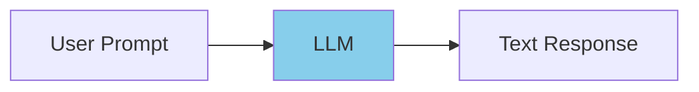
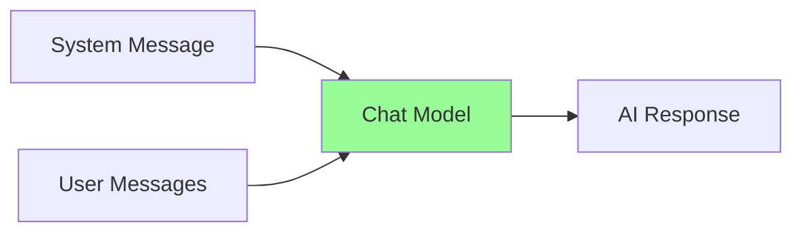
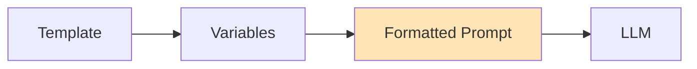
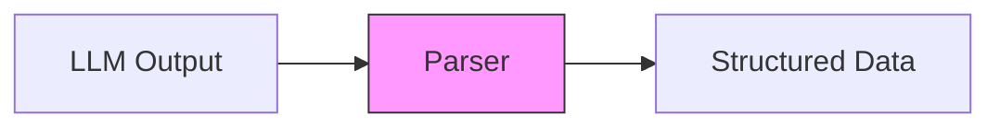
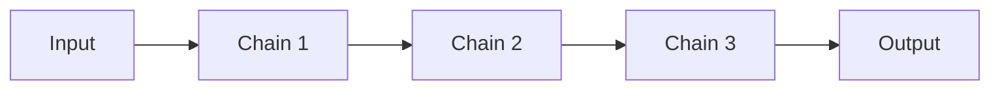
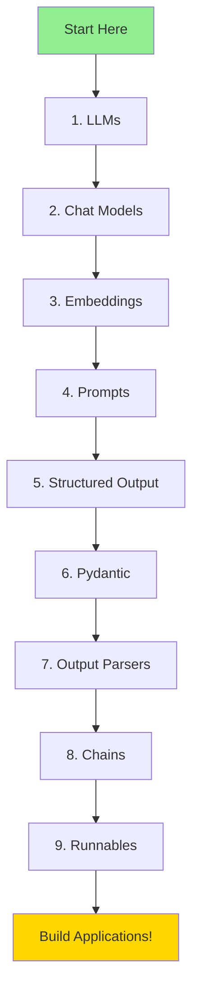

# 🔗 LangChain Complete Learning Repository

> **A comprehensive guide to LangChain** - From basics to advanced concepts with practical examples

This repository contains tutorials, examples, and documentation for learning LangChain, a powerful framework for building applications powered by large language models (LLMs).

## 📚 Table of Contents

1. [Overview](#overview)
2. [Repository Structure](#repository-structure)
3. [Module Descriptions](#module-descriptions)
4. [Learning Path](#learning-path)
5. [Quick Start](#quick-start)
6. [Installation](#installation)
7. [Best Practices](#best-practices)
8. [Additional Resources](#additional-resources)

---

## Overview

LangChain is a framework for developing applications powered by language models. This repository covers all the essential modules:

| Module | Purpose | Status |
|--------|---------|--------|
| **LLMs** | Base language models | ✅ Complete |
| **Chat Models** | Conversational AI models | ✅ Complete |
| **Embeddings** | Vector representations | ✅ Complete |
| **Prompts** | Template engineering | ✅ Complete |
| **Chatbot** | Full chatbot application | ✅ Complete |
| **Structured Output** | Format LLM responses | ✅ Complete |
| **Pydantic** | Data validation | ✅ Complete |
| **Output Parsers** | Parse LLM outputs | ✅ Complete |
| **Chains** | Connect components | ✅ Complete |
| **Runnables (LCEL)** | Modern composition | ✅ Complete |

---

## Repository Structure

```
LangChain/
├── 1. LLMs/                    # Base Language Model examples
│   ├── llm_demo.py             # OpenAI LLM demo
│   ├── ollama_llm.py           # Ollama local LLM
│   ├── huggingface_llm.py      # HuggingFace models
│   └── llamacpp_llm.py         # LlamaCpp integration
│
├── 2.ChatModels/               # Chat-specific models
│   ├── openai_chatModel.py     # OpenAI ChatGPT
│   ├── chatmodel_ollama.py     # Ollama chat models
│   ├── chatmodel_gemini.py     # Google Gemini
│   ├── chatmodel_claude.py     # Anthropic Claude
│   └── chatmodel_huggingface.py # HuggingFace chat
│
├── 3.EmbeddedModels/           # Embedding models
│   ├── openai_embeddings.py    # OpenAI embeddings
│   ├── ollama_embeddings.py    # Ollama embeddings
│   ├── huggingface_embeddings.py # HuggingFace embeddings
│   └── (more embedding options...)
│
├── 4.Prompts/                  # Prompt engineering
│   ├── basic_prompt_template.py    # Basic templates
│   ├── few_shot_prompts.py         # Few-shot learning
│   ├── chain_of_thought_prompts.py # CoT prompting
│   └── (more prompt patterns...)
│
├── 5.Chatbot/                  # Full chatbot application
│   ├── app.py                  # Flask backend
│   ├── templates/              # HTML templates
│   └── static/                 # CSS/JS assets
│
├── 5.StructuredOutput/         # Structured output examples
│   ├── 1_basic_string_output.py
│   ├── 2_json_structured_output.py
│   └── (more formats...)
│
├── 6.PydanticBasics/           # Pydantic tutorial
│   ├── 1_what_is_pydantic.py
│   ├── 2_type_hints_validation.py
│   └── (complete tutorial...)
│
├── 7.OutputParsers/            # Output parsing
│   ├── 1.Basic/                # Basic parsers
│   ├── 2.Intermediate/         # Intermediate parsers
│   └── 3.Advanced/             # Advanced parsers
│
├── 8.Chains/                   # LangChain chains
│   ├── 1.Basic/                # Basic chains
│   ├── 2.Intermediate/         # Intermediate chains
│   └── 3.Advanced/             # Advanced chains
│
├── 9.Runnables/                # LCEL (Modern syntax)
│   ├── 1.Basic/                # Basic runnables
│   ├── 2.Intermediate/         # Intermediate runnables
│   └── 3.Advanced/             # Advanced runnables
│
├── COMPLETE_GUIDE.md           # Comprehensive guide
├── requirements.txt            # Python dependencies
└── README.md                   # This file
```

---

## Module Descriptions

### 1. LLMs (Language Models)

**Location:** `1. LLMs/`

LLMs are the foundation of LangChain. They generate text based on input prompts.



**Key Concepts:**
- **Text completion**: Generate text from prompts
- **Temperature**: Control randomness (0 = deterministic, 1 = creative)
- **Max tokens**: Limit response length
- **Model selection**: Choose appropriate model for task

**Supported Providers:**
| Provider | File | API Key Required |
|----------|------|------------------|
| OpenAI | `llm_demo.py` | ✅ Yes |
| Ollama | `ollama_llm.py` | ❌ No (local) |
| HuggingFace | `huggingface_llm.py` | ✅ Yes |
| LlamaCpp | `llamacpp_llm.py` | ❌ No (local) |

**Example:**
```python
from langchain_openai import ChatOpenAI

llm = ChatOpenAI(model="gpt-4o-mini")
response = llm.invoke("What is LangChain?")
print(response.content)
```

[→ View LLMs Documentation](./1.%20LLMs/README.md)

---

### 2. Chat Models

**Location:** `2.ChatModels/`

Chat models are specialized for conversational interactions with message history support.



**Key Concepts:**
- **Message types**: System, Human, AI messages
- **Conversation history**: Maintain context
- **Streaming**: Real-time responses
- **Multi-turn**: Back-and-forth conversations

**Supported Providers:**
| Provider | Model | Best For |
|----------|-------|----------|
| OpenAI | GPT-4, GPT-3.5 | General purpose |
| Anthropic | Claude | Long context, safety |
| Google | Gemini | Multimodal |
| Ollama | Mistral, Llama | Local/private |

**Example:**
```python
from langchain_openai import ChatOpenAI
from langchain_core.messages import HumanMessage, SystemMessage

chat = ChatOpenAI(model="gpt-4")
messages = [
    SystemMessage(content="You are a helpful assistant."),
    HumanMessage(content="Hello!")
]
response = chat.invoke(messages)
```

[→ View Chat Models Documentation](./2.ChatModels/README.md)

---

### 3. Embeddings

**Location:** `3.EmbeddedModels/`

Embeddings convert text into numerical vectors for semantic search and similarity.

```mermaid
graph LR
    A[Text] --> B[Embedding Model]
    B --> C[Vector [0.1, 0.3, ...]]
    C --> D[Vector Store]
    style B fill:#FFD700
```

**Key Concepts:**
- **Semantic similarity**: Find related content
- **Vector dimensions**: 768, 1536, 3072 dimensions
- **Batch processing**: Embed multiple texts efficiently
- **Use cases**: RAG, semantic search, clustering

**Supported Providers:**
| Provider | Dimensions | Cost |
|----------|-----------|------|
| OpenAI | 1536/3072 | Paid |
| Ollama | Varies | Free (local) |
| HuggingFace | Varies | Free |
| Cohere | 1024 | Paid |

**Example:**
```python
from langchain_openai import OpenAIEmbeddings

embeddings = OpenAIEmbeddings()
vector = embeddings.embed_query("What is LangChain?")
print(f"Dimension: {len(vector)}")  # 1536
```

[→ View Embeddings Documentation](./3.EmbeddedModels/README.md)

---

### 4. Prompts

**Location:** `4.Prompts/`

Prompt templates help structure and reuse prompts with variables.



**Key Concepts:**
- **PromptTemplate**: Basic templates with variables
- **ChatPromptTemplate**: For chat models
- **Few-shot prompts**: Include examples
- **Chain of Thought**: Step-by-step reasoning

**Prompt Types:**
| Type | Use Case | Example |
|------|----------|---------|
| Basic | Simple queries | "Tell me about {topic}" |
| Few-shot | Learning patterns | Examples + query |
| CoT | Complex reasoning | "Think step by step..." |
| RAG | Context-aware | Context + question |

**Example:**
```python
from langchain.prompts import PromptTemplate

template = PromptTemplate(
    input_variables=["topic"],
    template="Explain {topic} in simple terms."
)
prompt = template.format(topic="machine learning")
```

[→ View Prompts Documentation](./4.Prompts/README.md)

---

### 5. Chatbot

**Location:** `5.Chatbot/`

A complete chatbot application with Flask backend and modern frontend.

**Features:**
- 🎨 Modern UI with animations
- 💬 Real-time chat interface
- 📝 Message formatting (bold, italic, code)
- 🔄 Conversation history
- ⌨️ Keyboard shortcuts

**Tech Stack:**
- Backend: Flask, Python
- Frontend: HTML5, CSS3, JavaScript
- API: OpenAI GPT-3.5

[→ View Chatbot Documentation](./5.Chatbot/README.md)

---

### 6. Structured Output

**Location:** `5.StructuredOutput/`

Get data from LLMs in specific formats (JSON, CSV, lists, etc.).

**Supported Formats:**
| Format | File | Use Case |
|--------|------|----------|
| String | `1_basic_string_output.py` | Simple text |
| JSON | `2_json_structured_output.py` | Objects |
| CSV | `3_csv_structured_output.py` | Tabular |
| List | `4_list_structured_output.py` | Arrays |
| Key-Value | `5_keyvalue_structured_output.py` | Properties |
| YAML | `6_yaml_structured_output.py` | Config |

[→ View Structured Output Documentation](./5.StructuredOutput/README.md)

---

### 7. Pydantic Basics

**Location:** `6.PydanticBasics/`

Learn Pydantic for data validation - essential for structured LLM outputs.

**Topics Covered:**
1. What is Pydantic
2. Type hints and validation
3. Optional fields
4. Lists and collections
5. Nested models
6. Custom validators
7. LLM use cases
8. TypedDict basics

[→ View Pydantic Documentation](./6.PydanticBasics/README.md)

---

### 8. Output Parsers

**Location:** `7.OutputParsers/`

Transform raw LLM outputs into structured data.



**Parser Types:**
| Level | Parser | Output Type |
|-------|--------|-------------|
| Basic | StrOutputParser | String |
| Basic | CommaSeparatedList | List |
| Basic | JsonOutputParser | Dictionary |
| Intermediate | PydanticOutputParser | Pydantic Model |
| Intermediate | StructuredOutputParser | Dictionary |
| Advanced | RetryWithErrorOutputParser | Auto-retry |

[→ View Output Parsers Documentation](./7.OutputParsers/README.md)

---

### 9. Chains

**Location:** `8.Chains/`

Connect multiple components into workflows.



**Chain Types:**
| Chain | Purpose | Status |
|-------|---------|--------|
| LLMChain | Basic LLM + Prompt | ⚠️ Legacy |
| SequentialChain | Multiple steps | ⚠️ Legacy |
| RouterChain | Conditional routing | ⚠️ Legacy |

> **Note:** For new projects, use Runnables (LCEL) instead.

[→ View Chains Documentation](./8.Chains/README.md)

---

### 10. Runnables (LCEL)

**Location:** `9.Runnables/`

Modern LangChain syntax using the pipe operator.

```python
# Modern syntax
chain = prompt | llm | parser
result = chain.invoke({"input": "hello"})
```

**Key Features:**
- ✅ Clean pipe syntax (`|`)
- ✅ Full streaming support
- ✅ Parallel execution
- ✅ Fallback handling
- ✅ Recommended for new projects

[→ View Runnables Documentation](./9.Runnables/README.md)

---

## Learning Path



### Recommended Order:

| Week | Module | Focus |
|------|--------|-------|
| 1 | LLMs + Chat Models | Foundation |
| 2 | Embeddings + Prompts | Data & Templates |
| 3 | Structured Output + Pydantic | Data Validation |
| 4 | Output Parsers | Parsing |
| 5 | Chains + Runnables | Composition |
| 6 | Build Projects | Application |

---

## Quick Start

### 1. Clone the repository:
```bash
git clone https://github.com/your-username/LangChain.git
cd LangChain
```

### 2. Install dependencies:
```bash
pip install -r requirements.txt
```

### 3. Set up environment variables:
```bash
# Create .env file
echo "OPENAI_API_KEY=your-key-here" > .env
```

### 4. Run your first example:
```bash
python "1. LLMs/llm_demo.py"
```

---

## Installation

### Requirements

- Python 3.9+
- pip package manager

### Core Dependencies

```bash
# LangChain core
pip install langchain langchain-core

# Provider integrations
pip install langchain-openai      # OpenAI
pip install langchain-anthropic   # Anthropic/Claude
pip install langchain-google-genai # Google Gemini

# Utilities
pip install python-dotenv pydantic
```

### Optional Dependencies

```bash
# Local models
pip install langchain-community   # Ollama, LlamaCpp

# HuggingFace
pip install langchain-huggingface transformers

# Machine learning
pip install numpy scikit-learn
```

---

## Best Practices

### 1. Use Environment Variables
```python
from dotenv import load_dotenv
load_dotenv()
# Never commit API keys!
```

### 2. Start with Runnables (LCEL)
```python
# ✅ Modern - Use this
chain = prompt | llm | parser

# ❌ Legacy - Avoid for new projects
chain = LLMChain(llm=llm, prompt=prompt)
```

### 3. Use Type Safety
```python
from pydantic import BaseModel

class Output(BaseModel):
    answer: str
    confidence: float

parser = PydanticOutputParser(pydantic_object=Output)
```

### 4. Handle Errors
```python
try:
    result = chain.invoke(input)
except Exception as e:
    print(f"Error: {e}")
    # Fallback logic
```

### 5. Use Streaming for Better UX
```python
for chunk in chain.stream(input):
    print(chunk, end="", flush=True)
```

---

## Additional Resources

### Official Documentation
- [LangChain Docs](https://python.langchain.com/)
- [LangChain API Reference](https://api.python.langchain.com/)
- [LCEL Guide](https://python.langchain.com/docs/expression_language/)

### Community
- [LangChain GitHub](https://github.com/langchain-ai/langchain)
- [LangChain Discord](https://discord.gg/langchain)

### Related Libraries
- [Pydantic Docs](https://docs.pydantic.dev/)
- [OpenAI API Docs](https://platform.openai.com/docs)

---

## Contributing

Contributions are welcome! Please feel free to submit issues and pull requests.

---

## License

This project is open source and available under the MIT License.

---

**Happy Learning! 🚀**

Start with the basics and work your way up. Each module builds on the previous one! Updated
